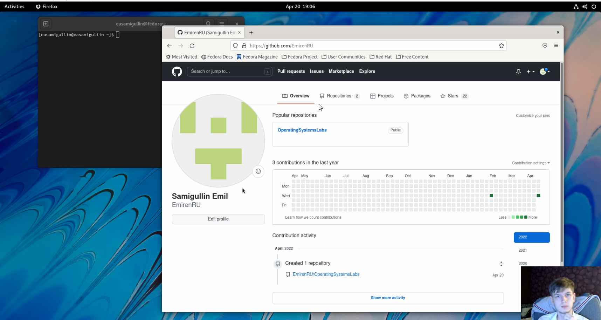
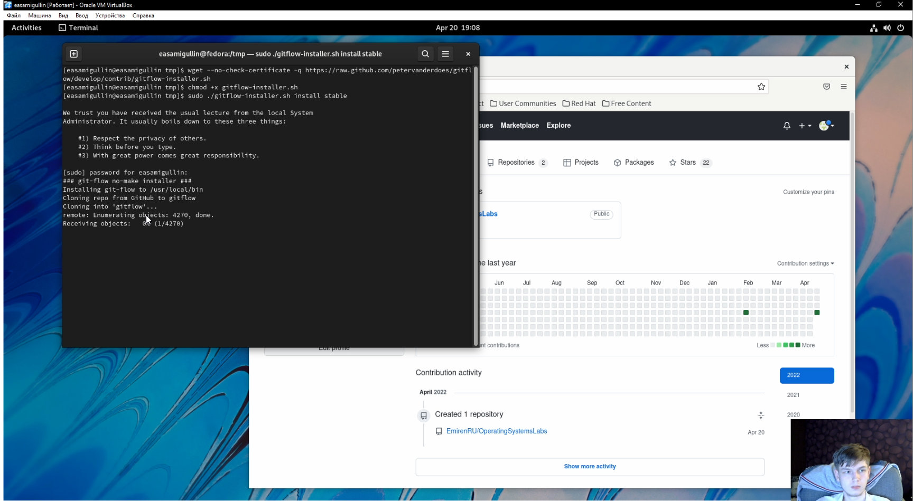
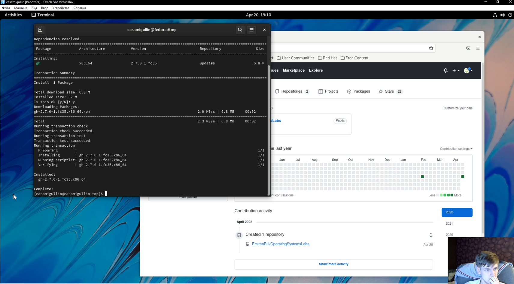
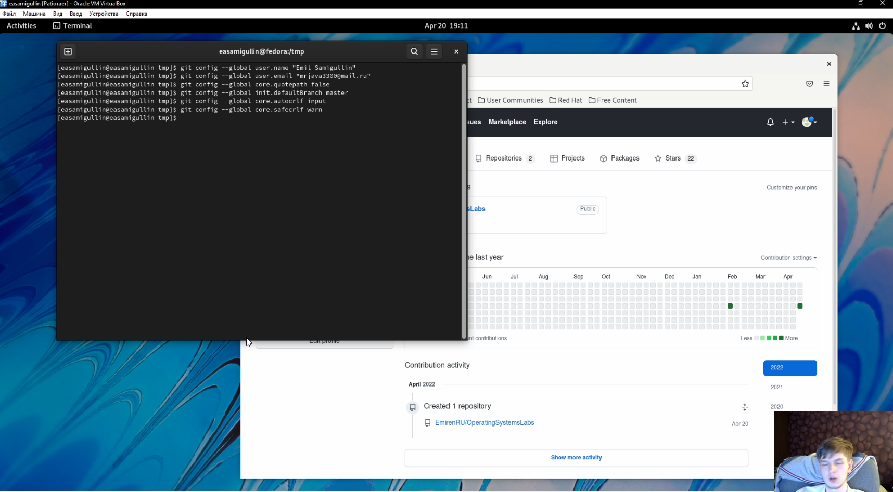
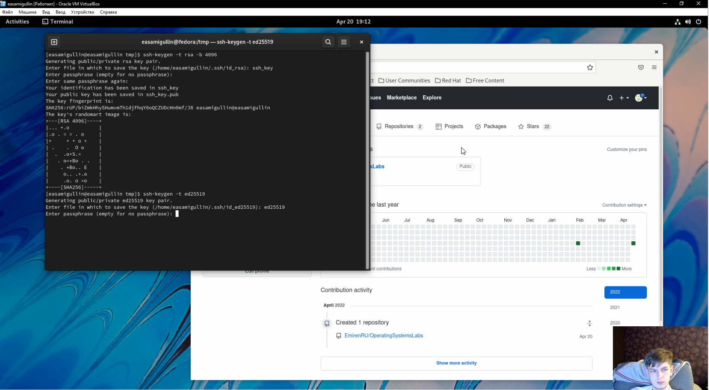
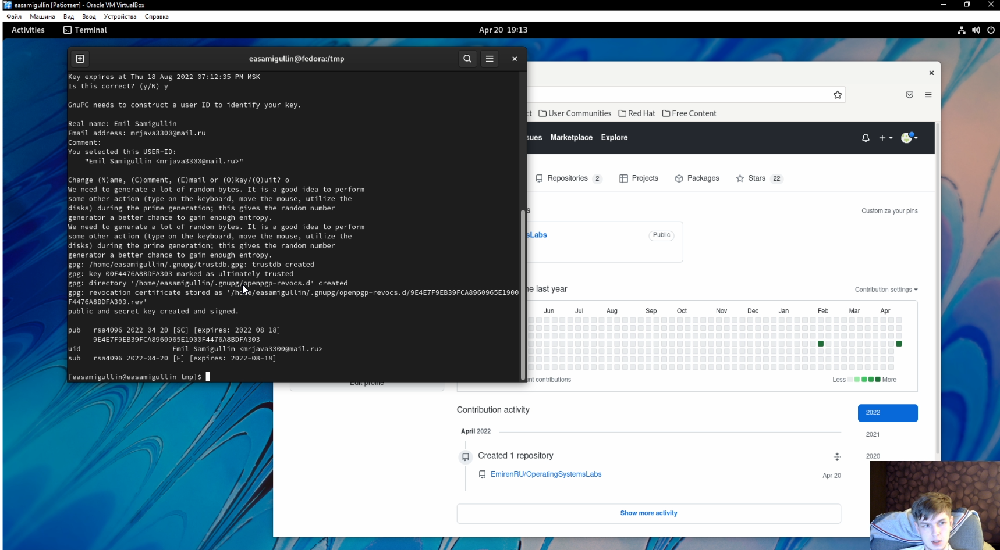
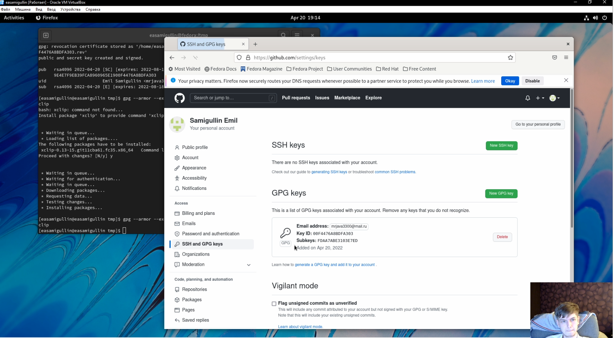
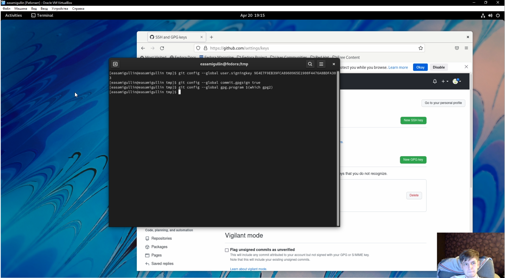
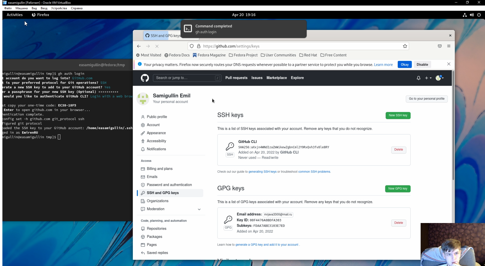

---
## Front matter
title: "Отчёт по лабораторной работе №2"
subtitle: "НКНбд-02-21"
author: "Самигуллин Эмиль Артурович"

## Generic otions
lang: ru-RU
toc-title: "Содержание"

## Bibliography
bibliography: bib/cite.bib
csl: pandoc/csl/gost-r-7-0-5-2008-numeric.csl

## Pdf output format
toc: true # Table of contents
toc-depth: 2
fontsize: 12pt
linestretch: 1.5
papersize: a4
documentclass: scrreprt
## I18n polyglossia
polyglossia-lang:
  name: russian
  options:
	- spelling=modern
	- babelshorthands=true
polyglossia-otherlangs:
  name: english
## I18n babel
babel-lang: russian
babel-otherlangs: english
## Fonts
mainfont: PT Serif
romanfont: PT Serif
sansfont: PT Sans
monofont: PT Mono
mainfontoptions: Ligatures=TeX
romanfontoptions: Ligatures=TeX
sansfontoptions: Ligatures=TeX,Scale=MatchLowercase
monofontoptions: Scale=MatchLowercase,Scale=0.9
## Biblatex
biblatex: true
biblio-style: "gost-numeric"
biblatexoptions:
  - parentracker=true
  - backend=biber
  - hyperref=auto
  - language=auto
  - autolang=other*
  - citestyle=gost-numeric
## Pandoc-crossref LaTeX customization
figureTitle: "Рис."
tableTitle: "Таблица"
listingTitle: "Листинг"
lofTitle: "Цель Работы"
lotTitle: "Ход Работы"
lolTitle: "Листинги"
## Misc options
indent: true
header-includes:
  - \usepackage{indentfirst}
  - \usepackage{float} # keep figures where there are in the text
  - \floatplacement{figure}{H} # keep figures where there are in the text
---

# Цель работы

- Изучить идеологию и применение средств контроля версий.

- Освоить умения по работе с git

# Ход работы

1. Зарегистрировался на github.(рис. [-@fig:001])
   { #fig:001 width=70% }
2. Установил git-flow. (рис. [-@fig:002])
   { #fig:002 width=70% }
3. Установил gh. (рис. [-@fig:003])
   { #fig:003 width=70% }
4. Настроил базово конфигурации git. (рис. [-@fig:004]) 
   { #fig:004 width=70% }
5. Создал ключи SSH. (рис. [-@fig:005])
   { #fig:005 width=70% }
6.  Создал ключи GPG. (рис. [-@fig:006])
   { #fig:006 width=70% }
7.  GPG ключ активирован в Github. (рис. [-@fig:007])
   { #fig:007 width=70% }
8.	Настроили автоматические подписи коммитов git. (рис. [-@fig:008])
   { #fig:008 width=70% }
9.	Настройка gh и добавление SSH ключей в Github.(рис. [-@fig:009])
   { #fig:009 width=70% }
10. SSH и GPG были добавлены в Github. (рис. [-@fig:010])
   { #fig:010 width=70% }
11. Создаем репозиторию курса на основе шаблона. (рис. [-@fig:011])
   { #fig:011 width=70% }
12. Настройка каталога курса.(рис. [-@fig:012])
   { #fig:012 width=70% }
13. Окончательная отправка на сервер. (рис. [-@fig:013])
    { #fig:013 width=70% }

# Вывод

Во время лабораторной работы, мы изучили идеологию системы контроля версий, научились скачивать программное обеспечение удалено из репозитория, базово настраивать git, создавать ключи SSH и GPG, добавление самих ключей в Github, и на основе шаблона создавать репозиторию курса.

# Контрольные вопросы.
1.	Системы контроля версий – это программное обеспечение, которое используется для облегчения работы с изменяющийся информацией, обычно используется в проектах от 2 человек.

2.	Репозиторий в системе контроля версий – это удаленный репозиторий, который позволяет хранить все файлы проекта
Commit – фиксация изменений перед загрузкой файлов в VCS
История хранит в себе все изменения в проекте и при необходимости позволяет откатиться в желаемое место.
Рабочая копия – это копия, которая хранится на компьютере. Если член команды изменил проект, то вам необходимо скачать новую версию проекта на свой компьютер

3.	В отличие от классических, в распределенных системах контроля версий центральный репозиторий не является обязательным. Среди классических VCS наиболее известны CVS, Subversion, а среди распространенных Git, Bazaar, Mercurial. У них отличаются в основном синтаксисы.  В Децентрилизованных системах у каждого из участников проекта есть копия проекта на своем компьютере, что делает его менее зависимым от сервера Git

4.	Для начала надо создать и подключить удаленный репозиторий. Затем по мере изменения проекта отправляйте изменения на сервер.

5.	Участник проекта перед началом посредством определенных команд получает нужную версию файлов. После внесения изменений, пользователь размещает новую версию на хранилище. При это предыдущие не удаляются, а позже можно вернуться к ним в любой момент.

6.	Упрощение обмена информаций, ускорение разработки, устранение ошибок.
