---
## Front matter
title: "Отчёта по лабораторной работе №2"
subtitle: "Управление версиями"
author: "Самигуллин Эмиль Артурович"

## Generic otions
lang: ru-RU
toc-title: "Содержание"

## Bibliography
bibliography: bib/cite.bib
csl: pandoc/csl/gost-r-7-0-5-2008-numeric.csl

## Pdf output format
toc-depth: 2
fontsize: 12pt
linestretch: 1.5
papersize: a4
documentclass: scrreprt
## I18n polyglossia
polyglossia-lang:
  name: russian
  options:
	- spelling=modern
	- babelshorthands=true
polyglossia-otherlangs:
  name: english
## I18n babel
babel-lang: russian
babel-otherlangs: english
## Fonts
mainfont: PT Serif
romanfont: PT Serif
sansfont: PT Sans
monofont: PT Mono
mainfontoptions: Ligatures=TeX
romanfontoptions: Ligatures=TeX
sansfontoptions: Ligatures=TeX,Scale=MatchLowercase
monofontoptions: Scale=MatchLowercase,Scale=0.9
## Biblatex
biblatex: true
biblio-style: "gost-numeric"
biblatexoptions:
  - parentracker=true
  - backend=biber
  - hyperref=auto
  - language=auto
  - autolang=other*
  - citestyle=gost-numeric
## Pandoc-crossref LaTeX customization
figureTitle: "Рис."
tableTitle: "Таблица"
listingTitle: "Листинг"
lofTitle: "Список иллюстраций"
lolTitle: "Листинги"
## Misc options
indent: true
header-includes:
  - \usepackage{indentfirst}
  - \usepackage{float} # keep figures where there are in the text
  - \floatplacement{figure}{H} # keep figures where there are in the text
---

# Цель работы

* Изучить идеологию и применение средств контроля версий.
* Освоить умения по работе с git.

# Задание

* Создать базовую конфигурацию для работы с git.
* Создать ключ SSH.
* Создать ключ PGP.
* Настроить подписи git.
* Зарегистрироваться на Github.
* Создать локальный каталог для выполнения заданий по предмету.

# Выполнение лабораторной работы

1. Создал учетную запись на Github и заполнил основные данные.

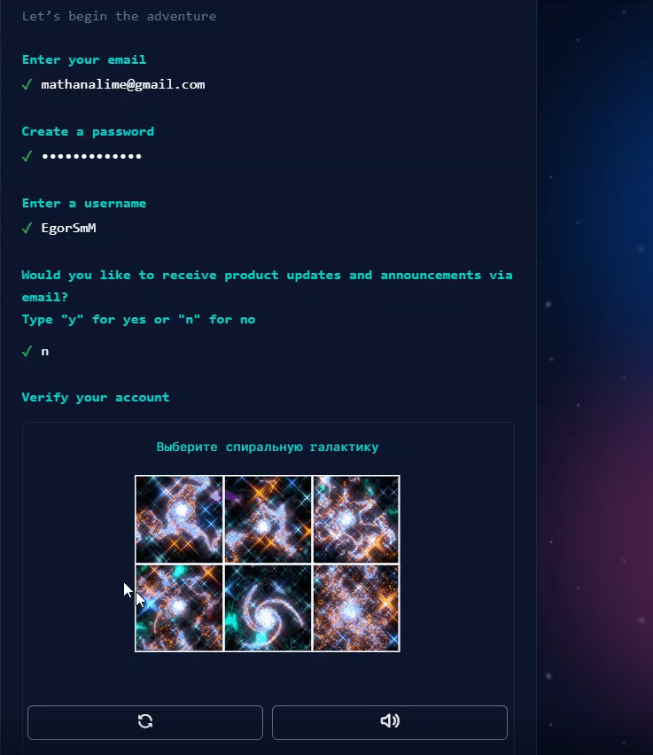

2. Установил Git-flow и gh на виртуальной машине.

<figure>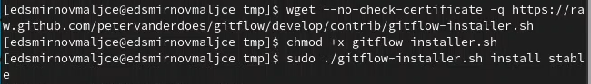
	
	<figcaption>Установка git-flow</figcaption>
<figure>
###  

<figure>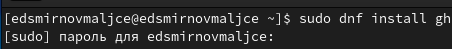
	
	<figcaption>Установка gh</figcaption>
<figure>

3. Настроил git. (рис. [-@fig:004], [-@fig:005])

<figure>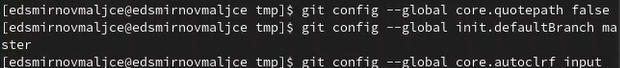
	
	<figcaption>Создание основной ветки</figcaption>
<figure>
###  

<figure>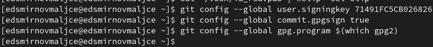
	
	<figcaption>Унифицирование коммитов</figcaption>
<figure>

4. Создал 2 ssh ключа: по алгоритму rsa размером 4096 бит и по алгоритму ed25519.

<figure>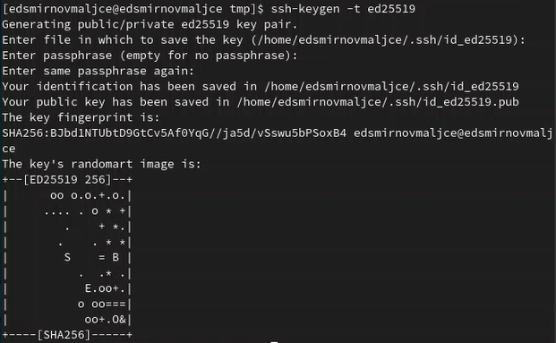
	
	<figcaption>Создание ключа по алгоритму ed25519</figcaption>
<figure>
###  

<figure>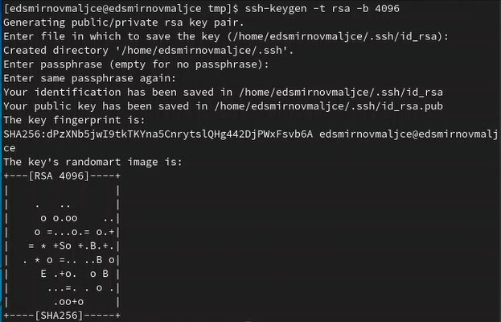
	
	<figcaption>Создание ключа по алгоритму rsa размером 4096 бит</figcaption>
<figure>

5. Сгенерировал pgp-ключ.

<figure>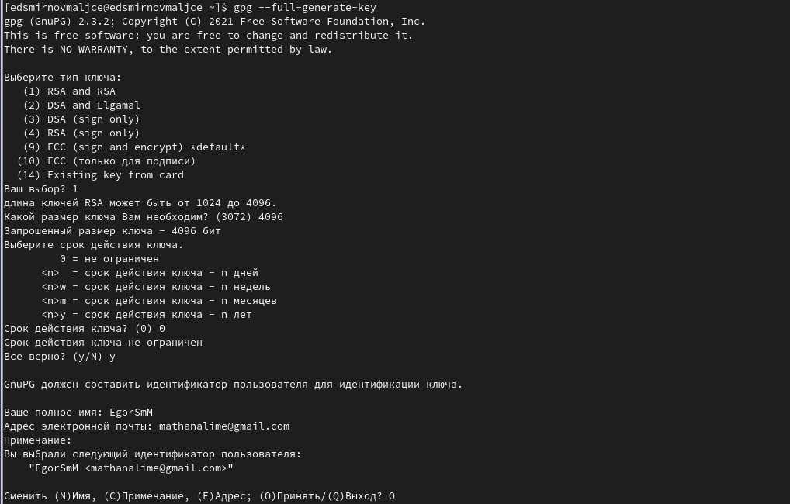
	
	<figcaption>Генерация pgp-ключа</figcaption>
<figure>

6. Скопировал pgp-ключ и ввел его на сайте Github.

<figure>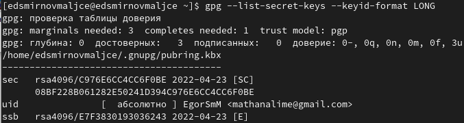
	
	<figcaption>Копирование pgp-ключа</figcaption>
<figure>

7. Скопировал ssh-ключ и ввел его на Github.

<figure>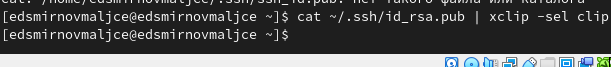
	
	<figcaption>Копирование ssh-ключа</figcaption>
<figure>

8. Указал Git применять ранее введенный email в качестве подписи коммитов.

<figure>
	
	<figcaption>Настройка автоматических подписей</figcaption>
<figure>

9. Авторизировался на Github.

<figure>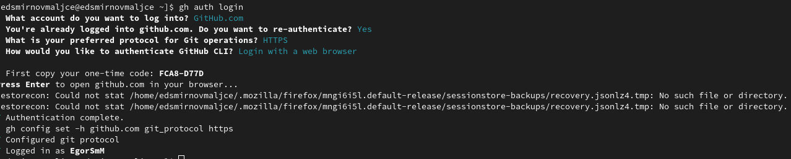
	
	<figcaption>Переход к авторизации через командную строку</figcaption>
<figure>

10. Создал репозиторий на основе шаблона рабочего пространства.

<figure>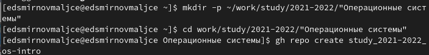
	
	<figcaption>Создание директории и переход в нее</figcaption>
<figure>
###  

<figure>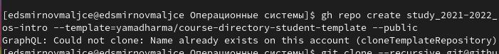
	
	<figcaption>Копирование шаблона репозитория</figcaption>
<figure>

11. Настроил репозиторий.

<figure>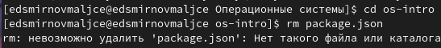
	
	<figcaption>Удаление лишнего файла</figcaption>
<figure>
###  

<figure>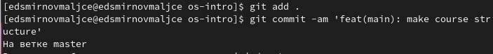
	
	<figcaption>Создание каталогов</figcaption>
<figure>
###  

<figure>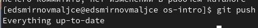
	
	<figcaption>Отправление файла на сервер</figcaption>
<figure>

# Выводы

* Я научился создавать репозиторий на Github с помощью командной строки.
* Я ознакомился с Git структурой и понял ее преимущества при работе в команде, а именно удобство отслеживания изменений.

# Ответы на контрольные вопросы

1. VCS – это системы контроля версий. Они используются при работе в
команде. Обычно основное дерево проекта хранится в локальном или
удалённом репозитории, к которому настроен доступ для участников
проекта. При внесении изменений в содержание проекта система
контроля версий позволяет их фиксировать, совмещать изменения,
произведённые разными участниками проекта, производить откат к
любой более ранней версии проекта, если это требуется.
2. Хранилище – место, в котором хранятся все версии проекта. Для
уменьшения объема используемой памяти можно хранить только
изменения проекта.
Commit – добавленные и измененные файлы по сравнению с
предшествующей версией проекта.
История – последовательность изменений проекта.
Рабочая копия – копия над которой сейчас идет работа.
3. Централизованная система – система, в которой существует центральное
хранилище, которое доступно всем участникам проекта. В
децентрализованной системе у каждого участника есть свой
репозиторий, что позволяет работать, не подключаясь к сети. Пример
централизованной системы: CVS. Децентрализованной: Git.
4. При единоличной работе с VCS берешь нужную версию, вносишь правки
и добавляешь коммит.
5. При совместной работе в централизованном хранилище, добавляется
работа по устранению конфликтов. Также необходимо сливать версии, и
вообще следить за структурированностью истории. Нельзя забывать
проверять последнюю версию программы, потому что напарник мог ее
изменить.
6. Git помогает работать одновременно над одним и тем же проектом
независимо, а потом совмещать достижения разработчиков. Также он
помогает хранить историю версий, что позволяет быстро откатиться в
случае необходимости.
7. Основные команды Git:
Создание основного дерева репозитория: git init
Получение обновлений (изменений) текущего дерева из центрального
репозитория: git pull
Отправка всех произведённых изменений локального дерева в
центральный репозиторий: git push
Просмотр списка изменённых файлов в текущей директории: git status
Просмотр текущих изменений: git diff
Добавить все изменённые и/или созданные файлы и/или каталоги: git add
Добавить конкретные изменённые и/или созданные файлы и/или
каталоги: git add имена_файлов
Удалить файл и/или каталог из индекса репозитория (при этом файл
и/или каталог остаётся в локальной директории): git rm имена_файлов
Сохранить все добавленные изменения и все изменённые файлы:
git commit -am 'Описание коммита'
Сохранить добавленные изменения с внесением комментария через
встроенный редактор: git commit
Создание новой ветки, базирующейся на текущей:
checkout -b имя_ветки
Переключение на некоторую ветку: git checkout имя_ветки
(при переключении на ветку, которой ещё нет в локальном репозитории,
она будет создана и связана с удалённой)
Отправка изменений конкретной ветки в центральный репозиторий:
git push origin имя_ветки
Слияние ветки с текущим деревом: git merge --no-ff имя_ветки
Удаление локальной уже слитой с основным деревом ветки:
git branch -d имя_ветки
Принудительное удаление локальной ветки: git branch -D имя_ветки
Удаление ветки с центрального репозитория: git push origin :имя_ветки
8. Пример использования локального репозитория: В Git создать
репозиторий привязанный к имени пользователя и email и работать в нем
не подключаясь к сети.
Пример использования удаленного репозитория: создать репозиторий на
Github, настроить авторизацию через ssh-ключ и pgp-ключ,
авторизоваться и работать с ним через командную строку.
9. Ветви необходимы в случае, если есть несколько путей развития
программы, поэтому из одной версии получаются сразу несколько.
10. Игнорировать файлы можно с помощью команды gitignore для того,
чтобы не забивать хранилище мусором.
