---
## Front matter
title: "Отчёт по лабораторной работе №5"
subtitle: "НКНбд-02-21"
author: "Самигуллин Эмиль Артурович"

## Generic otions
lang: ru-RU
toc-title: "Содержание"

## Bibliography
bibliography: bib/cite.bib
csl: pandoc/csl/gost-r-7-0-5-2008-numeric.csl

## Pdf output format
toc: true # Table of contents
toc-depth: 2
fontsize: 12pt
linestretch: 1.5
papersize: a4
documentclass: scrreprt
## I18n polyglossia
polyglossia-lang:
  name: russian
  options:
	- spelling=modern
	- babelshorthands=true
polyglossia-otherlangs:
  name: english
## I18n babel
babel-lang: russian
babel-otherlangs: english
## Fonts
mainfont: PT Serif
romanfont: PT Serif
sansfont: PT Sans
monofont: PT Mono
mainfontoptions: Ligatures=TeX
romanfontoptions: Ligatures=TeX
sansfontoptions: Ligatures=TeX,Scale=MatchLowercase
monofontoptions: Scale=MatchLowercase,Scale=0.9
## Biblatex
biblatex: true
biblio-style: "gost-numeric"
biblatexoptions:
  - parentracker=true
  - backend=biber
  - hyperref=auto
  - language=auto
  - autolang=other*
  - citestyle=gost-numeric
## Pandoc-crossref LaTeX customization
figureTitle: "Рис."
tableTitle: "Таблица"
listingTitle: "Листинг"
lofTitle: "Цель Работы"
lotTitle: "Ход Работы"
lolTitle: "Листинги"
## Misc options
indent: true
header-includes:
  - \usepackage{indentfirst}
  - \usepackage{float} # keep figures where there are in the text
  - \floatplacement{figure}{H} # keep figures where there are in the text
---

# Цель работы

- Ознакомление с файловой системой Linux, её структурой, именами и содержанием каталогов. 
- Приобретение практических навыков по применению команд для работы с файлами и каталогами, по управлению процессами (и работами), по проверке использования диска и обслуживанию файловой системы.

# Ход работы

1.
   1. Выполнил примеры 1 и 2. (рис. [-@fig:001])
   
   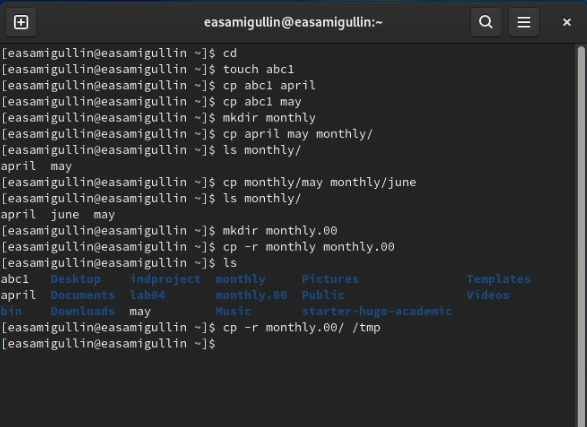{ #fig:001 width=70% }

   2. Выполнил пример 3. (рис. [-@fig:002])

    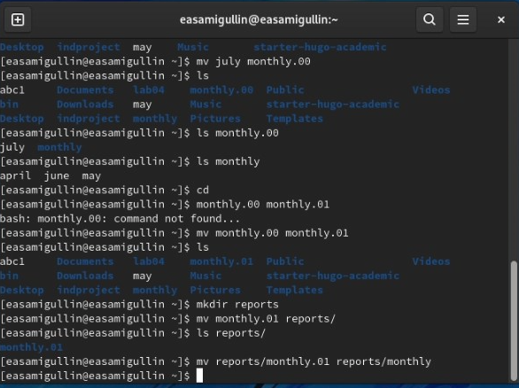{ #fig:002 width=70% }

   3. Выполнил пример 4.(рис. [-@fig:003])
   
   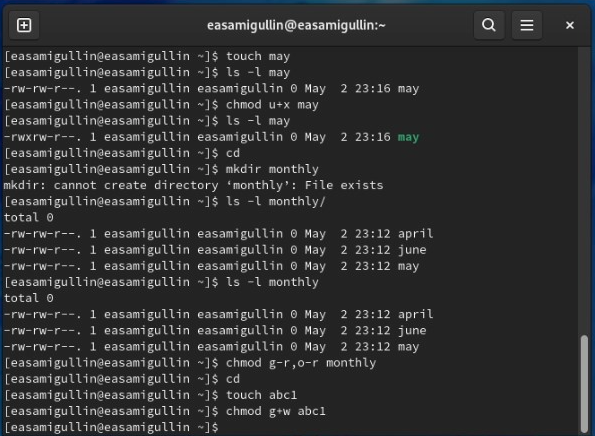{ #fig:003 width=70% }

2.
  1. Скопировал файл io.h и назвал его, как equipment.(рис. [-@fig:004])
   
   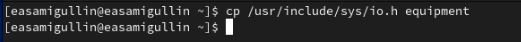{ #fig:004 width=70% }

   2. В домашнем каталоге создал директорию ski.plases.(рис. [-@fig:005])

   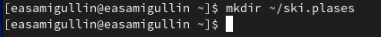{ #fig:005 width=70% }

   3. Переместил файл equipment в /ski.plases.(рис. [-@fig:006])
   
   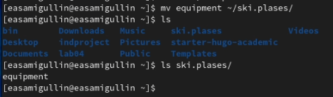{ #fig:006 width=70% }

   4. Переименовал файл equipment в equiplist.(рис. [-@fig:007])

   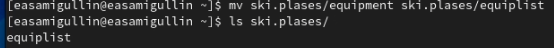{ #fig:007 width=70% }

   5. Создал в домашнем каталоге файл abc1 и скопировал его в /ski.plases и назвал его equiplist2.(рис. [-@fig:008])

    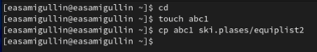{ #fig:008 width=70% }

   6. Создал каталог с именем equipment в каталоге /ski.plases.(рис. [-@fig:009])

   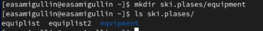{ #fig:009 width=70% }

   7. Переместил файлы equiplist и equiplist2 в каталог equipment.(рис. [-@fig:010])

   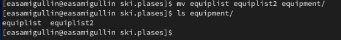{ #fig:010 width=70% }

   8. Создал и переместил каталог /newdir в /ski.plases и назвал его plans.(рис. [-@fig:011])

   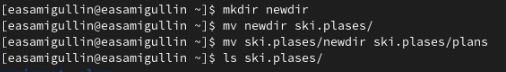{ #fig:011 width=70% }

3. Создал нужные файлы и задал им определенные права.(рис. [-@fig:012])

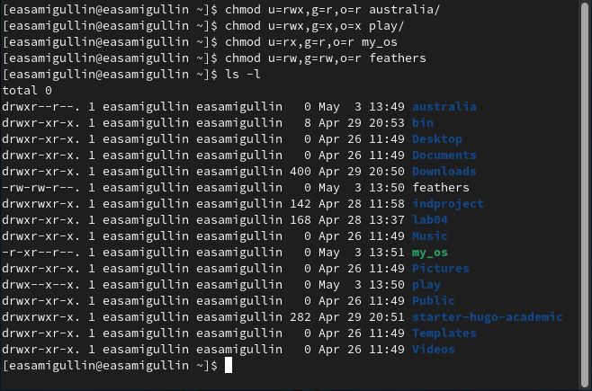{ #fig:012 width=70% }

4. 
   1. Попытался просмотреть содержимое /etc/password, Но такого файла не существует.(рис. [-@fig:013])

   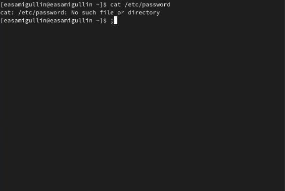{ #fig:013 width=70% }

   2. Скопировал файл feathers в файл file.old.(рис. [-@fig:014])
   
   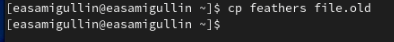{ #fig:014 width=70% }

   3. Переместил файл file.old в каталог play(рис. [-@fig:015])
   
   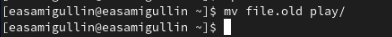{ #fig:015 width=70% }
   
   4. Скопировал каталог play В каталог fun. Неуспешно из-за выданных прав.(рис. [-@fig:016])
   
   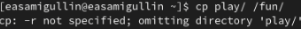{ #fig:016 width=70% }
   
   5. Переместил каталог fun В каталог play и назвал games.(рис. [-@fig:017])
   
   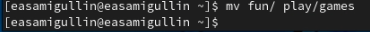{ #fig:017 width=70% }
   
   6. Лишил владельца файла feathers права на чтение.(рис. [-@fig:018])
   
   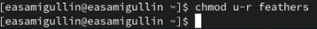{ #fig:018 width=70% }
   
   7. Попытался просмотреть файл feathers с помощью команды cat.(рис. [-@fig:019])
   
   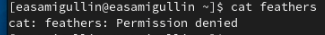{ #fig:019 width=70% }
   
   8. Попытался скопировать файл. Неуспешно.(рис. [-@fig:020])
   
   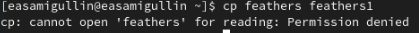{ #fig:020 width=70% }
   
   9.  Дал владельцу файла feathers права на чтение.(рис. [-@fig:021])
   
   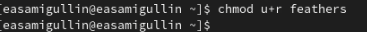{ #fig:021 width=70% }
   
   10. Лишил владельца каталога play на выполнение.(рис. [-@fig:022])
   
   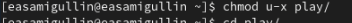{ #fig:022 width=70% }
   
   11. Перешел в каталог. Неуспешно из-за того, что права доступы не позволяют нам войти.(рис. [-@fig:023])
   
   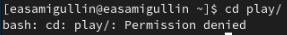{ #fig:023 width=70% }
   
   12. Дал владельцу каталога play право на выполнение.(рис. [-@fig:024])

    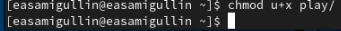{ #fig:024 width=70% }

5. 1. Просмотрел команду mount с помощью man.(рис. [-@fig:025])
   
   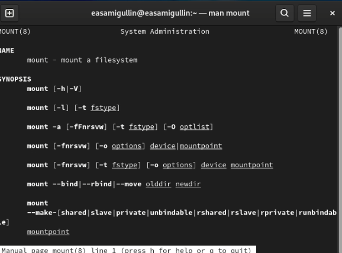{ #fig:025 width=70% }
   
   1. Просмотрел команду fsck с помощью man.(рис. [-@fig:026])
   
   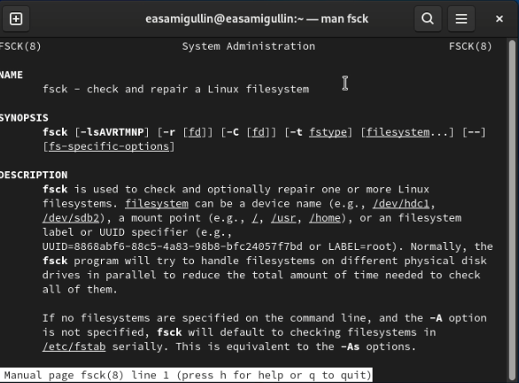{ #fig:026 width=70% }
   
   1. Просмотрел команду mkfs с помощью man.(рис. [-@fig:027])
   
   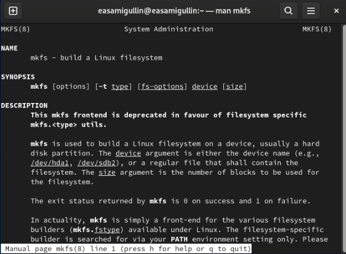{ #fig:027 width=70% }
   
   1. Просмотрел команду kill с помощью man.(рис. [-@fig:028])

    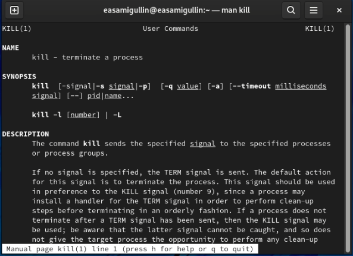{ #fig:028 width=70% }

# Вывод

Во время лабораторной работы, мы ознакомились с файловой системой, её структурой, именами и содержанием каталогов и приобрели практические навыки по применению команд  для работы с файлами и каталогами, по управлению процессами (и работами), по проверке использования диска и обслуживанию файловой системы.

