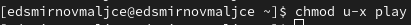

---
## Front matter
title: "Отчёт по лабораторной работе №5"
subtitle: "Анализ файловой системы Linux. Команды для работы с файлами и каталогами"
author: "Самигуллин Эмиль Артурович"

## Generic otions
lang: ru-RU
toc-title: "Содержание"

## Bibliography
bibliography: bib/cite.bib
csl: pandoc/csl/gost-r-7-0-5-2008-numeric.csl

## Pdf output format
toc-depth: 2
fontsize: 12pt
linestretch: 1.5
papersize: a4
documentclass: scrreprt
## I18n polyglossia
polyglossia-lang:
  name: russian
  options:
	- spelling=modern
	- babelshorthands=true
polyglossia-otherlangs:
  name: english
## I18n babel
babel-lang: russian
babel-otherlangs: english
## Fonts
mainfont: PT Serif
romanfont: PT Serif
sansfont: PT Sans
monofont: PT Mono
mainfontoptions: Ligatures=TeX
romanfontoptions: Ligatures=TeX
sansfontoptions: Ligatures=TeX,Scale=MatchLowercase
monofontoptions: Scale=MatchLowercase,Scale=0.9
## Biblatex
biblatex: true
biblio-style: "gost-numeric"
biblatexoptions:
  - parentracker=true
  - backend=biber
  - hyperref=auto
  - language=auto
  - autolang=other*
  - citestyle=gost-numeric
## Pandoc-crossref LaTeX customization
figureTitle: "Рис."
tableTitle: "Таблица"
listingTitle: "Листинг"
lofTitle: "Список иллюстраций"
lolTitle: "Листинги"
## Misc options
indent: true
header-includes:
  - \usepackage{indentfirst}
  - \usepackage{float} # keep figures where there are in the text
  - \floatplacement{figure}{H} # keep figures where there are in the text
---

# Цель работы

* Ознакомление с файловой системой Linux, её структурой, именами и содержанием
каталогов. Приобретение практических навыков по применению команд для работы
с файлами и каталогами, по управлению процессами (и работами), по проверке использования диска и обслуживанию файловой системы.

# Теоретическое введение

Для создания текстового файла можно использовать команду touch. Формат команды:

```
$ touch имя-файла
```

Для просмотра файлов небольшого размера можно использовать команду cat. Формат команды:

```
$ cat имя-файла
```

Для просмотра файлов постранично удобнее использовать команду less. Формат команды:

```
$ less имя-файла
```

Следующие клавиши используются для управления процессом просмотра:
– Space — переход к следующей странице,
– ENTER — сдвиг вперёд на одну строку,
– b — возврат на предыдущую страницу,
– h — обращение за подсказкой,
– q — выход из режима просмотра файла.

Команда head выводит по умолчанию первые 10 строк файла. Формат команды:

```
$ head [-n] имя-файла,
```

где n — количество выводимых строк.

Команда tail выводит умолчанию 10 последних строк файла. Формат команды:

```
$ tail [-n] имя-файла,
```

где n — количество выводимых строк.

Команда cp используется для копирования файлов и каталогов.
Формат команды:

```
$ cp [-опции] исходный_файл целевой_файл
```

Команды mv и mvdir предназначены для перемещения и переименования файлов
и каталогов.
Формат команды mv:

```
$ mv [-опции] старый_файл новый_файл
```

Каждый файл или каталог имеет права доступа.
В сведениях о файле или каталоге указываются:
– тип файла (символ (-) обозначает файл, а символ (d) — каталог);
– права для владельца файла (r — разрешено чтение, w — разрешена запись, x — разрешено выполнение, - — право доступа отсутствует);
– права для членов группы (r — разрешено чтение, w — разрешена запись, x — разрешено
выполнение, - — право доступа отсутствует);
– права для всех остальных (r — разрешено чтение, w — разрешена запись, x — разрешено
выполнение, - — право доступа отсутствует).

Права доступа к файлу или каталогу можно изменить, воспользовавшись командой
chmod. Сделать это может владелец файла (или каталога) или пользователь с правами
администратора.
Формат команды:

```
$ chmod режим имя_файла
```

Режим (в формате команды) имеет следующие компоненты структуры и способ записи:

= установить право

\- лишить права

\+ дать право

r чтение

w запись

x выполнение

u (user) владелец файла

g (group) группа, к которой принадлежит владелец файла

o (others) все остальные

В работе с правами доступа можно использовать их цифровую запись (восьмеричное
значение) вместо символьной.

Файловая система в Linux состоит из фалов и каталогов. Каждому физическому носителю соответствует своя файловая система.
Существует несколько типов файловых систем. Перечислим наиболее часто встречающиеся типы:
– ext2fs (second extended filesystem);
– ext2fs (third extended file system);
– ext4 (fourth extended file system);
– ReiserFS;
– xfs;
– fat (file allocation table);
– ntfs (new technology file system).

Для просмотра используемых в операционной системе файловых систем можно воспользоваться командой mount без параметров. В результате её применения можно
получить примерно следующее:

```
$ mount

proc on /proc type proc (rw)
sysfs on /sys type sysfs (rw,nosuid,nodev,noexec)
udev on /dev type tmpfs (rw,nosuid)
devpts on /dev/pts type devpts (rw,nosuid,noexec)
/dev/sda1 on /mnt/a type ext3 (rw,noatime)
/dev/sdb2 on /mnt/docs type reiserfs (rw,noatime)
shm on /dev/shm type tmpfs (rw,noexec,nosuid,nodev)
usbfs on /proc/bus/usb type usbfs
(rw,noexec,nosuid,devmode=0664,devgid=85)
binfmt_misc on /proc/sys/fs/binfmt_misc type binfmt_misc
(rw,noexec,nosuid,nodev)
nfsd on /proc/fs/nfs type nfsd (rw,noexec,nosuid,nodev)
```

В данном случае указаны имена устройств, названия соответствующих им точек монтирования (путь), тип файловой системы и параметрами монтирования.
В контексте команды mount устройство — специальный файл устройства, с помощью
которого операционная система получает доступ к аппаратному устройству. Файлы
устройств обычно располагаются в каталоге /dev, имеют сокращённые имена (например,
sdaN, sdbN или hdaN, hdbN, где N — порядковый номер устройства, sd — устройства SCSI,
hd — устройства MFM/IDE).
Точка монтирования — каталог (путь к каталогу), к которому присоединяются файлы
устройств.
Другой способ определения смонтированных в операционной системе файловых систем — просмотр файла/etc/fstab. Сделать это можно например с помощью команды
cat:

```
$ cat /etc/fstab

/dev/hda1 / ext2 defaults 1 1
/dev/hda5 /home ext2 defaults 1 2
/dev/hda6 swap swap defaults 0 0
/dev/hdc /mnt/cdrom auto umask=0,user,noauto,ro,exec,users 0 0
none /mnt/floppy supermount dev=/dev/fd0,fs=ext2:vfat,--,
sync,umask=0 0 0
none /proc proc defaults 0 0
none /dev/pts devpts mode=0622 0 0
```

В каждой строке этого файла указано:
– имя устройство;
– точка монтирования;
– тип файловой системы;
– опции монтирования;
– специальные флаги для утилиты dump;
– порядок проверки целостности файловой системы с помощью утилиты fsck.
Для определения объёма свободного пространства на файловой системе можно воспользоваться командой df, которая выведет на экран список всех файловых систем
в соответствии с именами устройств, с указанием размера и точки монтирования. Например:

```
$ df

Filesystem 1024-blocks Used Available Capacity Mounted on
/dev/hda3 297635 169499 112764 60% /
```

С помощью команды fsck можно проверить (а в ряде случаев восстановить) целостность файловой системы:
Формат команды:

```
$ fsck имя_устройства
```

# Выполнение лабораторной работы

1. Выполнил примеры из указаний к работе.

  1.1. Создал файл abc1 и скопировал его в файлы april и may.(рис. 1)

<figure>
	
	<figcaption>рис 1.</figcaption>
<figure>

  1.2. Скопировал april и may в каталог monthly.(рис. 2)
  
<figure>
	
	<figcaption>рис. 2.</figcaption>
<figure>
	
  1.3. Скопировал may в june(рис. 3)

<figure>
	
	<figcaption>рис 3.</figcaption>
<figure>

  1.4. Скопировал каталог monthly в monthly.00.(рис. 4)

<figure>
	
	<figcaption>рис 4.</figcaption>
<figure>

  1.5. Скопировал каталог monthly.00 в /tmp.(рис. 5)
				
<figure>
	
	<figcaption>рис 5.</figcaption>
<figure>

  1.6. Переименовал файл april в july.(рис. 6)
				
<figure>
	
	<figcaption>рис 6.</figcaption>
<figure>

  1.7. Переместил файл july в каталог monthly.00.(рис. 7)
		
<figure>
	
	<figcaption>рис 7.</figcaption>
<figure>

  1.8. Переименовал каталог monthly.00 в monthly.01.(рис. 8)

<figure>
	
	<figcaption>рис 8.</figcaption>
<figure>

  1.9. Переместил каталог monthly.01 в каталог reports.(рис. 9)
		
<figure>
	
	<figcaption>рис 9.</figcaption>
<figure>

  1.10. Переименовал каталог reports/monthly.01 в reports/monthly.(рис. 10)
		
<figure>
	
	<figcaption>рис 10.</figcaption>
<figure>

  1.11. Создал файл ~/may с правом выполнения для владельца.(рис. 11)

<figure>
	
	<figcaption>рис 11.</figcaption>
<figure>

  1.12. Лишил владельца файла ~/may права на выполнение.(рис. 12)
		
<figure>
	
	<figcaption>рис 12.</figcaption>
<figure>

  1.13. Создал каталог monthly с запретом на чтение для членов группы и всех остальных пользователей(рис. 13)

<figure>
	
	<figcaption>рис 13.</figcaption>
<figure>

  1.14. Создал файл ~/abc1 с правом записи для членов группы.(рис. 14)

<figure>
	
	<figcaption>рис 14.</figcaption>
<figure>

  1.15. Проверил целостность файловой системы.(рис. 15)

<figure>
	
	<figcaption>рис 15.</figcaption>
<figure>
		
2. Выполнил следующие действия:

 2.1.Скопировал файл /usr/include/sys/io.h в домашний каталог и назовал его equipment(рис. 16)
		
<figure>
	
	<figcaption>рис 16.</figcaption>
<figure>

  2.2. В домашнем каталоге создал директорию ~/ski.plases.(рис. 17)
		
<figure>
	
	<figcaption>рис 17.</figcaption>
<figure>

  2.3. Переместил файл equipment в каталог ~/ski.plases.(рис. 18)
		
<figure>
	
	<figcaption>рис 18.</figcaption>
<figure>

  2.4. Переименовал файл ~/ski.plases/equipment в ~/ski.plases/equiplist.(рис. 19)
		
<figure>
	
	<figcaption>рис 19.</figcaption>
<figure>

  2.5. Создал в домашнем каталоге файл abc1 и скопировал его в каталог ~/ski.plases, назовите его equiplist2.(рис. 20)

<figure>
	
	<figcaption>рис 20.</figcaption>
<figure>

  2.6. Создал каталог с именем equipment в каталоге ~/ski.plases.(рис. 21)

<figure>
	
	<figcaption>рис 21.</figcaption>
<figure>

  2.7. Переместил файлы ~/ski.plases/equiplist и equiplist2 в каталог ~/ski.plases/equipment.(рис. 22)

<figure>
	
	<figcaption>рис 22.</figcaption>
<figure>

  2.8. Создал и переместил каталог ~/newdir в каталог ~/ski.plases и назвал его plans.(рис. 23)

<figure>
	
	<figcaption>рис 23.</figcaption>
<figure>

3. Определите опции команды chmod, необходимые для того, чтобы присвоить перечисленным ниже файлам выделенные права доступа, считая, что в начале таких прав
нет:
  * drwxr--r-- ... australia
  * drwx--x--x ... play
  * -r-xr--r-- ... my_os
  * -rw-rw-r-- ... feathers (рис. 24)

<figure>
	
	<figcaption>рис 24.</figcaption>
<figure>

4. Проделал следующие упражнения:

  4.1. Просмотрел содержимое файла /etc/passwd.(рис. 25)

<figure>
	
	<figcaption>рис 25.</figcaption>
<figure>

  4.2. Скопировал файл ~/feathers в файл ~/file.old.(рис. 26)

<figure>
	
	<figcaption>рис 26.</figcaption>
<figure>

  4.3. Переместил файл ~/file.old в каталог ~/play.(рис. 27)

<figure>
	
	<figcaption>рис 27.</figcaption>
<figure>

  4.4. Скопировал каталог ~/play в каталог ~/fun.(рис. 28)

<figure>
	
	<figcaption>рис 28.</figcaption>
<figure>

  4.5. Переместил каталог ~/fun в каталог ~/play и назвал его games.(рис. 29)

<figure>
	
	<figcaption>рис 29.</figcaption>
<figure>

  4.6. Лишил владельца файла ~/feathers права на чтение.(рис. 31)

<figure>
	
	<figcaption>рис 31.</figcaption>
<figure>

  4.7. Попытался просмотреть файл ~/feathers командой cat, но у меня не получилось, поскольку нет на это прав.(рис. 32)

<figure>
	
	<figcaption>рис 32.</figcaption>
<figure>

  4.8. Попытался скопировать файл ~/feathers, но у меня не получилось, поскольку нет на это прав.(рис. 33)

<figure>
	
	<figcaption>рис 33.</figcaption>
<figure>

  4.9. Дал владельцу файла ~/feathers право на чтение.(рис. 34)

<figure>
	
	<figcaption>рис 34.</figcaption>
<figure>

  4.10. Лишил владельца каталога ~/play права на выполнение.(рис. 35)

<figure>
	
	<figcaption>рис 35.</figcaption>
<figure>

  4.11. Попытался перейти в каталог ~/play, но у меня не получилось, поскольку нет на это прав.(рис. 36)

<figure>
	
	<figcaption>рис 36.</figcaption>
<figure>

  4.12. Дал владельцу каталога ~/play право на выполнение.(рис. 37)

<figure>
	
	<figcaption>рис 37.</figcaption>
<figure>

5. Прочитал man по следующим командам:

  5.1. Все файлы, доступные в системе Unix, расположены в одном большом дереве, файловая иерархия, с корнем в /. Эти файлы могут быть распределены по нескольким устройствам. Команда mount служит для подключения файловой системы, найденной на каком-то устройстве к большому файловому дереву. И наоборот, команда umount отсоединит его снова. Файловая система используется для управления тем, как данные хранится на устройстве или предоставляется виртуальным способом по сети или другим услуги.(рис. 38)

<figure>
	
	<figcaption>рис 38.</figcaption>
<figure>

  5.2. fsck используется для проверки и при необходимости, восстановления одного или нескольких файловых систем. Файловой системой может быть имя устройства (например, /dev/hdc1, /dev/sdb2), точка монтирования (например, /, /usr, /home) или файловая система метка или спецификатор UUID (например, UUID=8868abf6-88c5-4a83-98b8-bfc24057f7bd или LABEL=root). Как правило, программа fsck попытается обработать файловые системы на другом физическом диске диски параллельно, чтобы сократить общее время, необходимое для проверки. Если в командной строке не указаны файловые системы, и параметр -A, fsck по умолчанию будет проверять файловые системы в /etc/fstab последовательно. Это эквивалентно параметрам -As.(рис. 39)

<figure>
	
	<figcaption>рис 39.</figcaption>
<figure>

  5.3. mkfs используется для создания файловой системы Linux на устройстве, обычно на жестком разделе диска. Аргументом является либо имя устройства (например, /dev/hda1, /dev/sdb2), либо обычный файл, который должен содержать файловая система. Аргумент size - это количество блоков, которые будут использоваться для файловой системы. Статус выхода, возвращаемый mkfs, равен 0 при успешном завершении и 1 при сбое.(рис. 40)

<figure>
	
	<figcaption>рис 40.</figcaption>
<figure>

  5.4. Команда kill отправляет указанный сигнал указанным процессам или группе процессов. Если сигнал не указан, отправляется сигнал TERM.  Действие по умолчанию для этого сигнала является завершение процесса. Этот сигнал следует использовать в предпочтении к сигналу KILL (номер 9), поскольку процесс может установить обработчик для терминального сигнала, чтобы выполнить очистку шагов перед завершением упорядоченным образом. Если процесс не завершается после того, как был отправлен сигнал TERM, тогда сигнал KILL может быть использованным; имейте в виду, что последний сигнал не может быть перехвачен, как и не дать целевому процессу возможности выполнить какую-либо очистку перед завершением. Большинство современных оболочек имеют встроенную команду kill, с использованием аналогично описанной здесь команде.(рис. 41)

<figure>
	
	<figcaption>рис 41.</figcaption>
<figure>

# Контрольные вопросы

1. Установленные файловые системы:

  1.1. devtmpfs, tmpfs - виртуальные файловые системы, которые напрямую обращаются к памяти.
  
  1.2. sda1, sda2 - жесткие диски.
  
2. / - КОРЕНЬ - 
Это главный каталог в системе Linux. По сути, это и есть файловая система Linux. Здесь нет дисков или чего-то подобного, как в Windows. Вместо этого, адреса всех файлов начинаются с корня, а дополнительные разделы, флешки или оптические диски подключаются в папки корневого каталога.

Только пользователь root имеет право читать и изменять файлы в этом каталоге. Обратите внимание, что у пользователя root домашний каталог /root, но не сам /.

/BIN - (BINARIES) БИНАРНЫЕ ФАЙЛЫ ПОЛЬЗОВАТЕЛЯ
Этот каталог содержит исполняемые файлы. Здесь расположены программы, которые можно использовать в однопользовательском режиме или режиме восстановления. Одним словом, те утилиты, которые могут использоваться пока еще не подключен каталог /usr/. Это такие общие команды, как cat, ls, tail, ps и т д.

/SBIN - (SYSTEM BINARIES) СИСТЕМНЫЕ ИСПОЛНЯЕМЫЕ ФАЙЛЫ
Так же как и /bin, содержит двоичные исполняемые файлы, которые доступны на ранних этапах загрузки, когда не примонтирован каталог /usr. Но здесь находятся программы, которые можно выполнять только с правами суперпользователя. Это разные утилиты для обслуживания системы. Например, iptables, reboot, fdisk, ifconfig,swapon и т д.

/ETC - (ETCETERA) КОНФИГУРАЦИОННЫЕ ФАЙЛЫ
В этой папке содержатся конфигурационные файлы всех программ, установленных в системе. Кроме конфигурационных файлов, в системе инициализации Init Scripts, здесь находятся скрипты запуска и завершения системных демонов, монтирования файловых систем и автозагрузки программ. Структура каталогов linux в этой папке может быть немного запутанной, но предназначение всех их - настройка и конфигурация.

/DEV - (DEVICES) ФАЙЛЫ УСТРОЙСТВ
В Linux все, в том числе внешние устройства являются файлами. Таким образом, все подключенные флешки, клавиатуры, микрофоны, камеры - это просто файлы в каталоге /dev/. Этот каталог содержит не совсем обычную файловую систему. Структура файловой системы Linux и содержащиеся в папке /dev файлы инициализируются при загрузке системы, сервисом udev. Выполняется сканирование всех подключенных устройств и создание для них специальных файлов. Это такие устройства, как: /dev/sda, /dev/sr0, /dev/tty1, /dev/usbmon0 и т д.

/PROC - (PROCCESS) ИНФОРМАЦИЯ О ПРОЦЕССАХ
Это тоже необычная файловая система, а подсистема, динамически создаваемая ядром. Здесь содержится вся информация о запущенных процессах в реальном времени. По сути, это псевдофайловая система, содержащая подробную информацию о каждом процессе, его Pid, имя исполняемого файла, параметры запуска, доступ к оперативной памяти и так далее. Также здесь можно найти информацию об использовании системных ресурсов, например, /proc/cpuinfo, /proc/meminfo или /proc/uptime. Кроме файлов в этом каталоге есть большая структура папок linux, из которых можно узнать достаточно много информации о системе.

/VAR (VARIABLE) - ПЕРЕМЕННЫЕ ФАЙЛЫ
Название каталога /var говорит само за себя, он должен содержать файлы, которые часто изменяются. Размер этих файлов постоянно увеличивается. Здесь содержатся файлы системных журналов, различные кеши, базы данных и так далее. Дальше рассмотрим назначение каталогов Linux в папке /var/.

3. Чтобы содержимое некоторой файловой системы было доступно операционной системе надо выполнить следующую команду:
```
$ mount <файловая система>
```

4. Отсутствие синхронизации между образом файловой системы в памяти и ее данными на диске в случае аварийной остановки является основной причиной повреждения файловой системы. Исправить повреждения можно следующей командой:
```
$ fsck
```

5. Создать файловую систему можно с помощью следующей команды:
```
$ mkfs <файловая система>
```

6. Cat - выводит содержимое файла на стандартное устройство вывода

7. Cp – копирует директорию или файлы.

8. mv - переименовывает или перемещает файл или директорию

9. Права доступа к файлу или каталогу можно изменить, воспользовавшись командой chmod. Сделать это может владелец файла (или каталога) или пользователь с правами администратора.

# Выводы

* Я ознакомился с файловой системой Linux и изучил основные команды для работы с файлами.
