---
## Front matter
title: "Отчёт по лабораторной работе №6"
subtitle: "НКНбд-02-21"
author: "Самигуллин Эмиль Артурович"

## Generic otions
lang: ru-RU
toc-title: "Содержание"

## Bibliography
bibliography: bib/cite.bib
csl: pandoc/csl/gost-r-7-0-5-2008-numeric.csl

## Pdf output format
toc: true # Table of contents
toc-depth: 2
fontsize: 12pt
linestretch: 1.5
papersize: a4
documentclass: scrreprt
## I18n polyglossia
polyglossia-lang:
  name: russian
  options:
	- spelling=modern
	- babelshorthands=true
polyglossia-otherlangs:
  name: english
## I18n babel
babel-lang: russian
babel-otherlangs: english
## Fonts
mainfont: PT Serif
romanfont: PT Serif
sansfont: PT Sans
monofont: PT Mono
mainfontoptions: Ligatures=TeX
romanfontoptions: Ligatures=TeX
sansfontoptions: Ligatures=TeX,Scale=MatchLowercase
monofontoptions: Scale=MatchLowercase,Scale=0.9
## Biblatex
biblatex: true
biblio-style: "gost-numeric"
biblatexoptions:
  - parentracker=true
  - backend=biber
  - hyperref=auto
  - language=auto
  - autolang=other*
  - citestyle=gost-numeric
## Pandoc-crossref LaTeX customization
figureTitle: "Рис."
tableTitle: "Таблица"
listingTitle: "Листинг"
lofTitle: "Цель Работы"
lotTitle: "Ход Работы"
lolTitle: "Листинги"
## Misc options
indent: true
header-includes:
  - \usepackage{indentfirst}
  - \usepackage{float} # keep figures where there are in the text
  - \floatplacement{figure}{H} # keep figures where there are in the text
---

# Цель работы 

- Ознакомление с инструментами поиска файлов и фильтрации текстовых данных.
- Приобретение практических навыков: по управлению процессами (и заданиями), попроверке использования диска и обслуживанию файловых систем.

# Ход работы

1. Выполнили вход в систему.

2. Записал в файл file.txt названия файлов, содержащихся в /etc и ~.(рис. [-@fig:001],[-@fig:002])

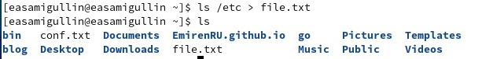{ #fig:001 width=70% }

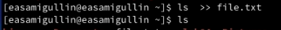{ #fig:002 width=70% }

3. Вывел имена всех файлов из file.txt с расширением .conf и записал в conf.txt.(рис. [-@fig:003])

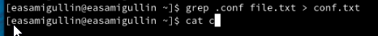{ #fig:003 width=70% }

4. Определил файлы, начинающиеся с символа c. (два способа решения: grep или find).(рис. [-@fig:004]),[-@fig:005])

{ #fig:004 width=70% }

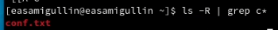{ #fig:005 width=70% }

5. Вывели имена файлов из каталога /etc, начинающиеся с символа h.(рис. [-@fig:006])

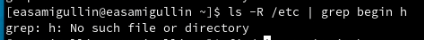{ #fig:006 width=70% }

6. Запустил в фоновом режиме процесс, который записал в файл logfile файлы, имена которых начинаются с log.(рис. [-@fig:007])

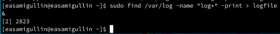{ #fig:007 width=70% }

7. Удалил файл logfile.(рис. [-@fig:008])

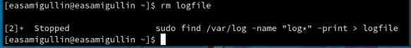{ #fig:008 width=70% }

8. Запустил в фоновом режиме редактор gedit.(рис. [-@fig:009])

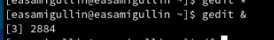{ #fig:009 width=70% }

9.  Определили индентификатор процесса gedit.(рис. [-@fig:010])

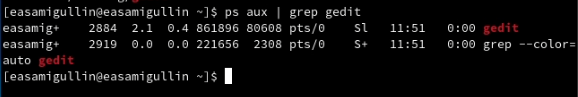{ #fig:010 width=70% }

10.   Прочли справку по kill, и уничтожили процесс gedit.(рис. [-@fig:011])

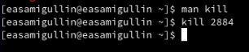{ #fig:011 width=70% }

11.   Выполнили df и du, узнав, что df показывает размер каждого смонтированного раздела диска, а du показывает число килобайт, используемое каждым файлом или каталогом.(рис. [-@fig:012],[-@fig:013])

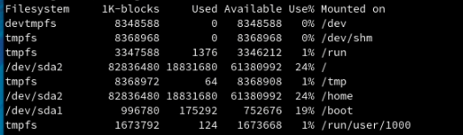{ #fig:012 width=70% }

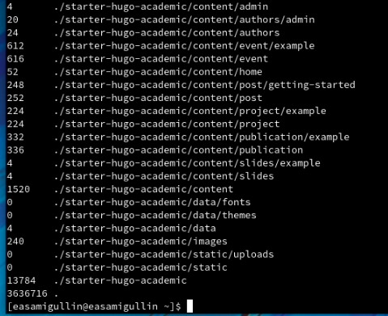{ #fig:013 width=70% }

12.  Воспользовавшись справкой по find, вывели все имена всех директорий в домашнем каталоге.(рис. [-@fig:014], [-@fig:015])

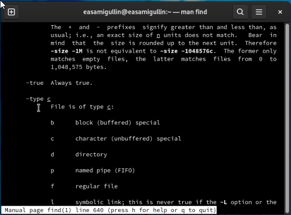{ #fig:014 width=70% }

{ #fig:015 width=70% }

# Вывод

Во время лабораторной работы, мы ознакомились с инструментами поиска файлов и фильтрации текстовых данных и приобрели практических навыков: по управлению процессами (и заданиями), попроверке использования диска и обслуживанию файловых систем.

# Контрольные вопросы

1. stdin — стандартный поток ввода (по умолчанию: клавиатура), файловый дескриптор 0.
   
2. /> - открытие файла для перенаправления потока. />> - файл открывается в режиме добавления.
   
3. Конвейер (pipe) служит для объединения простых команд или утилит в цепочки,в которых результат работы предыдущей команды передаётся последующей. Синтаксис следующий: команда 1 | команда 2 означает, что вывод команды 1 передастся на ввод команде 2.
   
4. Процессы в linux можно описать как контейнеры, в которых хранится вся информация о состоянии и выполнении программы.
   
5. Process IDentifier, PID — уникальный номер (идентификатор процесса. (GID) - обозначает группу, к которой относится пользователь.
   
6. Запущенные фоном программы называются задачами (jobs). Ими можно управлять с помощью команды jobs, которая выводит список запущенных в данный момент задач.
   
7.  top - позволяет выводить информацию о системе, а также список процессов динамически обновляя информацию о потребляемых ими ресурсах. Команда htop похожа на команду top по выполняемой функции: они обе показывают информацию о процессах в реальном времени, выводят данные о потреблении системных ресурсов и позволяют искать, останавливать и управлять процессами. В программе htop реализован очень удобный поиск по процессам, а также их фильтрация.
   
8.  Команда find используется для поиска и отображения имён файлов, соответствующих заданной строке символов. Формат команды: find путь [-опции] Путь определяет каталог, начиная с которого по всем подкаталогам будет вестисьпоиск. Пример: Вывести на экран имена файлов из вашего домашнего каталога и его подкаталогов, начинающихся на f: find ~ -name "f*" -print где ~ — обозначение вашего домашнего каталога, -name — после этой опции указывается имя файла, который нужно найти, "f*" — строка символов, определяющая имя файла, -print — опция, задающая вывод результатов поиска на экран.
   
9.  Можно найти файл по контексту (содержанию) используя комбинацию команд find и grep. find -type f -exec grep -H 'text'.
    
10.  Определить объем свободной памяти на жёстком диске можно с помощью df -h.
    
11.  Определить объем домашнего каталога можно командой du -s.
    
12. Для завершения процесса необходимо выполнить команду kill [номер задач].
    
