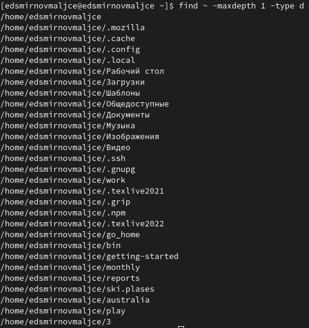

---
## Front matter
title: "Отчёт по лабораторной работе №6"
subtitle: "Поиск файлов. Перенаправление ввода-вывода. Просмотр запущенных процессов"
author: "Самигуллин Эмиль Артурович"

## Generic otions
lang: ru-RU
toc-title: "Содержание"

## Bibliography
bibliography: bib/cite.bib
csl: pandoc/csl/gost-r-7-0-5-2008-numeric.csl

## Pdf output format
toc-depth: 2
fontsize: 12pt
linestretch: 1.5
papersize: a4
documentclass: scrreprt
## I18n polyglossia
polyglossia-lang:
  name: russian
  options:
	- spelling=modern
	- babelshorthands=true
polyglossia-otherlangs:
  name: english
## I18n babel
babel-lang: russian
babel-otherlangs: english
## Fonts
mainfont: PT Serif
romanfont: PT Serif
sansfont: PT Sans
monofont: PT Mono
mainfontoptions: Ligatures=TeX
romanfontoptions: Ligatures=TeX
sansfontoptions: Ligatures=TeX,Scale=MatchLowercase
monofontoptions: Scale=MatchLowercase,Scale=0.9
## Biblatex
biblatex: true
biblio-style: "gost-numeric"
biblatexoptions:
  - parentracker=true
  - backend=biber
  - hyperref=auto
  - language=auto
  - autolang=other*
  - citestyle=gost-numeric
## Pandoc-crossref LaTeX customization
figureTitle: "Рис."
tableTitle: "Таблица"
listingTitle: "Листинг"
lofTitle: "Список иллюстраций"
lolTitle: "Листинги"
## Misc options
indent: true
header-includes:
  - \usepackage{indentfirst}
  - \usepackage{float} # keep figures where there are in the text
  - \floatplacement{figure}{H} # keep figures where there are in the text
---

# Цель работы

* Ознакомление с инструментами поиска файлов и фильтрации текстовых данных.
Приобретение практических навыков: по управлению процессами (и заданиями), по
проверке использования диска и обслуживанию файловых систем..

# Теоретическое введение

## 1. Перенаправление вводда-выывода

В системе по умолчанию открыто три специальных потока:
– stdin — стандартный поток ввода (по умолчанию: клавиатура), файловый дескриптор 0;
– stdout — стандартный поток вывода (по умолчанию: консоль), файловый дескриптор 1;
– stderr — стандартный поток вывод сообщений об ошибках (по умолчанию: консоль),
файловый дескриптор 2.

Большинство используемых в консоли команд и программ записывают результаты
своей работы в стандартный поток вывода stdout. Например, команда ls выводит в стандартный поток вывода (консоль) 
список файлов в текущей директории. Потоки вывода
и ввода можно перенаправлять на другие файлы или устройства. Проще всего это делается
с помощью символов >, >>, <, <<. Рассмотрим пример.
```
# Перенаправление stdout (вывода) в файл.
# Если файл отсутствовал, то он создаётся,
# иначе -- перезаписывается.

# Создаёт файл, содержащий список дерева каталогов.
$ ls -lR > dir-tree.list

$ 1>filename
# Перенаправление вывода (stdout) в файл "filename".
$ 1>>filename
# Перенаправление вывода (stdout) в файл "filename",
# файл открывается в режиме добавления.
$ 2>filename
# Перенаправление stderr в файл "filename".
$ 2>>filename
# Перенаправление stderr в файл "filename",
# файл открывается в режиме добавления.
$ &>filename
# Перенаправление stdout и stderr в файл "filename".
```
## 2. Конвейер
Конвейер (pipe) служит для объединения простых команд или утилит в цепочки, в которых результат работы 
предыдущей команды передаётся последующей. Синтаксис следующий:
```
$ команда 1 | команда 2
# означает, что вывод команды 1 передастся на ввод команде 2
```

Конвейеры можно группировать в цепочки и выводить с помощью перенаправления
в файл, например:
```
$ ls -la |sort > sortilg_list
```

вывод команды ls -la передаётся команде сортировки sort\verb, которая пишет результат в файл sorting_list\verb.
Чаще всего скрипты на Bash используются в качестве автоматизации каких-то рутинных операций в консоли, отсюда 
иногда возникает необходимость в обработке stdout одной команды и передача на stdin другой команде, при этом 
результат выполнения команды должен обработан.
## 3. Поиск файла
Команда find используется для поиска и отображения на экран имён файлов, соответствующих заданной строке символов.
Формат команды:
```
$ find путь [-опции]
```

Путь определяет каталог, начиная с которого по всем подкаталогам будет вестись поиск.
Примеры:

1. Вывести на экран имена файлов из вашего домашнего каталога и его подкаталогов,
начинающихся на f:
```
$ find ~ -name "f*" -print
```

Здесь ~ — обозначение вашего домашнего каталога, -name — после этой опции указывается имя файла, который нужно 
найти, "f*" — строка символов, определяющая имя файла, -print — опция, задающая вывод результатов поиска на экран.

2. Вывести на экран имена файлов в каталоге /etc, начинающихся с символа p:
```
$ find /etc -name "p*" -print
```

3. Найти в Вашем домашнем каталоге файлы, имена которых заканчиваются символом ~ и удалить их:
```
$ find ~ -name "*~" -exec rm "{}" \;
```

Здесь опция -exec rm "{}" \; задаёт применение команды rm ко всем файлам, имена которых соответствуют указанной 
после опции -name строке символов. Для просмотра опций команды find воспользуйтесь командой man.

## 4. Фильтрация текста
Найти в текстовом файле указанную строку символов позволяет команда grep.
Формат команды:
```
$ grep строка имя_файла
```

Кроме того, команда grep способна обрабатывать стандартный вывод других команд
(любой текст). Для этого следует использовать конвейер, связав вывод команды с вводом
grep.
Примеры:
1. Показать строки во всех файлах в вашем домашнем каталоге с именами, начинающимися на f, в которых есть слово begin:
```
$ grep begin f*
```

2. Найти в текущем каталоге все файлы, содержащих в имени «лаб»:
```
$ ls -l | grep лаб
```

## 5. Проверка использования диска
Команда df показывает размер каждого смонтированного раздела диска.
Формат команды:
```
$ df [-опции] [файловая_система]
```

Пример:
```
$ df -vi
```

Команда du показывает число килобайт, используемое каждым файлом или каталогом.
Формат команды:
```
$ du [-опции] [имя_файла...]
```

Пример.
```
$ du -a ~/
```

На afs можно посмотреть использованное пространство командой
```
$ fs quota
```

## 6. Управление задачами
Любую выполняющуюся в консоли команду или внешнюю программу можно запустить
в фоновом режиме. Для этого следует в конце имени команды указать знак амперсанда
&. Например:
```
$ gedit &
```

Будет запущен текстовой редактор gedit в фоновом режиме. Консоль при этом не будет
заблокирована.
Запущенные фоном программы называются задачами (jobs). Ими можно управлять
с помощью команды jobs, которая выводит список запущенных в данный момент задач.
Для завершения задачи необходимо выполнить команду
```
$ kill %номер задачи
```

## 7. Управление процессами
Любой команде, выполняемой в системе, присваивается идентификатор процесса
(process ID). Получить информацию о процессе и управлять им, пользуясь идентификатором процесса, 
можно из любого окна командного интерпретатора.

## 8. Получение информации о процессах
Команда ps используется для получения информации о процессах.
Формат команды:
```
$ ps [-опции]
```

Для получения информации о процессах, управляемых вами и запущенных (работающих или остановленных) на вашем 
терминале, используйте опцию aux.
Пример:
```
$ ps aux
```

Для запуска команды в фоновом режиме необходимо в конце командной строки указать знак & (амперсанд).
Пример работы, требующей много машинного времени для выполнения, и которую
целесообразно запустить в фоновом режиме:
```
$ find /var/log -name "*.log" -print > l.log &
```

# Выполнение лабораторной работы

1. Записал в файл file.txt названия файлов, содержащихся в каталоге /etc.(рис. 1)

<figure>
	
	<figcaption>рис. 1</figcaption>
<figure>

Дописал в этот же файл имена объектов домашнего каталога.(рис. 2)

<figure>
	
	<figcaption>рис. 2</figcaption>
<figure>

2. Вывел имена всех файлов из file.txt, имеющих расширение .conf и записал их в conf.txt.(рис.3)

<figure>
	
	<figcaption>рис. 3</figcaption>
<figure>

3. Двумя способами вывел файлы домашнего каталога, начинающиеся на c.(рис. 4)

<figure>
	
	<figcaption>рис. 4</figcaption>
<figure>

4. Вывел на экран имена файлов каталога /etc, начинающиеся с символа h.
(рис. 5)

<figure>
	
	<figcaption>рис. 5</figcaption>
<figure>

5. Запустил в фоновом режиме процесс, который будет записывать в файл
~/logfile файлы, имена которых начинаются с log.(рис. 6)

<figure>
	
	<figcaption>рис. 6</figcaption>
<figure>

6. Удалил logfile.(рис. 7)

<figure>
	
	<figcaption>рис. 7</figcaption>
<figure>

7. Запустил в фоновом режиме gedit.(рис. 8)

<figure>
	
	<figcaption>рис. 8</figcaption>
<figure>

8. Определил идентификатор процесса gedit 2 способами.(рис. 9.1, 9.2)

<figure>
	
	<figcaption>рис. 9.1</figcaption>
<figure>

<figure>
	
	<figcaption>рис. 9.2</figcaption>
<figure>

9. Завершил процесс gedit.(рис. 10)

<figure>
	
	<figcaption>рис. 10</figcaption>
<figure>

10. С помощью команды df узнал список подключенных устройств, 
информацию о занятом месте (в килобайтах) и точку монтирования.(рис. 11)

<figure>
	
	<figcaption>рис. 11</figcaption>
<figure>

11. С помощью команды du вывел все папки постранично.(рис. 12)

<figure>
	
	<figcaption>рис. 12</figcaption>
<figure>

12. Вывел имена всех директорий домашнего каталога с помощью команды find.
(рис. 13)

<figure>
	
	<figcaption>рис. 13</figcaption>
<figure>

# Ответы на контрольные вопросы
1. В системе по умолчанию открыто три специальных потока:
– stdin — стандартный поток ввода (по умолчанию: клавиатура),
файловый дескриптор 0;
– stdout — стандартный поток вывода (по умолчанию: консоль),
файловый дескриптор 1;
– stderr — стандартный поток вывод сообщений об ошибках
(по умолчанию: консоль), файловый дескриптор 2.

2. \> - создает новый файл; \>\> - дописывает старый.

3. Конвейер - последовательность команд, в которой следующая команда
получает на вход вывод предыдущей команды.

4. Программа - это определенная группа упорядоченных операций,
которые должны быть выполнены. С другой стороны,
экземпляр выполняемой программы является процессом.

5. PID - это идентификатор процесса.
GID — идентификационный номер основной группы пользователя.

6. Задачи - запущенные фоном программы. Ими можно управлять с помощью
команды jobs.

7. Команды top и htop  показывают информацию о процессах в реальном времени,
выводят данные о потреблении системных ресурсов и позволяют искать,
останавливать и управлять процессами.

8. Поиск файлов производится с помощью команды find. Пример:
```
$ find ~ -name "f*" -print
```

9. Найти файл по контексту можно с помощью следующей команды:
```
$ grep -rn '<путь к папке>' -e "шаблон"
```

10. Узнать свободное место на жестком диске можно с помощью следующей
команды:
```
$ df /
```

11. Объем домашнего каталога можно определить с помощью следующей команды:
```
$ df ~
```

12. Удалить зависший процесс можно с помощью следующей команды:
```
$ kill <PID процесса>
```

# Выводы

* Я изучил инструменты поиска файлов и фильтрации текстовых данных.
* Я научился управлять процессами.
* Я научился проверять использование диска и обслуживать файловые системы.
