---
## Front matter
title: "Отчёт по лабораторной работе №7"
subtitle: "НКНбд-02-21"
author: "Самигуллин Эмиль Артурович"

## Generic otions
lang: ru-RU
toc-title: "Содержание"

## Bibliography
bibliography: bib/cite.bib
csl: pandoc/csl/gost-r-7-0-5-2008-numeric.csl

## Pdf output format
toc: true # Table of contents
toc-depth: 2
fontsize: 12pt
linestretch: 1.5
papersize: a4
documentclass: scrreprt
## I18n polyglossia
polyglossia-lang:
  name: russian
  options:
	- spelling=modern
	- babelshorthands=true
polyglossia-otherlangs:
  name: english
## I18n babel
babel-lang: russian
babel-otherlangs: english
## Fonts
mainfont: PT Serif
romanfont: PT Serif
sansfont: PT Sans
monofont: PT Mono
mainfontoptions: Ligatures=TeX
romanfontoptions: Ligatures=TeX
sansfontoptions: Ligatures=TeX,Scale=MatchLowercase
monofontoptions: Scale=MatchLowercase,Scale=0.9
## Biblatex
biblatex: true
biblio-style: "gost-numeric"
biblatexoptions:
  - parentracker=true
  - backend=biber
  - hyperref=auto
  - language=auto
  - autolang=other*
  - citestyle=gost-numeric
## Pandoc-crossref LaTeX customization
figureTitle: "Рис."
tableTitle: "Таблица"
listingTitle: "Листинг"
lofTitle: "Цель Работы"
lotTitle: "Ход Работы"
lolTitle: "Листинги"
## Misc options
indent: true
header-includes:
  - \usepackage{indentfirst}
  - \usepackage{float} # keep figures where there are in the text
  - \floatplacement{figure}{H} # keep figures where there are in the text
---

# Цель работы.

- Освоение основных возможностей командной оболочки Midnight Commander. 
- 
- Приобретение навыков практической работы по просмотру каталогов и файлов; манипуляций с ними.

# Ход работы. Этап №1.

1. Изучил информацию о mc, вызвав в командной строке man mc.(рис. [-@fig:001])

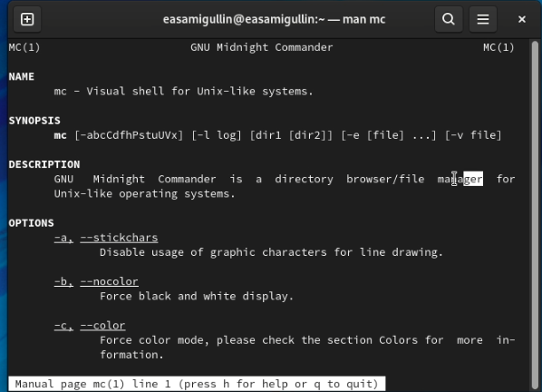{ #fig:001 width=70% }

2. Запустили командную строки mc, изучили его структуру и меню.(рис. [-@fig:002])

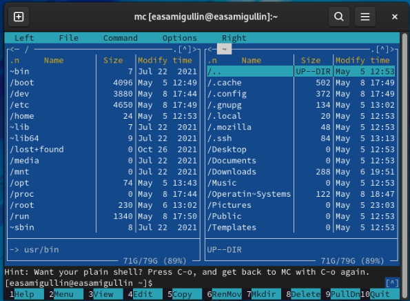{ #fig:002 width=70%}

3. Выполнили несколько операций в mc, используя управляющие клавиши (операции с панелями; выделение/отмена выделения файлов, копирование/перемещение файлов)(рис. [-@fig:003],[-@fig:004])

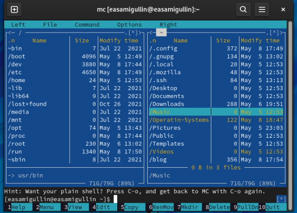{ #fig:003 width=70%}

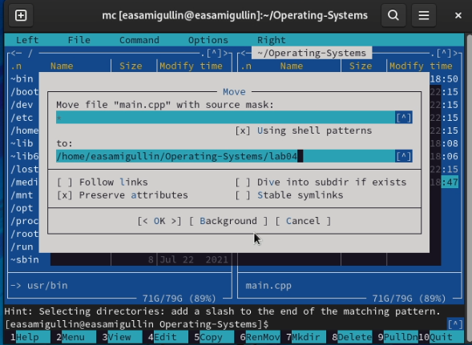{ #fig:004 width=70%}

4. Выполнили основные команды меню левой (или правой) панели. File listing - показывает текущую директорию с возможностью перемещения. Quick view - позволяет увидеть содержимое файлов. Info - выводит информацию о директории и файла. Tree - Выводит дерево с возможностью перемещения по корням. (рис. [-@fig:005])

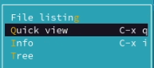{ #fig:005 width=70%}

5. Используя возможности подменю Файл , выполните:

– просмотрели содержимого текстового файла;(рис. [-@fig:006])

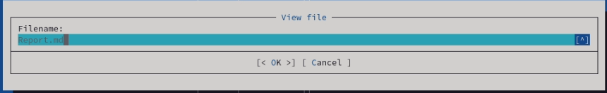{ #fig:006 width=70%}

– редактировал содержимого текстового файла (без сохранения результатов редактирования)(рис. [-@fig:007])

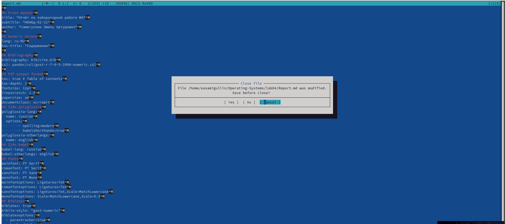{ #fig:007 width=70%}

– создание каталога(рис. [-@fig:008])

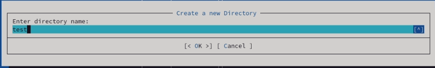{ #fig:008 width=70%}

– копирование в файлов в созданный каталог.(рис. [-@fig:009])

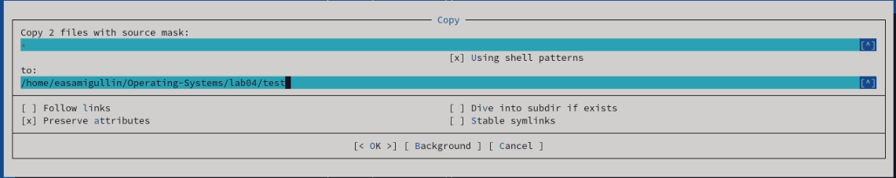{ #fig:009 width=70%}

6. С помощью соответствующих средств подменю Команда осуществите:

– поиск в файловой системе файла с заданными условиями (например, файла с расширением .c или .cpp, содержащего строку main);(рис. [-@fig:010])

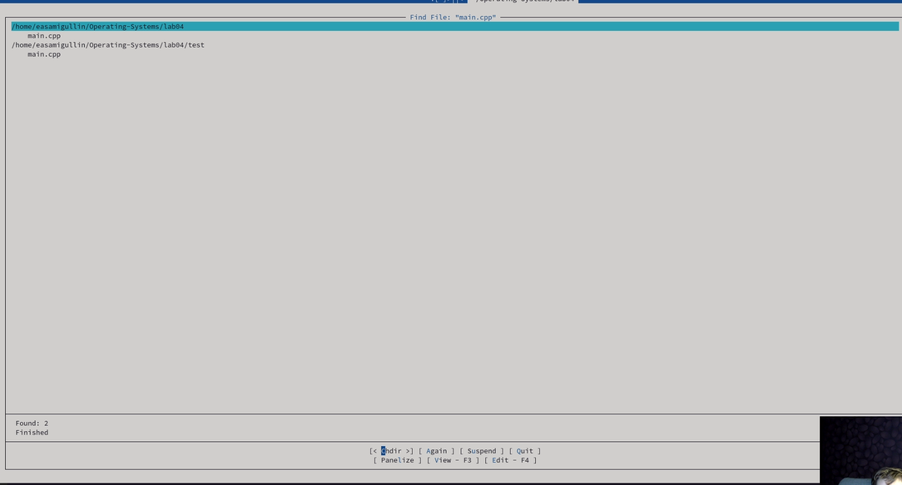{ #fig:010 width=70%}

– выбор и повторение одной из предыдущих команд;(рис. [-@fig:011])

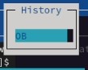{ #fig:011 width=70%}

– переход в домашний каталог;(рис. [-@fig:012])

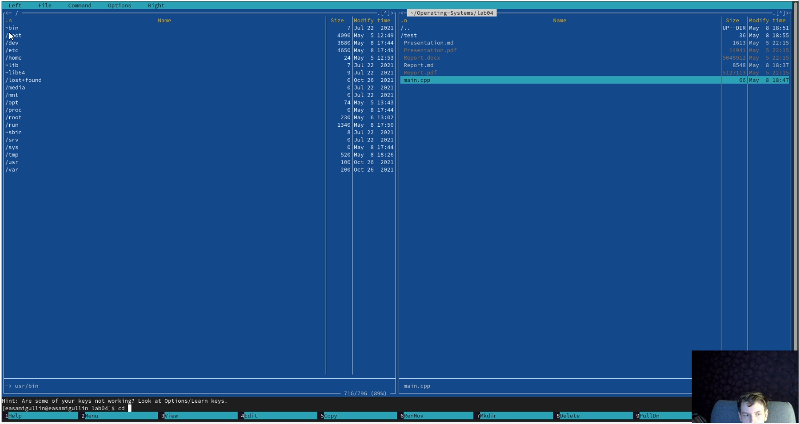{ #fig:012 width=70%}

– анализ файла меню и файла расширений. (Edit extension file, edit menu file).(рис. [-@fig:013], [-@fig:014])

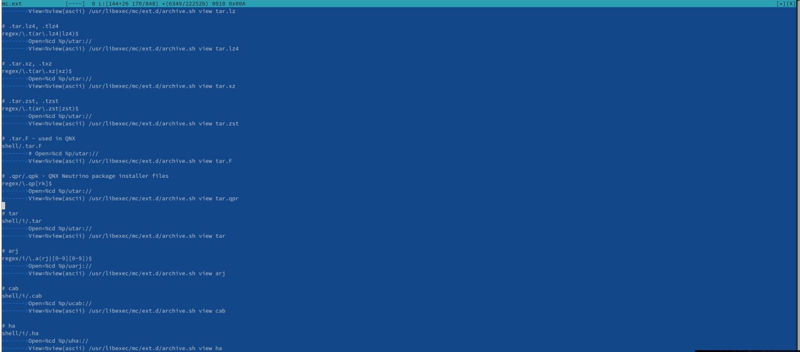{ #fig:013 width=70%}

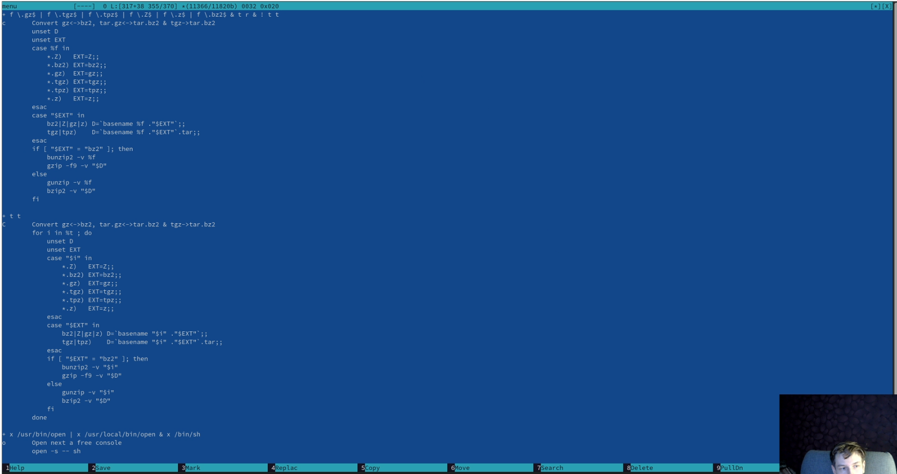{ #fig:014 width=70%}

7. Вызвал подменю Настройки . Освоил операции, определяющие структуру экрана mc (Full screen, Double Width, Show Hidden Files и т.д.)

# Ход работы. Этап №2.

1. Создайте текстовой файл text.txt.(рис. [-@fig:015])

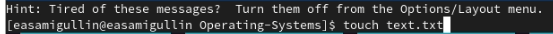{ #fig:015 width=70%}

2. Откройте этот файл с помощью встроенного в mc редактора.
   
3. Вставьте в открытый файл небольшой фрагмент текста, скопированный из любого другого файла или Интернета.(рис. [-@fig:016])

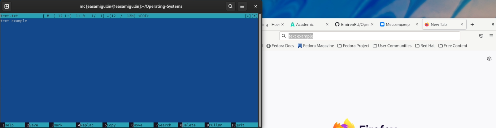{ #fig:016 width=70%}

4. Проделайте с текстом следующие манипуляции, используя горячие клавиши:

4.1. Удалите строку текста.(рис. [-@fig:017])

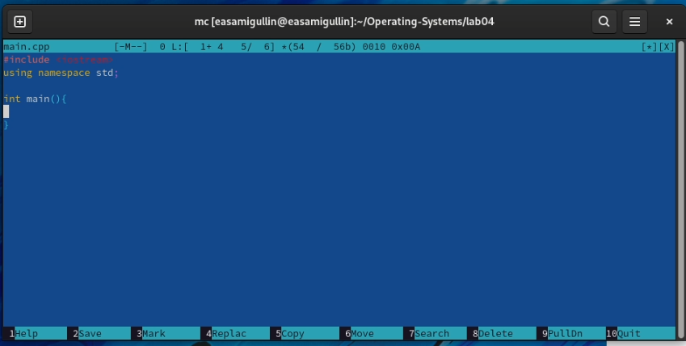{ #fig:017 width=70%}

4.2. Выделите фрагмент текста и скопируйте его на новую строку.(рис. [-@fig:018])

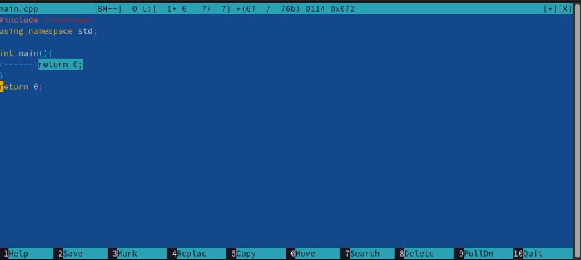{ #fig:018 width=70%}

4.3. Выделите фрагмент текста и перенесите его на новую строку.(рис. [-@fig:019])

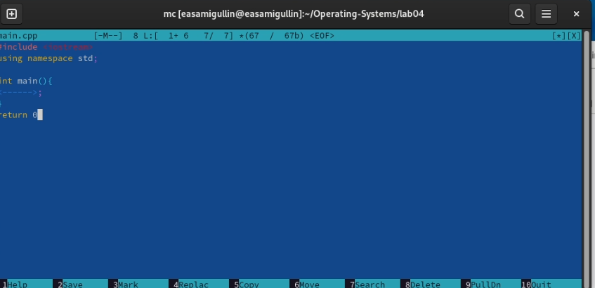{ #fig:019 width=70%}

4.4. Отмените последнее действие.(рис. [-@fig:020])

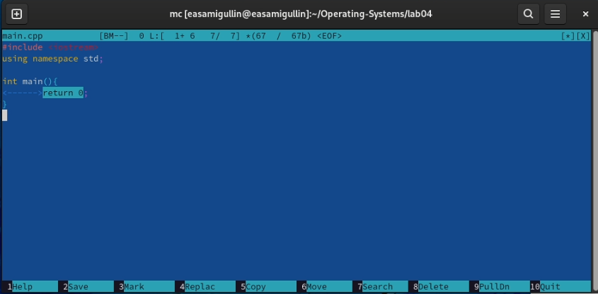{ #fig:020 width=70%}

4.5. Перешли в конец файла (нажав комбинацию клавиш) и напишите некоторый текст и перешли в начало файла (нажав комбинацию клавиш) и напишите некоторый текст. (Команды ctrl+home и ctrl+end)

4.7. Сохраните и закройте файл.(рис. [-@fig:021])

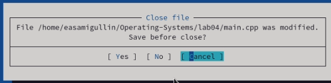{ #fig:021 width=70%}

5. Открыл файл с исходным текстом на некотором языке программирования.
   
6.  Используя меню редактора, выключил подсветку синтаксиса.(рис. [-@fig:022])

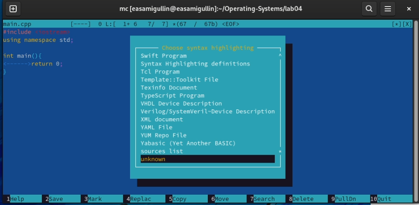{ #fig:022 width=70%}

# Вывод.

Во время лабораторной работы, мы освоили основные возможности командной оболочки Midnight Commander и приобрели навыки практической работы по просмотру каталогов и файлов; манипуляций с ними.

# Контрольные вопросы.

1. Панели могут дополнительно быть переведены в один из двух режимов: Информация или Дерево. В режиме Дерево на одной из панелей выводится структура дерева каталогов. В режиме Информация на панель выводятся сведения о файле и текущей файловой системе, расположенных на активной панели.

2. в (как и в shell) можно переносить копировать и получать информацию о файлах.

3. В меню каждой (левой или правой) панели можно выбрать Формат списка (стандартный, ускоренный, расширенный, определённый пользователем) и порядок сортировки, который позволяет задать критерии сортировки при выводе списка файлов и каталогов: без сортировки, по имени, расширенный, время правки, время доступа, время изменения атрибута, размер, узел..

4. Команды меню Файл : – Просмотр ( F3 ) — позволяет посмотреть содержимое текущего (или выделенного) файла без возможности редактирования. – Просмотр вывода команды ( М + ! ) — функция запроса команды с параметрами (аргумент к текущему выбранному файлу). – Правка ( F4 ) — открывает текущий (или выделенный) файл для его редактирования. – Копирование ( F5 ) — осуществляет копирование одного или нескольких файлов или каталогов в указанное пользователем во всплывающем окне место. – Права доступа ( Ctrl-x c ) — позволяет указать (изменить) права доступа к одному или нескольким файлам или каталогам. – Жёсткая ссылка ( Ctrl-x l ) — позволяет создать жёсткую ссылку к текущему (или выделенному) файлу1. – Символическая ссылка ( Ctrl-x s ) — позволяет создать символическую ссылку к текущему (или выделенному) файлу2. – Владелец/группа ( Ctrl-x o ) — позволяет задать (изменить) владельца и имя группы для одного или нескольких файлов или каталогов. – Права (расширенные) — позволяет изменить права доступа и владения для одного или нескольких файлов или каталогов. – Переименование ( F6 ) — позволяет переименовать (или переместить) один или несколько файлов или каталогов. – Создание каталога ( F7 ) — позволяет создать каталог. – Удалить ( F8 ) — позволяет удалить один или несколько файлов или каталогов. – Выход ( F10 ) — завершает работу .

5. Команды меню Команда : – Дерево каталогов — отображает структуру каталогов системы. – Поиск файла — выполняет поиск файлов по заданным параметрам. – Переставить панели — меняет местами левую и правую панели. – Сравнить каталоги ( Ctrl-x d ) — сравнивает содержимое двух каталогов. – Размеры каталогов — отображает размер и время изменения каталога (по умолчанию в размер каталога корректно не отображается). – История командной строки — выводит на экран список ранее выполненных воболочке команд. – Каталоги быстрого доступа ( Ctrl-\ ) — пр вызове выполняется быстрая смена текущего каталога на один из заданного списка. – Восстановление файлов — позволяет восстановить файлы на файловых системах ext2 и ext3. – Редактировать файл расширений — позволяет задать с помощью определённого синтаксиса действия при запуске файлов с определённым расширением (например, какое программного обеспечение запускать для открытия или редактирования файлов с расширением doc или docx). – Редактировать файл меню — позволяет отредактировать контекстное меню пользователя, вызываемое по клавише F2 . – Редактировать файл расцветки имён — позволяет подобрать оптимальную для пользователя расцветку имён файлов в зависимости от их типа.

6. Конфигурация — позволяет скорректировать настройки работы с панелями. – Внешний вид и Настройки панелей — определяет элементы (строка меню, командная строка, подсказки и прочее), отображаемые при вызове , а также геометрию расположения панелей и цветовыделение. – Биты символов — задаёт формат обработки информации локальным терминалом. – Подтверждение — позволяет установить или убрать вывод окна с запросом подтверждения действий при операциях удаления и перезаписи файлов, а также привыходе из программы. – Распознание клавиш — диалоговое окно используется для тестирования функциональных клавиш, клавиш управления курсором и прочее. – Виртуальные ФС –– настройки виртуальной файловой системы: тайм-аут, пароль и прочее.
   
7. F1 Вызов контекстно-зависимой подсказки F2 Вызов пользовательского меню с возможностью создания и/или дополнения дополнительных функций F3 Просмотр содержимого файла, на который указывает подсветка в активной панели (без возможности редактирования) F4 Вызов встроенного в редактора для изменения содержания файла, на который указывает подсветка в активной панели F5 Копирование одного или нескольких файлов, отмеченных в первой (активной) панели, в каталог, отображаемый на второй панели F6 Перенос одного или нескольких файлов, отмеченных в первой (ак- тивной) панели, в каталог, отображаемый на второй панели F7 Создание подкаталога в каталоге, отображаемом в активной панели F8 Удаление одного или нескольких файлов (каталогов), отмеченных в первой (активной) панели файлов F9 Вызов меню F10 Выход.
   
8. Ctrl-y удалить строку Ctrl-u отмена последней операции Ins вставка/замена F7 поиск (можно использовать регулярные выражения) -F7 повтор последней операции поиска F4 замена F3 первое нажатие — начало выделения, второе — окончание выделения F5 копировать выделенный фрагмент F6 переместить выделенный фрагмент F8 удалить выделенный фрагмент F2 записать изменения в файл F10 выйти из редактора.
   
9.  Можете сохранить часто используемые команды панелизации под отдельными информативными именами, чтобы иметь возможность их быстро вызвать по этим именам. Для этого нужно набрать команду в строке ввода (строка "Команда") и нажать кнопку Добавить. После этого потребуется ввести имя, по которому мы будем вызывать команду. В следующий раз вам достаточно будет выбрать нужное имя из списка, а не вводить всю команду заново.
