---
## Front matter
title: "Отчёт по лабораторной работе №7"
subtitle: "Командная оболочка Midnight Commander"
author: "Самигуллин Эмиль Артурович"

## Generic otions
lang: ru-RU
toc-title: "Содержание"

## Bibliography
bibliography: bib/cite.bib
csl: pandoc/csl/gost-r-7-0-5-2008-numeric.csl

## Pdf output format
toc-depth: 2
fontsize: 12pt
linestretch: 1.5
papersize: a4
documentclass: scrreprt
## I18n polyglossia
polyglossia-lang:
  name: russian
  options:
	- spelling=modern
	- babelshorthands=true
polyglossia-otherlangs:
  name: english
## I18n babel
babel-lang: russian
babel-otherlangs: english
## Fonts
mainfont: PT Serif
romanfont: PT Serif
sansfont: PT Sans
monofont: PT Mono
mainfontoptions: Ligatures=TeX
romanfontoptions: Ligatures=TeX
sansfontoptions: Ligatures=TeX,Scale=MatchLowercase
monofontoptions: Scale=MatchLowercase,Scale=0.9
## Biblatex
biblatex: true
biblio-style: "gost-numeric"
biblatexoptions:
  - parentracker=true
  - backend=biber
  - hyperref=auto
  - language=auto
  - autolang=other*
  - citestyle=gost-numeric
## Pandoc-crossref LaTeX customization
figureTitle: "Рис."
tableTitle: "Таблица"
listingTitle: "Листинг"
lofTitle: "Список иллюстраций"
lolTitle: "Листинги"
## Misc options
indent: true
header-includes:
  - \usepackage{indentfirst}
  - \usepackage{float} # keep figures where there are in the text
  - \floatplacement{figure}{H} # keep figures where there are in the text
---

# Цель работы

* Ознакомление с инструментами поиска файлов и фильтрации текстовых данных.
Приобретение практических навыков: по управлению процессами (и заданиями), по
проверке использования диска и обслуживанию файловых систем..

# Задание

## Задание по mc

1. Изучите информацию о mc, вызвав в командной строке man mc.

2. Запустите из командной строки mc, изучите его структуру и меню.

3. Выполните несколько операций в mc, используя управляющие клавиши
(операции с панелями; выделение/отмена выделения файлов,
копирование/перемещение файлов, получение информации о размере и правах
доступа на файлы и/или каталоги и т.п.)

4. Выполните основные команды меню панелей. Оцените степень
подробности вывода информации о файлах.

5. Используя возможности подменю ```Файл```, выполните: – просмотр содержимого
текстового файла; – редактирование содержимого текстового файла
(без сохранения результатов редактирования); – создание каталога; –
копирование в файлов в созданный каталог.

6. С помощью соответствующих средств подменю ```Команда``` осуществите: – поиск
в файловой системе файла с заданными условиями (например, файла с
расширением .c или .cpp, содержащего строку main); – выбор и повторение
одной из предыдущих команд; – переход в домашний каталог; – анализ файла меню
и файла расширений.

7. Вызовите подменю ```Настройки```. Освойте операции, определяющие структуру
экрана mc (Full screen, Double Width, Show Hidden Files и т.д.).

## Задание по встроенному редактору mc

1. Создайте текстовой файл text.txt.

2. Откройте этот файл с помощью встроенного в mc редактора.

3. Вставьте в открытый файл небольшой фрагмент текста, скопированный из
любого другого файла или Интернета.

4. Проделайте с текстом следующие манипуляции, используя горячие клавиши:
- Удалите строку текста.
- Выделите фрагмент текста и скопируйте его на новую строку.
- Выделите фрагмент текста и перенесите его на новую строку.
- Сохраните файл.
- Отмените последнее действие.
- Перейдите в конец файла (нажав комбинацию клавиш) и напишите некоторый текст.
- Перейдите в начало файла (нажав комбинацию клавиш) и напишите некоторый текст.
- Сохраните и закройте файл.

5. Откройте файл с исходным текстом на некотором языке программирования
(например C или Java).

6. Используя меню редактора, включите подсветку синтаксиса, если она не
включена, или выключите, если она включена.

# Теоретическое введение

GNU Midnight Commander (mc) — один из файловых менеджеров с текстовым
интерфейсом типа Norton Commander для UNIX-подобных операционных систем,
а также Microsoft Windows и Windows NT, OS/2, macOS (но не Mac OS 9).
Создан в 1994 году Мигелем де Икасой.

Midnight Commander (GNU Midnight Commander) является частью проекта GNU,
и все разработчики передали свои права на программу в пользу
Free Software Foundation.


## Возможности

- Работа с различными архивами и образами файловых систем, как если бы они
являлись обычными каталогами.
- Работа с сетевыми файловыми системами Samba, FTP, SFTP.
- Выполнение операций копирования и перемещения файлов в фоновом режиме.
- Встроенный текстовый редактор с подсветкой синтаксиса.
- Текстовый режим, основанный на библиотеках ncurses и S-Lang.
Это позволяет программе работать как в консоли, так и в различных эмуляторах
терминала и через удалённые соединения, например, по протоколу SSH.
Поддерживает мышь.
- Поддержка многоязыкового интерфейса.
- Поддержка кодировки UTF-8 (начиная с 2009 года).
- Настраиваемое пользовательское меню, вызывается по ```F2```.
Каждый пункт меню выполняет набор команд оболочки (shell).
Команды прописываются в файл ~/.config/mc/.mc.menu (или ~/.config/mc/menu).
- Список каталогов для быстрого доступа, вызывается по ```Ctrl+\```.
Настраивается непосредственно в панели быстрого доступа,
либо редактированием файла ~/.config/mc/hotlist.

# Выполнение лабораторной работы

1. Изучил информацию о mc, вызвав в командной строке man mc. (рис. 1)

<figure>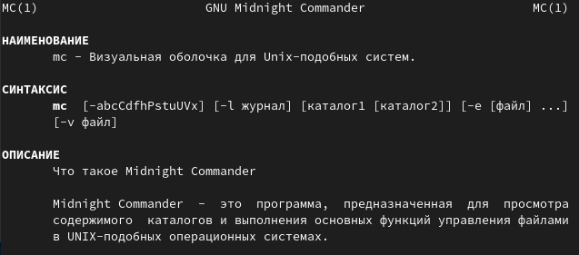
	
	<figcaption>рис. 1</figcaption>
<figure>

2. Запустил из командной строки mc, изучите его структуру и меню. (рис. 2)

<figure>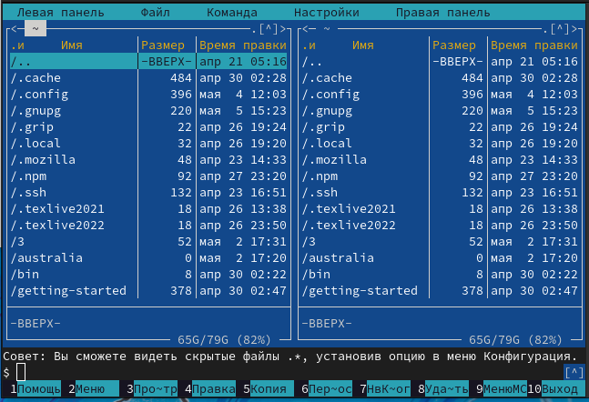
	
	<figcaption>рис. 2</figcaption>
<figure>

3. Выполнил несколько операций в mc, используя управляющие клавиши
- выделение/отмена выделения файлов (рис. 3)
- копирование/перемещение файлов (рис. 4)
- получение информации о размере и правах доступа на файлы и/или каталоги и т.п.). (рис. 5)

<figure>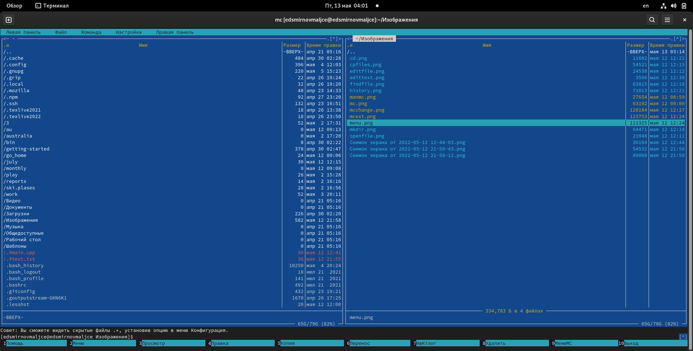
	
	<figcaption>рис. 3</figcaption>
<figure>

<figure>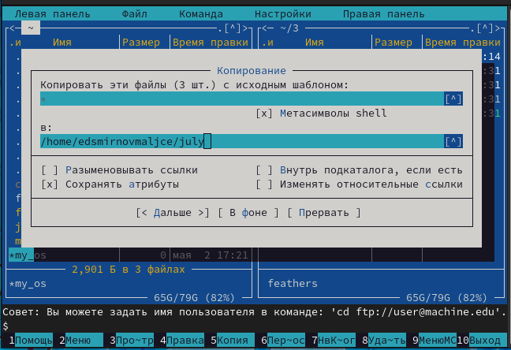
	
	<figcaption>рис. 4</figcaption>
<figure>

<figure>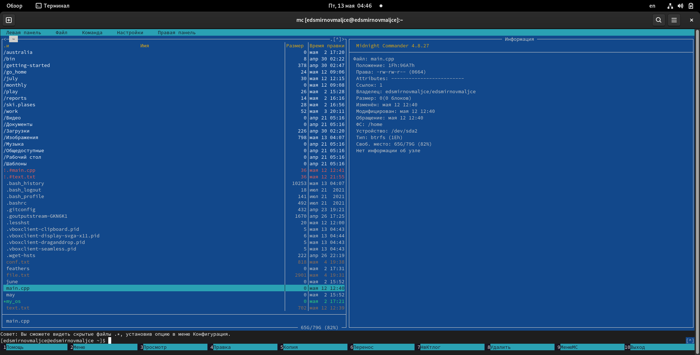
	
	<figcaption>рис. 5</figcaption>
<figure>

4. Выполнил основные команды меню панелей. Информация, выводимая mc, также полна,
как и выводимая с помощью команды ls.

5. Используя возможности подменю ```Файл```, выполнил следующее: 
– просмотр содержимого текстового файла (рис. 6)
– редактирование содержимого текстового файла (без сохранения результатов редактирования) (рис. 7)
– создание каталога (рис. 8)
– копирование в файлов в созданный каталог (рис. 9).

<figure>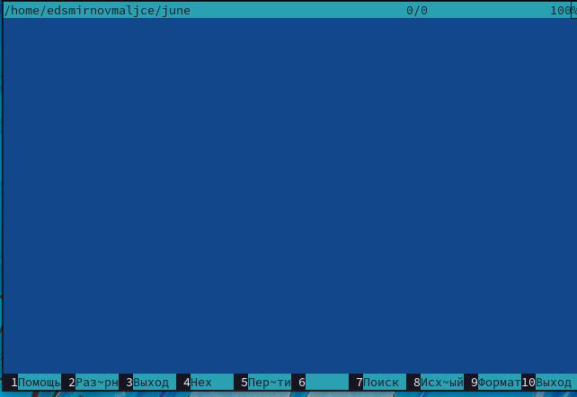
	
	<figcaption>рис. 6</figcaption>
<figure>

<figure>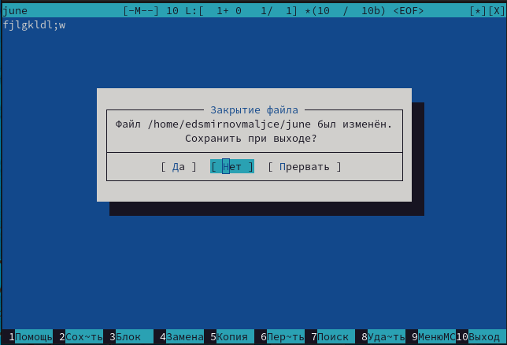
	
	<figcaption>рис. 7</figcaption>
<figure>

<figure>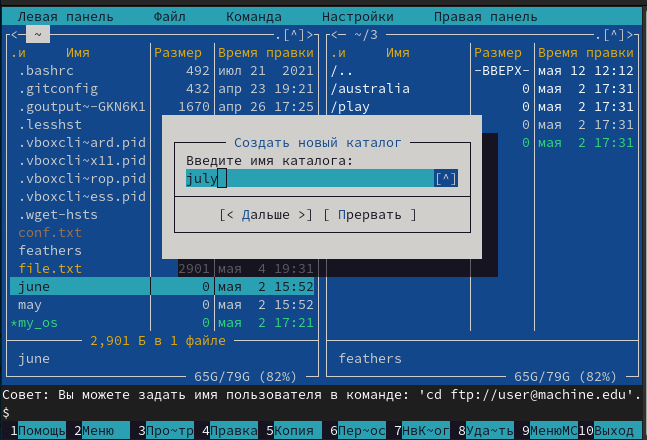
	
	<figcaption>рис. 8</figcaption>
<figure>

<figure>
	
	<figcaption>рис. 9</figcaption>
<figure>

6. С помощью соответствующих средств подменю ```Команда``` осуществил следующее: 
– поиск в файловой системе файла .cpp, содержащего строку main (рис. 10)
– выбор и повторение одной из предыдущих команд (рис. 11)
– переход в домашний каталог (рис. 12)
– анализ файла меню (рис. 13) и файла расширений (рис. 14).


<figure>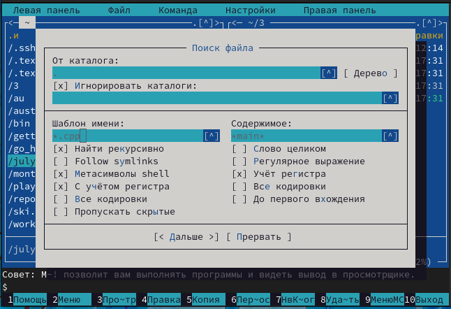
	
	<figcaption>рис. 10</figcaption>
<figure>

<figure>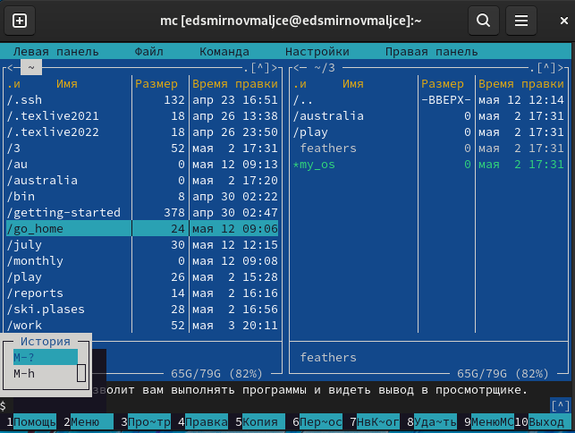
	
	<figcaption>рис. 11</figcaption>
<figure>

<figure>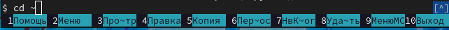
	
	<figcaption>рис. 12</figcaption>
<figure>

<figure>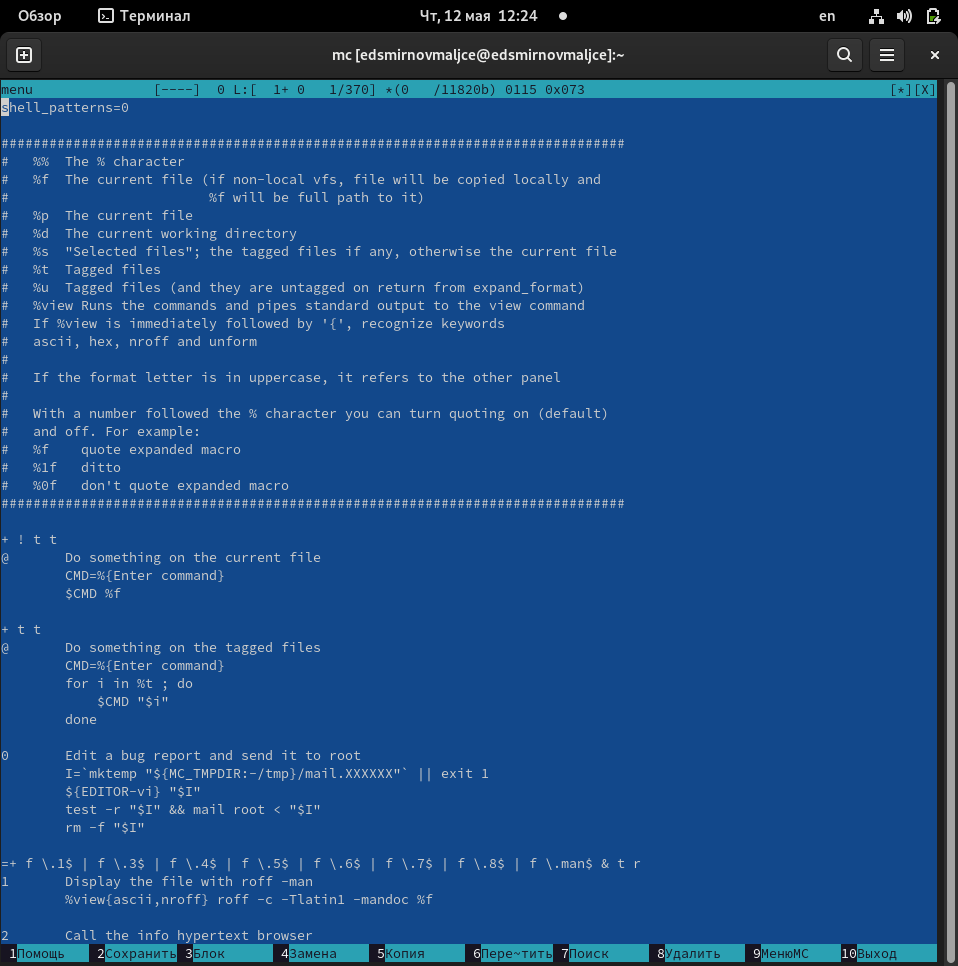
	
	<figcaption>рис. 13</figcaption>
<figure>

<figure>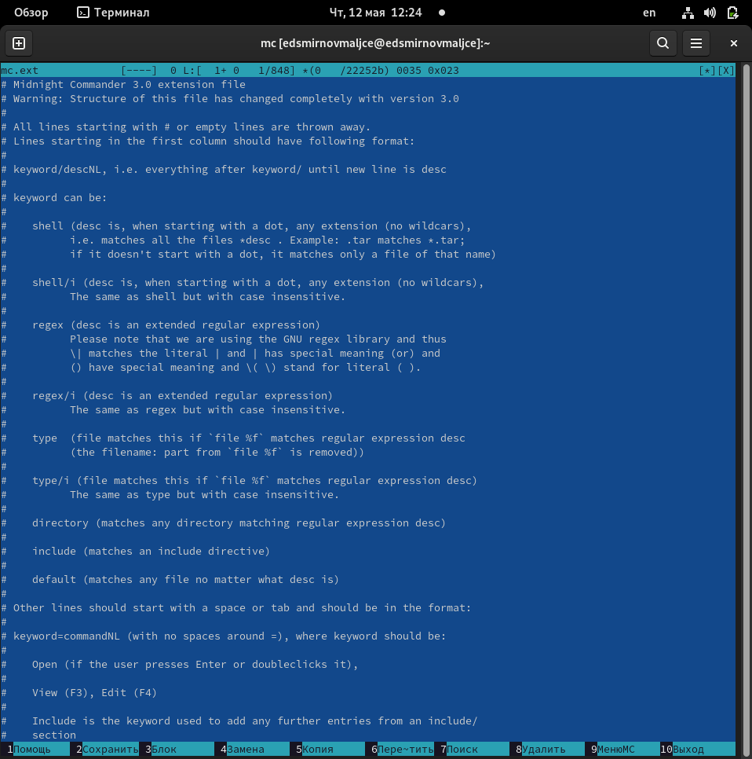
	
	<figcaption>рис. 14</figcaption>
<figure>

7. Вызвал подменю ```Настройки```. Освоил операции, определяющие структуру
экрана mc (Full screen, Double Width, Show Hidden Files и т.д.) (рис. 15).

<figure>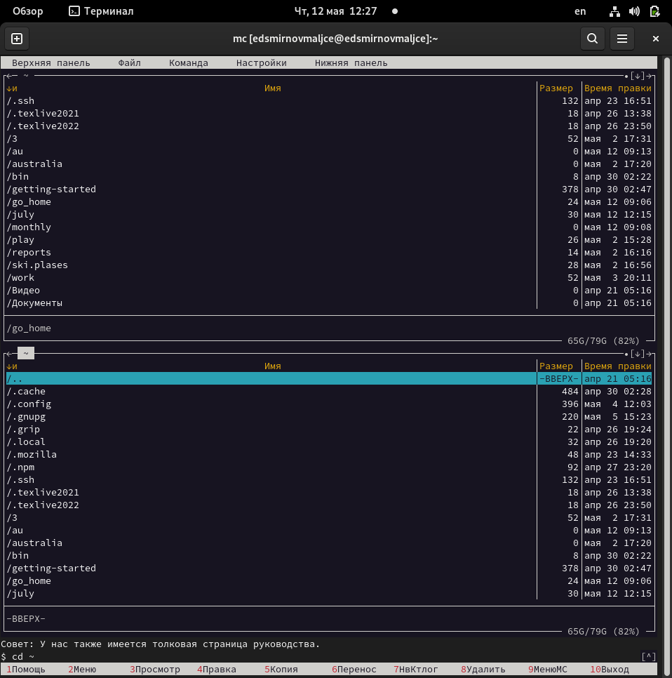
	
	<figcaption>рис. 15</figcaption>
<figure>

8. Создал текстовой файл text.txt и открыл его в mcedit (рис. 16).

<figure>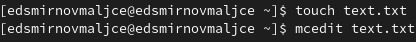
	
	<figcaption>рис. 16</figcaption>
<figure>

9. Вставил в открытый файл небольшой фрагмент текста, скопированный из задания лабораторной работы (рис. 17).

<figure>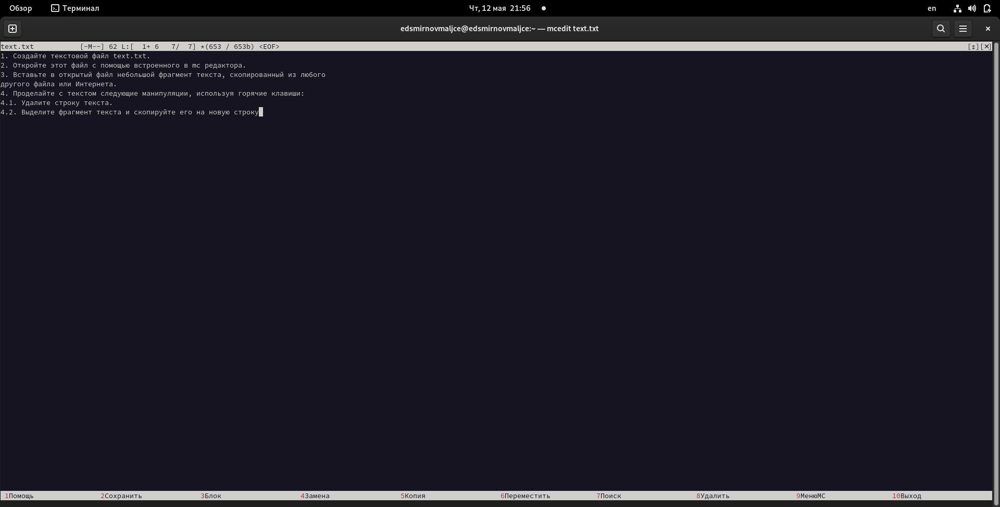
	
	<figcaption>рис. 17</figcaption>
<figure>

10. Проделайте с текстом следующие манипуляции, используя горячие клавиши:
- Удалил строку текста (рис. 18).
- Выделил фрагмент текста и скопируйте его на новую строку (рис. 19).
- Выделил фрагмент текста и перенесите его на новую строку (рис. 20).
- Отменил последнее действие (рис. 21).
- На моей клавиатуре нет кнопок ```end```, ```home```, поэтому я не могу перейти в конец и начало файла.
- Сохранил и закрыл файл (рис. 22).

<figure>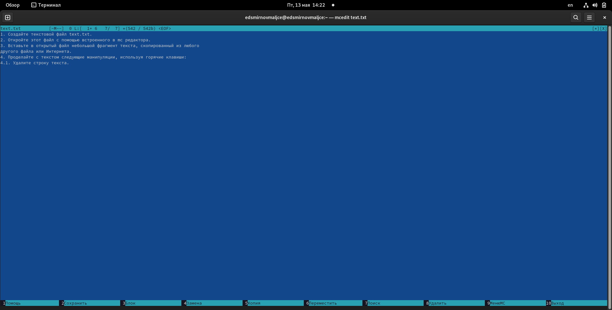
	
	<figcaption>рис. 18</figcaption>
<figure>

<figure>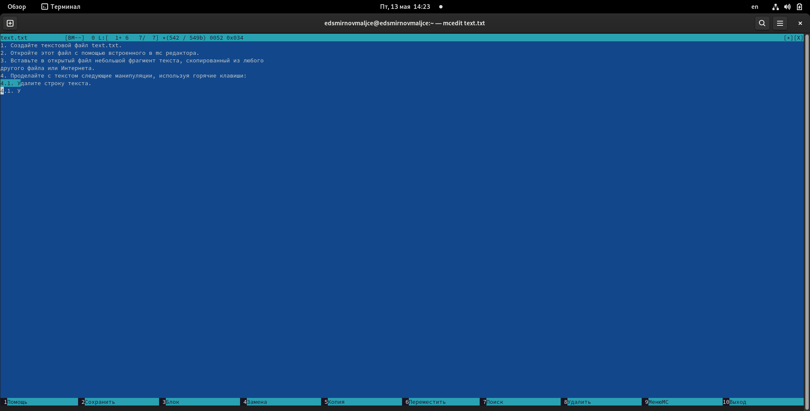
	
	<figcaption>рис. 19</figcaption>
<figure>

<figure>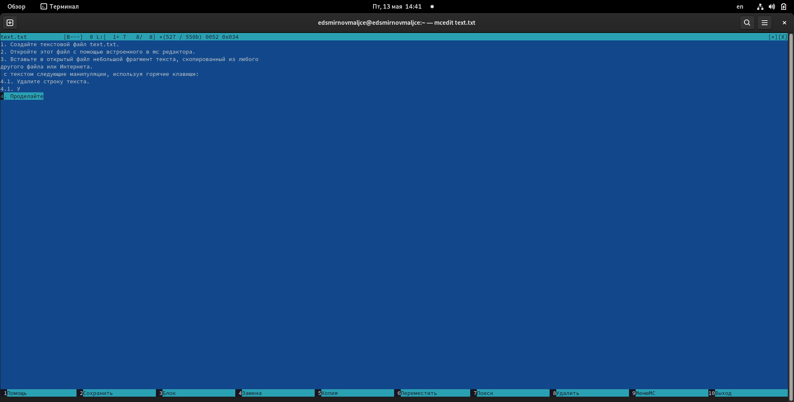
	
	<figcaption>рис. 20</figcaption>
<figure>

<figure>
	
	<figcaption>рис. 21</figcaption>
<figure>

<figure>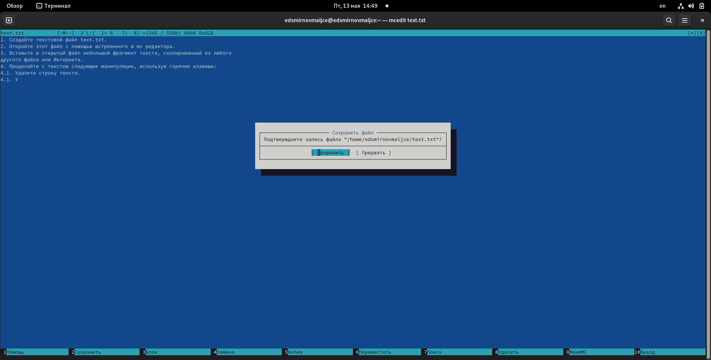
	
	<figcaption>рис. 22</figcaption>
<figure>

11. Открыл файл с исходным текстом на языке с++ (рис. 23).

<figure>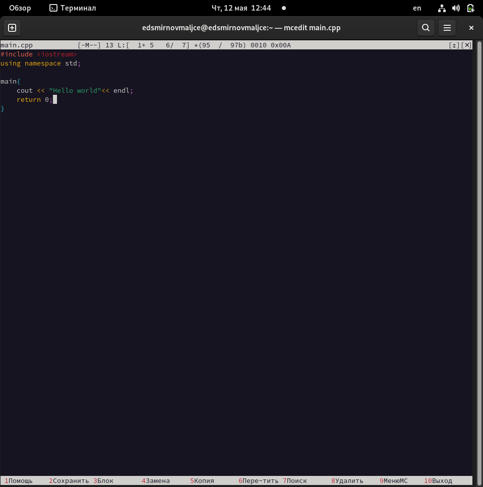
	
	<figcaption>рис. 23</figcaption>
<figure>

12. Используя меню редактора, выключил подсветку текста (рис. 24).

<figure>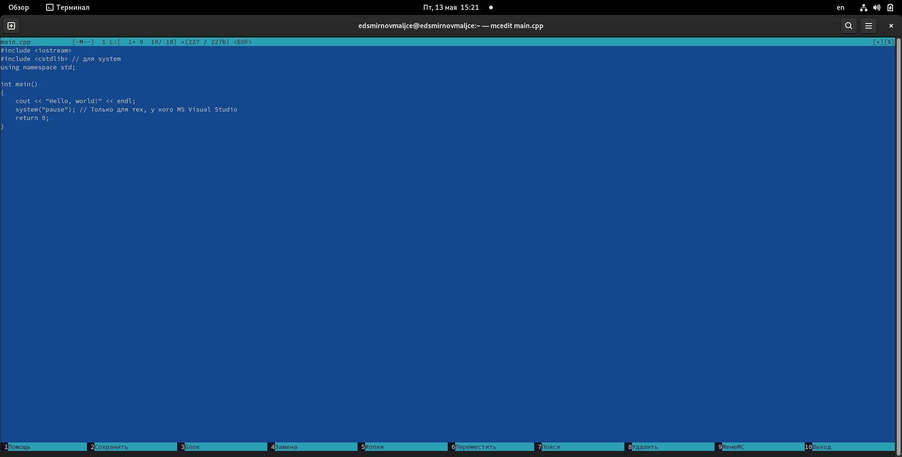
	
	<figcaption>рис. 24</figcaption>
<figure>

# Ответы на контрольные вопросы
1. mc работает с панелями, отображающими файлы. Панели могут дополнительно быть переведены в один из трех режимов:
стандартный, режим информация и режим дерева.
В стандартном режиме объекты показаны в том же виде, как и при просмотре файлов через проводник.
В режиме дерево на одной из панелей выводится структура дерева каталогов.
В режиме информация на панель выводятся сведения о файле и текущей файловой системе,
расположенных на активной панели.
2. В ходе лабораторной работы мы копировали, перемещали и просматривали файлы с помощью mc. Все это можно
делать в shell с помощью команд cp, rm и cat.
3. В меню панелей можно выбрать формат списка (стандартный, ускоренный, расширенный, определённый пользователем)
и порядок сортировки, который позволяет задать критерии сортировки при выводе списка файлов и каталогов:
без сортировки, по имени, расширенный, время правки, время доступа, время изменения атрибута, размер, узел.
4. Команды меню ```Файл```:
– Просмотр ( F3 ) — позволяет посмотреть содержимое текущего (или выделенного) файла без возможности редактирования.
– Просмотр вывода команды (```М```+```!```) — функция запроса команды с параметрами
(аргумент к текущему выбранному файлу).
– Правка (```F4```) — открывает текущий (или выделенный) файл для его редактирования.
– Копирование (```F5```) — осуществляет копирование одного или нескольких файлов или каталогов в указанное
пользователем во всплывающем окне место.
– Права доступа (```Ctrl-x``````c```) — позволяет указать (изменить) права доступа к одному или нескольким файлам
или каталогам.
– Жёсткая ссылка(```Ctrl-x``````l```) — позволяет создать жёсткую ссылку к текущему (или выделенному) файлу.
– Символическая ссылка (```Ctrl-x``````s``` ) — позволяет создать символическую ссылку к текущему
(или выделенному) файлу.
– Владелец/группа (```Ctrl-x``````o```) — позволяет задать (изменить) владельца и имя группы для одного или
нескольких файлов или каталогов.
– Права (расширенные) — позволяет изменить права доступа и владения для одного или нескольких файлов или каталогов.
– Переименование (```F6```) — позволяет переименовать (или переместить) один или несколько файлов или каталогов.
– Создание каталога (```F7```) — позволяет создать каталог.
– Удалить (```F8```) — позволяет удалить один или несколько файлов или каталогов.
– Выход (```F10```) — завершает работу.
5. Команды меню ```Команда```:
– Дерево каталогов — отображает структуру каталогов системы.
– Поиск файла — выполняет поиск файлов по заданным параметрам.
– Переставить панели — меняет местами левую и правую панели.
– Сравнить каталоги (```Ctrl-x``````d```) — сравнивает содержимое двух каталогов.
– Размеры каталогов — отображает размер и время изменения каталога
– История командной строки — выводит на экран список ранее выполненных воболочке команд.
– Каталоги быстрого доступа (```Ctrl-\```) — при вызове выполняется быстрая смена текущего каталога на один из
заданного списка.
– Восстановление файлов — позволяет восстановить файлы на файловых системах ext2 и ext3.
– Редактировать файл расширений — позволяет задать с помощью определённого синтаксиса действия при запуске файлов
с определённым расширением (например, какое программного обеспечение запускать для открытия или редактирования файлов
с расширением doc или docx).
– Редактировать файл меню — позволяет отредактировать контекстное меню пользователя, вызываемое по клавише ```F2```.
– Редактировать файл расцветки имён — позволяет подобрать оптимальную для пользователя расцветку имён файлов в
зависимости от их типа.
6. Команды меню ```Настройки```:
- Конфигурация — позволяет скорректировать настройки работы с панелями.
– Внешний вид и Настройки панелей — определяет элементы (строка меню, командная строка, подсказки и прочее),
отображаемые при вызове , а также геометрию расположения панелей и цветовыделение.
– Биты символов — задаёт формат обработки информации локальным терминалом.
– Подтверждение — позволяет установить или убрать вывод окна с запросом подтверждения действий при операциях
удаления и перезаписи файлов, а также привыходе из программы.
– Распознание клавиш — диалоговое окно используется для тестирования функциональных клавиш,
клавиш управления курсором и прочее.
– Виртуальные ФС – настройки виртуальной файловой системы: тайм-аут, пароль и прочее.
7. Команды mc:
- ```F1``` - вызов контекстно-зависимой подсказки.
- ```F2``` - вызов пользовательского меню с возможностью создания и/или дополнения дополнительных функций.
- ```F3``` - просмотр содержимого файла, на который указывает подсветка в активной панели.
- ```F4``` - вызов встроенного в редактора для изменения содержания файла,
на который указывает подсветка в активной панели.
- ```F5``` - копирование одного или нескольких файлов, отмеченных в первой (активной) панели, в каталог,
отображаемый на второй панели.
- ```F6``` - перенос одного или нескольких файлов, отмеченных в активной панели, в каталог,
отображаемый на второй панели.
- ```F7``` - создание подкаталога в каталоге, отображаемом в активной панели.
- ```F8``` - удаление одного или нескольких файлов (каталогов), отмеченных в активной панели.
- ```F9``` - вызов меню.
- ```F10``` - выход из mc.
8. Команды редактора mc:
- ```Ctrl-y``` - удалить строку.
- ```Ctrl-u``` - отмена последней операции.
- ```Ins``` - вставка/замена.
- ```F7``` - поиск строки.
- ```F4``` - замена.
- ```F3``` - первое нажатие — начало выделения, второе — окончание выделения
- ```F5``` - копировать выделенный фрагмент.
- ```F6``` - переместить выделенный фрагмент.
- ```F8``` - удалить выделенный фрагмент.
- ```F2``` - записать изменения в файл.
- ```F10``` - выйти из редактора.
9. В mc есть меню пользователя. Оно позволяет сохранить часто используемые команды панелизации под отдельными
информативными именами, чтобы иметь возможность их быстро вызвать по этим именам.
Для этого нужно набрать команду в строке ввода (строка "Команда") и нажать кнопку ```Добавить```.
После этого потребуется ввести имя, по которому будет вызываться команда.
В следующий раз достаточно будет выбрать нужное имя из списка, а не вводить всю команду заново.
10. Программа MC, как и любой файловый процессор, может выполнять операции с одиночным файлом и с группой файлов.
Кроме выполнения стандартных операций возможно выполнение ряда дополнительных действий:
редактирование текстовых файлов, подключение к удаленному компьютеру, работа с архивными файлами и т.д.
Методика выполнения операций у всех файловых процессоров одинакова:
* выбрать объект (файл или группу файлов);
* указать операцию с помощью клавиатуры или мыши;
* при необходимости указать дополнительные параметры.

# Выводы

* Я освоил осноы работы c файлами с помощью mc.
