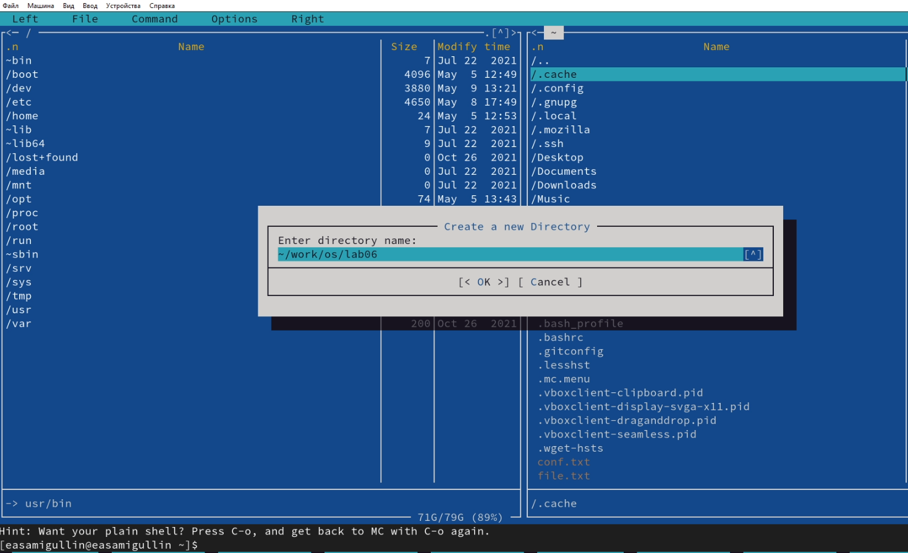
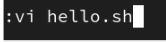
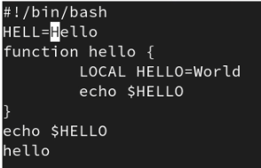
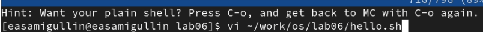
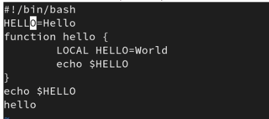
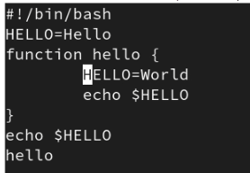
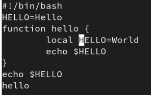
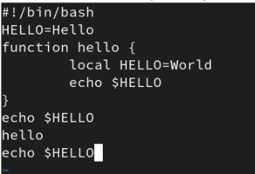
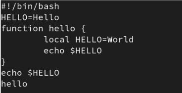
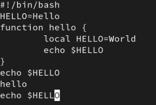

---
## Front matter
title: "Отчёт по лабораторной работе №8"
subtitle: "НКНбд-02-21"
author: "Самигуллин Эмиль Артурович"

## Generic otions
lang: ru-RU
toc-title: "Содержание"

## Bibliography
bibliography: bib/cite.bib
csl: pandoc/csl/gost-r-7-0-5-2008-numeric.csl

## Pdf output format
toc: true # Table of contents
toc-depth: 2
fontsize: 12pt
linestretch: 1.5
papersize: a4
documentclass: scrreprt
## I18n polyglossia
polyglossia-lang:
  name: russian
  options:
	- spelling=modern
	- babelshorthands=true
polyglossia-otherlangs:
  name: english
## I18n babel
babel-lang: russian
babel-otherlangs: english
## Fonts
mainfont: PT Serif
romanfont: PT Serif
sansfont: PT Sans
monofont: PT Mono
mainfontoptions: Ligatures=TeX
romanfontoptions: Ligatures=TeX
sansfontoptions: Ligatures=TeX,Scale=MatchLowercase
monofontoptions: Scale=MatchLowercase,Scale=0.9
## Biblatex
biblatex: true
biblio-style: "gost-numeric"
biblatexoptions:
  - parentracker=true
  - backend=biber
  - hyperref=auto
  - language=auto
  - autolang=other*
  - citestyle=gost-numeric
## Pandoc-crossref LaTeX customization
figureTitle: "Рис."
tableTitle: "Таблица"
listingTitle: "Листинг"
lofTitle: "Цель Работы"
lotTitle: "Ход Работы"
lolTitle: "Листинги"
## Misc options
indent: true
header-includes:
  - \usepackage{indentfirst}
  - \usepackage{float} # keep figures where there are in the text
  - \floatplacement{figure}{H} # keep figures where there are in the text
---

# Цель работы.

- Познакомиться с операционной системой Linux. 
  
- Получить практические навыки работы с редактором vi, установленным по умолчанию практически во всех дистрибутивах.

# Ход работы. Этап №1.

1. Создал каталог с именем ~/work/os/lab06.(рис. [-@fig:001])

   { #fig:001 width=70% }

2. Перешел во вновь созданный каталог.

3. Вызвал vi и создал файл hello.sh (vi hello.sh)(рис. [-@fig:002])

   { #fig:002 width=70% }

4. Нажал клавишу i и ввел текст.(рис. [-@fig:003])

   { #fig:003 width=70% }

5. Нажал клавишу Esc для перехода в командный режим после завершения ввода текста.

6. Нажал : для перехода в режим последней строки.

7. Нажал w (записать) и q (выйти), а затем нажал клавишу Enter для сохранения вашего текста и завершения работы.(рис. [-@fig:04],[-@fig:05])

   { #fig:04 width=70% }

   { #fig:05 width=70% }

8. Сделал файл исполняемым chmod +x hello.sh

# Ход работы. Этап №2.

1. Вызвал vi для редактирования файла vi ~/work/os/lab06/hello.sh.(рис. [-@fig:06])

   { #fig:06 width=70% }

2. Установил курсор в конец слова HELL второй строки.

3. Перешёл в режим вставки и заменил на HELLO. Нажал Esc для возврата в командный режим.(рис. [-@fig:07])

   { #fig:07 width=70% }

4. Установил курсор на четвертую строку и стёр слово LOCAL.(рис. [-@fig:08])

   { #fig:08 width=70% }

5. Перешёл в режим вставки и наберал следующий текст: local, нажал Esc для возврата в командный режим.(рис. [-@fig:09])

   { #fig:09 width=70% }

6. Установил курсор на последней строке файла. Вставил после неё строку, содержащую следующий текст: echo $HELLO.(рис. [-@fig:010])

   { #fig:010 width=70% }

7. Нажал Esc для перехода в командный режим.

8. Удалил последнюю строку.(рис. [-@fig:011])

   { #fig:011 width=70% }

9. Ввел команду отмены изменений (u) для отмены последней команды.(рис. [-@fig:012])

   { #fig:012 width=70% }

10. Ввёл символ : для перехода в режим последней строки.Записал произведённые изменения и выйдите из vi.

# Вывод.

Во время лабораторной работы, мы получили практические навыки использования текстового редактора Vim.

# Контрольные вопросы. 

1. Vim - это интерактивный экранный редактор, который используется для создания и редактирования текстовых файлов. Все действия vi производит в буфере. Произведенные изменения могут быть записаны на диск или отменены. Редактор vi имеет три режима: командный, вставки/ввода и последняя строка.
   
2. Можно нажимать символ q (или q!), если требуется выйти из редактора без сохранения.

3. команды позиционирования: 
   
   3.1. 0 (ноль) — переход в начало строки;
   
   3.2. $ — переход в конец строки;
   
   3.3. G — переход в конец файла;
   
   3.4 nG — переход на строку с номером n

4. Редактор vi предполагает, что слово - это строка символов, которая может включать в себя буквы, цифры и символы подчеркивания.
5. G — переход в конец файла и "1G" - переход в начало файла.
   
6. Команды редактирования:

   - Вставка текста – а — вставить текст после курсора; – А — вставить текст в конец строки; – i — вставить текст перед курсором; – n i - вставить текст n раз; – I — вставить текст в начало строки.
   
   - Вставка строки – о — вставить строку под курсором; – О — вставить строку над курсором.
   
   - Удаление текста – x — удалить один символ в буфер; – d w — удалить одно слово в буфер; – d $ — удалить в буфер текст от курсора до конца строки; – d 0 — удалить в буфер текст от начала строки до позиции курсора; – d d — удалить в буфер одну строку; – n d d — удалить в буфер n строк.
   
   - Отмена и повтор произведённых изменений – u — отменить последнее изменение; – . — повторить последнее изменение.
    Копирование текста в буфер – Y — скопировать строку в буфер; – n Y — скопировать n строк в буфер; – y w — скопировать слово в буфер.
   
   - Вставка текста из буфера – p — вставить текст из буфера после курсора; – P — вставить текст из буфера перед курсором.
   -  Замена текста – c w — заменить слово; – n c w — заменить n слов; – c $ — заменить текст от курсора до конца строки; – r — заменить слово; – R — заменить текст.
   - Поиск текста – / текст — произвести поиск вперёд по тексту указанной строки символов текст; – ? текст — произвести поиск назад по тексту указанной строки символов текст.

7. 80 + A + "Символ" +  Esc

8. u — отменить последнее изменение

9. Режим последней строки — используется для записи изменений в файл и выхода из редактора.

10. $ — переход в конец строки

11. Опции редактора vi позволяют настроить рабочую среду. Для задания опций используется команда set (в режиме последней строки): – : set all — вывести полный список опций; – : set nu — вывести номера строк; – : set list — вывести невидимые символы; – : set ic — не учитывать при поиске, является ли символ прописным или строчным.

12. В редакторе vi есть два основных режима: командный режим и режим вставки. По умолчанию работа начинается в командном режиме. В режиме вставки клавиатура используется для набора текста. Для выхода в командный режим используется клавиша Esc или комбинация Ctrl + c .
