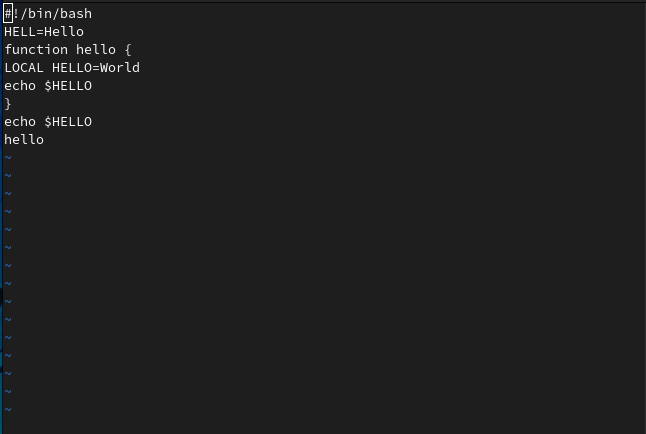

---
## Front matter
title: "Отчёт по лабораторной работе №8"
subtitle: "Текстовой редактор vi"
author: "Самигуллин Эмиль Артурович"

## Generic otions
lang: ru-RU
toc-title: "Содержание"

## Bibliography
bibliography: bib/cite.bib
csl: pandoc/csl/gost-r-7-0-5-2008-numeric.csl

## Pdf output format
toc-depth: 2
fontsize: 12pt
linestretch: 1.5
papersize: a4
documentclass: scrreprt
## I18n polyglossia
polyglossia-lang:
  name: russian
  options:
	- spelling=modern
	- babelshorthands=true
polyglossia-otherlangs:
  name: english
## I18n babel
babel-lang: russian
babel-otherlangs: english
## Fonts
mainfont: PT Serif
romanfont: PT Serif
sansfont: PT Sans
monofont: PT Mono
mainfontoptions: Ligatures=TeX
romanfontoptions: Ligatures=TeX
sansfontoptions: Ligatures=TeX,Scale=MatchLowercase
monofontoptions: Scale=MatchLowercase,Scale=0.9
## Biblatex
biblatex: true
biblio-style: "gost-numeric"
biblatexoptions:
  - parentracker=true
  - backend=biber
  - hyperref=auto
  - language=auto
  - autolang=other*
  - citestyle=gost-numeric
## Pandoc-crossref LaTeX customization
figureTitle: "Рис."
tableTitle: "Таблица"
listingTitle: "Листинг"
lofTitle: "Список иллюстраций"
lolTitle: "Листинги"
## Misc options
indent: true
header-includes:
  - \usepackage{indentfirst}
  - \usepackage{float} # keep figures where there are in the text
  - \floatplacement{figure}{H} # keep figures where there are in the text
---

# Цель работы

* Познакомиться с операционной системой Linux.
Получить практические навыки работы с редактором vi, установленным по умолчанию практически во всех дистрибутивах.

# Задание

1. Ознакомиться с теоретическим материалом.
2. Ознакомиться с редактором vi.
3. Выполнить упражнения, используя команды vi:

3.1. Создание нового файла с использованием vi
1. Создайте каталог с именем ~/work/os/lab06.
2. Перейдите во вновь созданный каталог.
3. Вызовите vi и создайте файл hello.sh
```
vi hello.sh
```
4. Нажмите клавишу ```i``` и вводите следующий текст.
```
#!/bin/bash
HELL=Hello
function hello {
LOCAL HELLO=World
echo $HELLO
}
echo $HELLO
hello
```
5. Нажмите клавишу ```Esc``` для перехода в командный режим после завершения ввода текста.
6. Нажмите ```:``` для перехода в режим последней строки и внизу вашего экрана появится
приглашение в виде двоеточия.
7. Нажмите ```w``` (записать) и ```q``` (выйти), а затем нажмите клавишу ```Enter``` для сохранения
вашего текста и завершения работы.
8. Сделайте файл исполняемым
```
chmod +x hello.sh
```

3.2. Редактирование существующего файла.
1. Вызовите vi на редактирование файла.
```
vi ~/work/os/lab06/hello.sh
```
2. Установите курсор в конец слова HELL второй строки.
3. Перейдите в режим вставки и замените на HELLO. Нажмите ```Esc``` для возврата в командный режим.
4. Установите курсор на четвертую строку и сотрите слово LOCAL.
5. Перейдите в режим вставки и наберите следующий текст: local, нажмите ```Esc``` для возврата в командный режим.
6. Установите курсор на последней строке файла. Вставьте после неё строку, содержащую следующий текст: echo $HELLO.
7. Нажмите ```Esc``` для перехода в командный режим.
8. Удалите последнюю строку.
9. Введите команду отмены изменений ```u``` для отмены последней команды.
10. Введите символ ```:``` для перехода в режим последней строки. Запишите произведённые изменения и выйдите из vi

# Теоретическое введение

В любой момент при работе в редакторе vi вы находитесь в одном из трёх режимов редактора:
командный режим (command mode), режим ввода (insert mode) и режим последней строки (last line mode).

При запуске редактора vi вы оказываетесь в командном режиме.
В этом режиме можно давать команды для редактирования файлов или перейти в другой режим.
Например, вводя ```x``` в командном режиме мы удаляем символ, на который указывает курсор.
Клавиши-стрелки перемещают курсор по редактируемому файлу. Как правило, команды, используемые в командном режиме,
состоят из одного или двух символов.

Основной ввод и редактирование текста осуществляется в режиме ввода. При использовании редактора vi основное время,
скорее всего, будет проводиться именно в этом режиме. Переход в режим ввода из командного режима осуществляется
командой ```i``` (от слова insert). Находясь в режиме ввода, можно вводить текст в то место, куда указывает курсор.
Выход из режима ввода в командный режим осуществляется клавишей ```Esc```.

Режим последней строки — это специальный режим, в котором редактору даются сложные команды.
При вводе этих команд они отображаются в последней строке экрана (отсюда пошло название режима).
Например, если ввести в командном режиме команду ```:```, то осуществится переход в режим последней строки,
и можно будет вводить такие команды, как ```wq``` (записать файл и покинуть редактор vi) или 
```q!``` (выйти из редактора vi без сохранения изменений). В режиме последней строки обычно вводятся команды,
название которых состоит из нескольких символов. В этом режиме в последнюю строку вводится команда,
после чего нажимается клавиша ```Enter```, и команда исполняется.

# Выполнение лабораторной работы

1. Ознакомился с теоретическим материалом.
2. Ознакомился с редактором vi.
3. Выполнил следующие упражнения:

## Создание нового файла с использованием vi

1. Создал каталог с именем ~/work/os/lab06. Перешел во вновь созданный каталог.(рис.1)

<figure>
	
	<figcaption>рис. 1</figcaption>
<figure>

2. Вызвал vi и создал файл hello.sh (рис. 2).

<figure>
	
	<figcaption>рис. 2</figcaption>
<figure>

3. Нажал клавишу ```i``` и ввёл текст из задания (рис. 3).

<figure>
	
	<figcaption>рис. 3</figcaption>
<figure>

4. Нажал клавишу ```Esc``` для перехода в командный режим после завершения ввода текста (рис. 4).

<figure>
	
	<figcaption>рис. 4</figcaption>
<figure>

5. Нажал ```:``` для перехода в режим последней строки (рис. 5).

<figure>
	
	<figcaption>рис. 5</figcaption>
<figure>

6. Нажал ```w``` (записать) и ```q``` (выйти), а затем нажал клавишу ```Enter``` для сохранения
текста и завершения работы (рис. 6).

<figure>
	
	<figcaption>рис. 6</figcaption>
<figure>

7. Сделал файл исполняемым (рис. 7).

<figure>
	
	<figcaption>рис. 7</figcaption>
<figure>

## Редактирование существующего файла.

1. Вызвал vi на редактирование файла (рис. 8).

<figure>
	
	<figcaption>рис. 8</figcaption>
<figure>

2. Установил курсор в конец слова HELL второй строки (рис. 9).

<figure>
	
	<figcaption>рис. 9</figcaption>
<figure>

3. Перешёл в режим вставки и заменил на HELLO. Нажал ```Esc``` для возврата в командный режим (рис. 10).

<figure>
	
	<figcaption>рис. 10</figcaption>
<figure>

4. Установил курсор на четвертую строку и стёр слово LOCAL (рис. 11).

<figure>
	
	<figcaption>рис. 11</figcaption>
<figure>

5. Перешёл в режим вставки и набрал следующий текст: local, нажал ```Esc``` для возврата в командный режим (рис. 12).

<figure>
	
	<figcaption>рис. 12</figcaption>
<figure>

6. Установил курсор на последней строке файла. Вставил после неё строку, содержащую следующий текст:
echo $HELLO (рис. 13).

<figure>
	
	<figcaption>рис. 13</figcaption>
<figure>

7. Нажал ```Esc``` для перехода в командный режим (рис. 14).

<figure>
	
	<figcaption>рис. 14</figcaption>
<figure>

8. Удалил последнюю строку (рис. 15).

<figure>
	
	<figcaption>рис. 15</figcaption>
<figure>

9. Ввел команду отмены изменений ```u``` для отмены последней команды (рис. 16).

<figure>
	
	<figcaption>рис. 16</figcaption>
<figure>

10. Ввёл символ ```:``` для перехода в режим последней строки. Записал произведённые изменения и вышел из vi.

# Ответы на контрольные вопросы

1. Редактор VI имеет три режима:

* Командный - в этом режиме можно перемещаться по файлу и выполнять редактирующие команды над текстом.
Команды вызываются латинскими буквами.

* Ввода текста - в этом режиме обычные латинские буквы будут вставляться в текст.

* Режим строчного редактора используется для управления файлами (сохранить файл, зачитать файл и т.д.)

2. Чтобы выйти из редактора без сохранения надо ввести команду ```q!```.

3. Команды позиционирования нужны для быстрого перемещения курсора по файлу.

4. При использовании прописных W и B под словом понимается набор символов между пробелами, табуляцией и возвратом
каретки. При использовании строчных w и b под словом понимается набор символов между любыми знаками пунктуации,
пробелами, табуляцией и возвратом каретки.

5. Чтобы перейти в начало файла, надо ввести команду ```gg```.
Чтобы перейти в конец файла, надо ввести команду ```G```.

6. Команды редактирования:

* Команды вставки текста - вставлять можно после курсора и перед ним, в конец и начало строки,
также можно вставить текст n раз.
* Команды вставки строки - вставлять можно под курсором и над ним.
* Удаление текста - удалить можно символ, слово, n строк, от начала строки до курсора и от курсора до конца строки.
* Отмена и повтор изменений.
* Копирование текста в буфер - скопировать можно сразу n строк и слово.
* Вставка текста из буфера - вставить можно перед курсором и после.
* Замена текста - заменить можно n слов, текст от начала строки до курсора, от курсора до конца строки, весь текст.
* Поиск текста - поиск можно проводить по тексту после курсора и до.
* Запись в файл и выход из редактора - можно записать изменения в текущий файл, новый, существующий, а также выйти
без записи.

7. Чтобы заполнить строку символом $ надо ввести этот символ и перейти в конец строки.

8. Отменить действие можно с помощью команды u.

9. Команды режима последней строки:

* Копирование и перемещение текста - можно заменить, копировать и переместить несколько подряд идущих строк,
а также записать их в файл.
* Запись в файл и выход из редактора - можно записать изменения в текущий файл, новый, существующий, а также выйти
без записи.

10. Чтобы узнать позицию, в которой заканчивается строка можно ввести $ и перейти в конец строки.

11. Опции редактора vi позволяют настроить рабочую среду.
Для задания опций используется команда set (в режиме последней строки):
* ```:``` set all — вывести полный список опций;
* ```:``` set nu — вывести номера строк;
* ```:``` set list — вывести невидимые символы;
* ```:``` set ic — не учитывать при поиске, является ли символ прописным или строчным.
Если вы хотите отказаться от использования опции, то в команде set перед именем опции надо поставить no.

12. Режим работы редактора можно увидеть в последней строке.

13. Из командного режима можно перейти в режим ввода с помощью команды ```i```,а обратно с помощью ```esc```.
Из командного режима можно перейти в режим последней строки с помощью команды ```:```,
а обратно с помощью ```enter```.

# Выводы

* Я освоил основы работы c редактором vi.
