---
## Front matter
title: "Отчёт по лабораторной работе №9"
subtitle: "НКНбд-02-21"
author: "Самигуллин Эмиль Артурович"

## Generic otions
lang: ru-RU
toc-title: "Содержание"

## Bibliography
bibliography: bib/cite.bib
csl: pandoc/csl/gost-r-7-0-5-2008-numeric.csl

## Pdf output format
toc: true # Table of contents
toc-depth: 2
fontsize: 12pt
linestretch: 1.5
papersize: a4
documentclass: scrreprt
## I18n polyglossia
polyglossia-lang:
  name: russian
  options:
	- spelling=modern
	- babelshorthands=true
polyglossia-otherlangs:
  name: english
## I18n babel
babel-lang: russian
babel-otherlangs: english
## Fonts
mainfont: PT Serif
romanfont: PT Serif
sansfont: PT Sans
monofont: PT Mono
mainfontoptions: Ligatures=TeX
romanfontoptions: Ligatures=TeX
sansfontoptions: Ligatures=TeX,Scale=MatchLowercase
monofontoptions: Scale=MatchLowercase,Scale=0.9
## Biblatex
biblatex: true
biblio-style: "gost-numeric"
biblatexoptions:
  - parentracker=true
  - backend=biber
  - hyperref=auto
  - language=auto
  - autolang=other*
  - citestyle=gost-numeric
## Pandoc-crossref LaTeX customization
figureTitle: "Рис."
tableTitle: "Таблица"
listingTitle: "Листинг"
lofTitle: "Цель Работы"
lotTitle: "Ход Работы"
lolTitle: "Листинги"
## Misc options
indent: true
header-includes:
  - \usepackage{indentfirst}
  - \usepackage{float} # keep figures where there are in the text
  - \floatplacement{figure}{H} # keep figures where there are in the text
---

# Цель работы

- Познакомиться с операционной системой Linux. 
  
- Получить практические навыки работы с редактором Emacs.

# Ход работы

1. Открыл emacs. (рис. [-@fig:01])
   
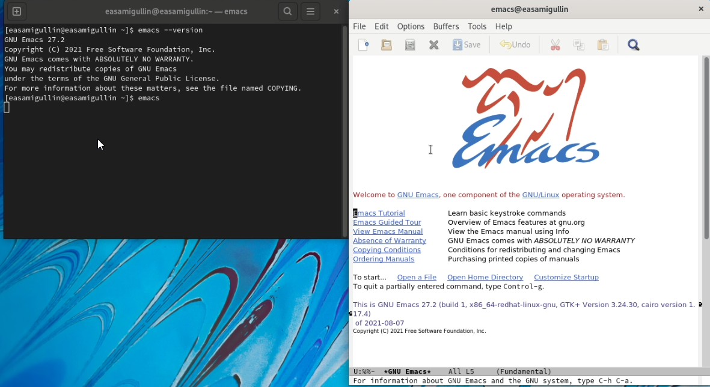{ #fig:01 width=70% }

2. Создал файл lab07.sh с помощью комбинации Ctrl-x Ctrl-f (C-x C-f). (рис. [-@fig:02])

{ #fig:02 width=70% }

3. Набрал текст. (рис. [-@fig:03])

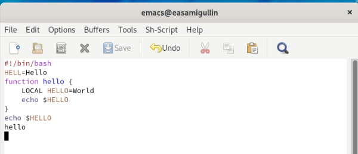{ #fig:03 width=70% }

4. Сохранил файл с помощью комбинации Ctrl-x Ctrl-s (C-x C-s).(рис. [-@fig:04])

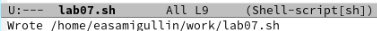{ #fig:04 width=70% }

5. Проделать с текстом стандартные процедуры редактирования, каждое действие долж-
но осуществляться комбинацией клавиш.

5.1. Вырезал одной командой целую строку (С-k).(рис. [-@fig:05])

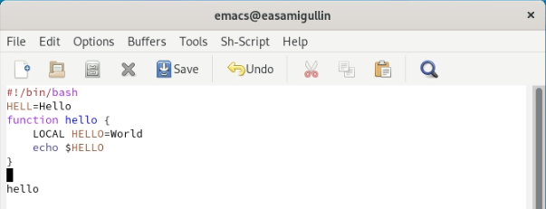{ #fig:05 width=70% }

5.2. Вставил эту строку в конец файла (C-y).(рис. [-@fig:06])

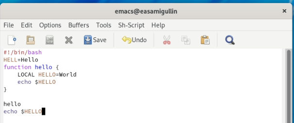{ #fig:06 width=70% }

5.3. Выделил область текста (C-space).(рис. [-@fig:07])

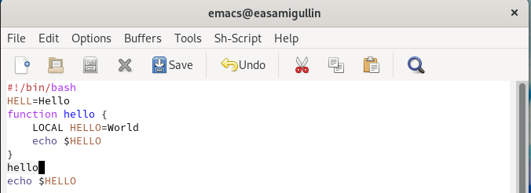{ #fig:07 width=70% }

5.4. Скопировал область в буфер обмена (M-w).

5.5. Вставил область в конец файла.(рис. [-@fig:08])

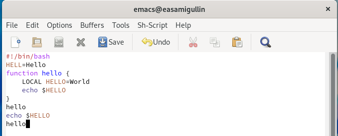{ #fig:08 width=70% }

5.6. Вновь выделил эту область и на этот раз вырезать её (C-w).(рис. [-@fig:09])

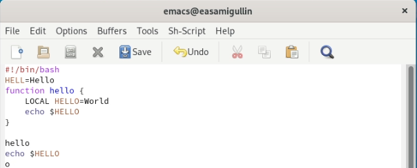{ #fig:09 width=70% }

5.7. Отменил последнее действие (C-/).(рис. [-@fig:010])

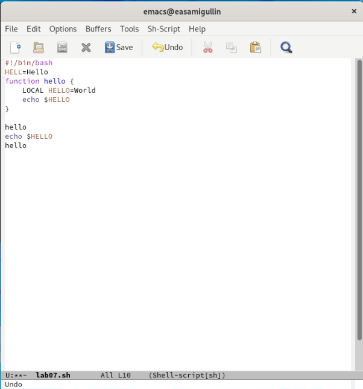{ #fig:010 width=70% }

6. Научитесь использовать команды по перемещению курсора.

6.1. Переместите курсор в начало строки (C-a).

6.2. Переместите курсор в конец строки (C-e).

6.3. Переместите курсор в начало буфера (M-<).

6.4. Переместите курсор в конец буфера (M->).

7. Управление буферами.

7.1. Вывести список активных буферов на экран (C-x C-b).(рис. [-@fig:011])

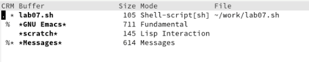{ #fig:011 width=70% }

7.2. Переместитесь во вновь открытое окно (C-x) o со списком открытых буферов и переключитесь на другой буфер.

7.3. Закройте это окно (C-x 0).(рис. [-@fig:012])

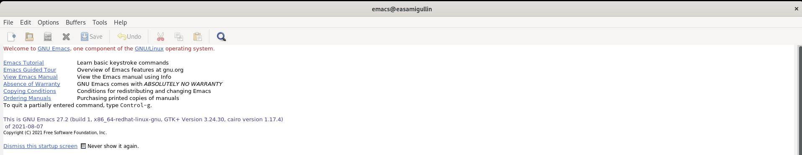{ #fig:012 width=70% }

7.4. Теперь вновь переключайтесь между буферами, но уже без вывода их списка на экран (C-x b).

8. Управление окнами.

8.1. Поделите фрейм на 4 части: разделите фрейм на два окна по вертикали (C-x 3), а затем каждое из этих окон на две части по горизонтали (C-x 2) (см. рис. 9.1).(рис. [-@fig:013])

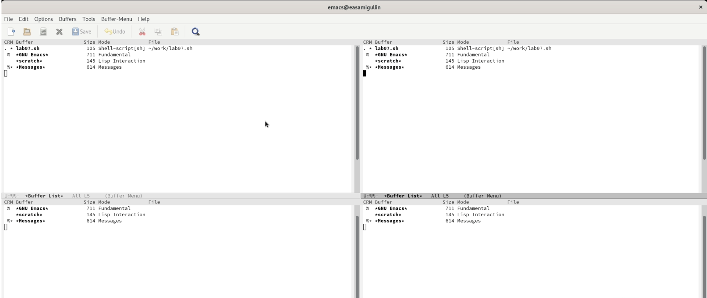{ #fig:013 width=70% }

8.2. В каждом из четырёх созданных окон откройте новый буфер (файл) и введите несколько строк текста.(рис. [-@fig:014])

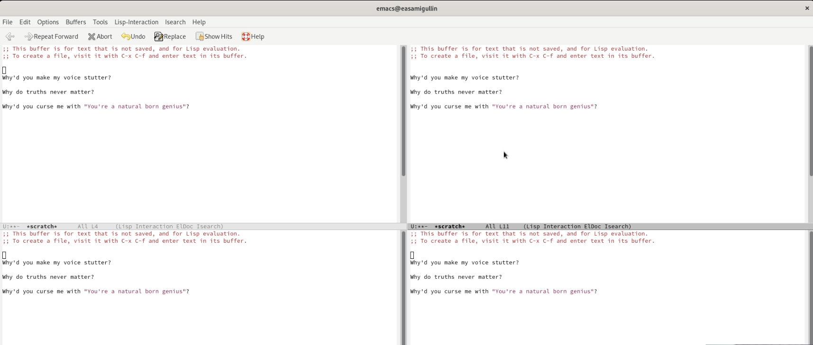{ #fig:014 width=70% }

9. Режим поиска

9.1. Переключились в режим поиска (C-s) и найдите несколько слов, присутствующих в тексте. (рис. [-@fig:015])

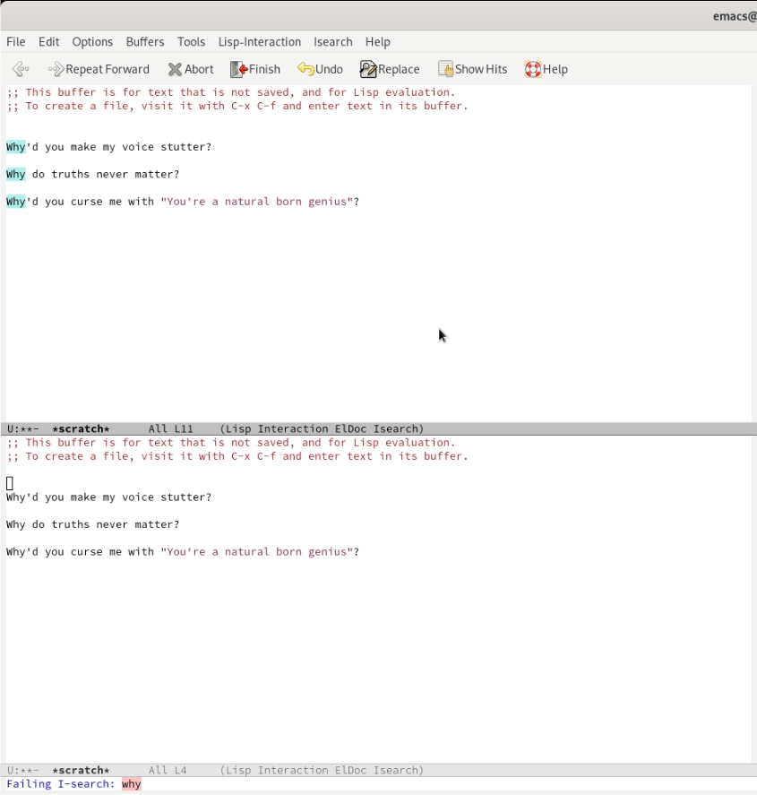{ #fig:015 width=70% }

9.2. Переключились между результатами поиска, нажимая C-s.(рис. [-@fig:016])

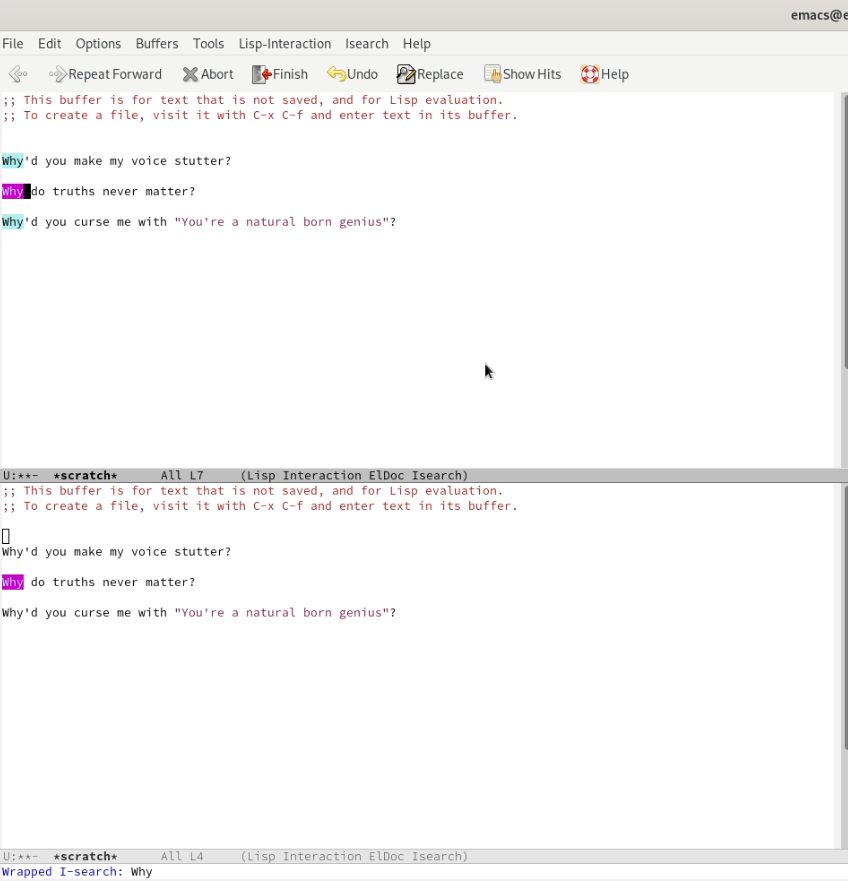{ #fig:016 width=70% }

9.3. Вышли из режима поиска, нажав C-g.

9.4. Перешли в режим поиска и замены (M-%), ввели текст, который следует найти и заменить, нажмите Enter , затем ввели текст для замены После того как будут подсвечены результаты поиска, нажмите ! для подтверждения замены.

9.5. Испробовали другой режим поиска, нажав M-s o.

# Вывод.

Во время выполнения лабораторной работы, мы получили практические навыки работы с текстовым редактором Emacs.

# Контрольные вопросы.

1. Emacs представляет собой мощный экранный редактор текста, написанный на языке высокого уровня Elisp.

2. Самое проблемное для новичка будет - это большое количество горячих клавишей, их больше чем в Vim.

3. Буфер — объект, представляющий какой-либо текст. Окно — прямоугольная область фрейма, отображающая один из буферов.

4. Можно, но кто будет использовать столько буферов в одном окне. Это неудобно.

5. Emacs использует буферы с именами, начинающимися с пробела, для внутренних целей. Отчасти он обращается с буферами с такими именами особенным образом -- например, по умолчанию в них не записывается информация для отмены изменений

6. Ctrl + c, а потом | и Ctrl + c Ctrl + |

7. Разделите фрейм на два окна по вертикали(C-x 3), а затем каждое из этих окон на две части по горизонтали (C-x 2).

8. Настройки emacs хранятся в файле . emacs, который хранится в домашней дирректории пользователя. Кроме этого файла есть ещё папка . emacs.

9. Клавиша <- или Backspace удаляет букву или выделенный отрезок. Её нельзя заменить без последствий, так как она зашита в систему.

10. Понравился больше Vim, потому что он более проще чем emacs, не требует пользования мышкой, как иногда многие IDE в том числе emacs и при правильной настройки Vim становится грозой для большинства IDE редакторов.
