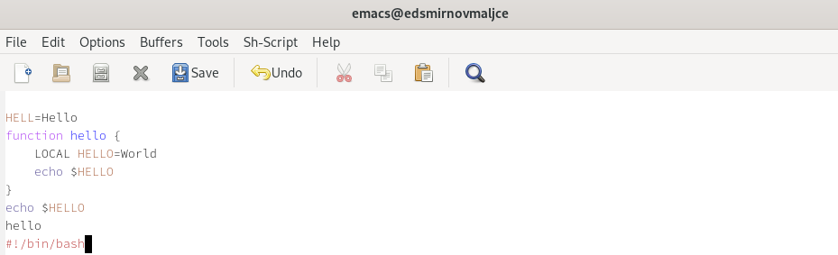

---
## Front matter
title: "Отчёт по лабораторной работе №9"
subtitle: "Текстовой редактор emacs"
author: "Самигуллин Эмиль Артурович"

## Generic otions
lang: ru-RU
toc-title: "Содержание"

## Bibliography
bibliography: bib/cite.bib
csl: pandoc/csl/gost-r-7-0-5-2008-numeric.csl

## Pdf output format
toc-depth: 2
fontsize: 12pt
linestretch: 1.5
papersize: a4
documentclass: scrreprt
## I18n polyglossia
polyglossia-lang:
  name: russian
  options:
	- spelling=modern
	- babelshorthands=true
polyglossia-otherlangs:
  name: english
## I18n babel
babel-lang: russian
babel-otherlangs: english
## Fonts
mainfont: PT Serif
romanfont: PT Serif
sansfont: PT Sans
monofont: PT Mono
mainfontoptions: Ligatures=TeX
romanfontoptions: Ligatures=TeX
sansfontoptions: Ligatures=TeX,Scale=MatchLowercase
monofontoptions: Scale=MatchLowercase,Scale=0.9
## Biblatex
biblatex: true
biblio-style: "gost-numeric"
biblatexoptions:
  - parentracker=true
  - backend=biber
  - hyperref=auto
  - language=auto
  - autolang=other*
  - citestyle=gost-numeric
## Pandoc-crossref LaTeX customization
figureTitle: "Рис."
tableTitle: "Таблица"
listingTitle: "Листинг"
lofTitle: "Список иллюстраций"
lolTitle: "Листинги"
## Misc options
indent: true
header-includes:
  - \usepackage{indentfirst}
  - \usepackage{float} # keep figures where there are in the text
  - \floatplacement{figure}{H} # keep figures where there are in the text
---

# Цель работы

* Познакомиться с операционной системой Linux.
Получить практические навыки работы с редактором Emacs.

# Задание

1. Ознакомиться с теоретическим материалом.
2. Ознакомиться с редактором emacs.
3. Выполнить следующие упражнения:

  1. Открыть emacs.
  2. Создать файл lab07.sh с помощью комбинации Ctrl-x Ctrl-f (C-x C-f).
  3. Наберите текст:
  ```
  #!/bin/bash
  HELL=Hello
  function hello {
  LOCAL HELLO=World
  echo $HELLO
  }
  ```
  4. Сохранить файл с помощью комбинации Ctrl-x Ctrl-s (C-x C-s).
  5. Проделать с текстом стандартные процедуры редактирования, каждое действие должно осуществляться комбинацией клавиш.
    5.1. Вырезать одной командой целую строку (С-k).
    5.2. Вставить эту строку в конец файла (C-y).
    5.3. Выделить область текста (C-space).
    5.4. Скопировать область в буфер обмена (M-w).
    5.5. Вставить область в конец файла.
    5.6. Вновь выделить эту область и на этот раз вырезать её (C-w).
    5.7. Отмените последнее действие (C-/).
  6. Научитесь использовать команды по перемещению курсора.
    6.1. Переместите курсор в начало строки (C-a).
    6.2. Переместите курсор в конец строки (C-e).
    6.3. Переместите курсор в начало буфера (M-<).
    6.4. Переместите курсор в конец буфера (M->).
  7. Управление буферами.
    7.1. Вывести список активных буферов на экран (C-x C-b).
    7.2. Переместитесь во вновь открытое окно (C-x) o со списком открытых буферов
    и переключитесь на другой буфер.
    7.3. Закройте это окно (C-x 0).
    7.4. Теперь вновь переключайтесь между буферами, но уже без вывода их списка на 
    экран (C-x b).
  8. Управление окнами.
    8.1. Поделите фрейм на 4 части: разделите фрейм на два окна по вертикали (C-x 3),
    а затем каждое из этих окон на две части по горизонтали (C-x 2) (см. рис. 9.1).
    8.2. В каждом из четырёх созданных окон откройте новый буфер (файл) и введите
    несколько строк текста.
  9. Режим поиска
    9.1. Переключитесь в режим поиска (C-s) и найдите несколько слов, присутствующих
    в тексте.
    9.2. Переключайтесь между результатами поиска, нажимая C-s.
    9.3. Выйдите из режима поиска, нажав C-g.
    9.4. Перейдите в режим поиска и замены (M-%), введите текст, который следует найти
    и заменить, нажмите Enter , затем введите текст для замены. После того как будут
    подсвечены результаты поиска, нажмите ! для подтверждения замены.
    9.5. Испробуйте другой режим поиска, нажав M-s o. Объясните, чем он отличается от
    обычного режима?

# Теоретическое введение

Emacs — один из наиболее мощных и широко распространённых редакторов, используемых в мире UNIX.
По популярности он соперничает с редактором vi и его клонами.
В зависимости от ситуации, Emacs может быть:
* текстовым редактором;
* программой для чтения почты и новостей Usenet;
* интегрированной средой разработки (IDE);
* операционной системой;

Всё это разнообразие достигается благодаря архитектуре Emacs, которая позволяет расширять возможности редактора при помощи языка Emacs Lisp.
На языке C написаны лишь самые базовые и низкоуровневые части Emacs,
включая полнофункциональный интерпретатор языка Lisp. Таким образом, Emacs имеет встроенный язык программирования,
который может использоваться для настройки, расширения и изменения поведения редактора. В действительности, большая часть того редактора,
с которым пользователи Emacs работают в наши дни, написана на языке Lisp.

Используемая терминология:
1. Буфера и файлы
  Буфер — это основная единица редактирования; один буфер соответствует одному куску редактируемого текста. Можно иметь несколько буферов, но в каждый конкретный момент редактируется только один «выбранный» буфер,
  хотя при использовании нескольких окон, видимыми могут быть несколько буферов. Чаще всего буферы обращаются к какому-либо файлу, считывая данные из файла в буфер, или записывая данные из буфера в файл.

2. Точка, область и метка
  * Точка (point) — это место в буфере, в котором происходит вставка или удаление данных. Считается, что точка находится между двумя знаками, а не на каком-то одном из них. Например, если курсор находится на букве «h» в слове «the»,
  то точка находится между «t» и «h». Курсор терминала показывает положение точки.
  * Как и другие современные редакторы, Emacs позволяет выполнять разные действия над фрагментами текущего буфера — изменение отступа, проверку орфографии, переформатирование, вырезание, копирование, вставку и т.д.
  Можно подсветить (или «пометить») блок текста, используя клавиатуру или мышь, а затем выполнить операцию только над выделенным блоком. В Emacs такой блок текста называется область (region).
  Область — это текст между точкой и меткой.
  * Метка указывает на позицию в тексте. Она определяет один конец области, в то время как точка находится на другом конце области. Многие команды работают с текстом целиком от точки до метки. Каждый буфер имеет свою метку.

3. Окна и фреймы
  * Окно в Emacs — это область экрана, в которой отображается буфер. Когда Emacs запускается, у вас на экране отображается одно окно.
  При обращении к некоторым функциям Emacs (таким, как оперативная справка и интерактивная документация) часто (временно) открываются дополнительные окна на экране Emacs.
  * Фрейм (frame) — это отдельное окно используемой оконной системы, в котором отображаются одно или несколько окон Emacs. При этом несколько фреймов, открытых одновременно, являются частью одного сеанса Emacs.

# Выполнение лабораторной работы

1. Открыл emacs. (рис. 1)

<figure>
	
	<figcaption>рис. 1: меню emacs.</figcaption>
<figure>

2. Создал файл lab07.sh с помощью комбинации Ctrl-x Ctrl-f (C-x C-f) (рис. 2).

<figure>
	
	<figcaption>рис. 2: создание файла</figcaption>
<figure>

3. Набрал текст в файл (рис. 3).

<figure>
	
	<figcaption>рис. 3: набранный текст.</figcaption>
<figure>

4. Сохранить файл с помощью комбинации Ctrl-x Ctrl-s (C-x C-s) (рис. 4).

<figure>
	
	<figcaption>рис. 4: строка с информацией о сохранении.</figcaption>
<figure>

5. Проделал с текстом стандартные процедуры редактирования,
осуществляя каждое действие комбинацией клавиш.

  5.1. Вырезал одной командой целую строку (С-k) (рис. 5).

<figure>
	
	<figcaption>рис. 5: результат удаления строки.</figcaption>
<figure>

  5.2. Вставил эту строку в конец файла (рис. 6).

<figure>
	
	<figcaption>рис. 6: результат вставки строки.</figcaption>
<figure>

  5.3. Выделил область текста и скопировал его (рис. 7).

<figure>
	
	<figcaption>рис. 7: выделение текста.</figcaption>
<figure>

  5.4. Вставил область в конец файла (рис. 8).

<figure>
	
	<figcaption>рис. 8: результат вставки текста.</figcaption>
<figure>

  5.5. Вновь выделил эту область и на этот раз вырезал её (рис. 9).

<figure>
	
	<figcaption>рис. 9: результат вырезания текста.</figcaption>
<figure>

  5.6. Отменил последнее действие (рис. 10).

<figure>
	
	<figcaption>рис. 10: результат отмены действия.</figcaption>
<figure>

6. Научился использовать команды по перемещению курсора.

  6.1. Переместил курсор в начало строки (рис. 11).

<figure>
	
	<figcaption>рис. 11: перемещение курсора в начало строки.</figcaption>
<figure>

  6.2. Переместил курсор в конец строки (рис. 12).

<figure>
	
	<figcaption>рис. 12: перемещение курсора в конец строки.</figcaption>
<figure>

  6.3. Переместил курсор в начало буфера.

  6.4. Переместил курсор в конец буфера.
  
7. Управление буферами.

  7.1. Вывел список активных буферов на экран (рис. 14)

<figure>
	
	<figcaption>рис. 14: список буферов.</figcaption>
<figure>

  7.2. Переместился во вновь открытое окно со списком открытых буферов
  и переключился на другой буфер (рис. 15).

<figure>
	
	<figcaption>рис. 15: новый буфер.</figcaption>
<figure>

  7.3. Закрыл это окно (рис. 16).

<figure>
	
	<figcaption>рис. 16: результат закрытия буфера.</figcaption>
<figure>

  7.4. Вновь переключился между буферами, но уже без вывода их списка на 
  экран (рис. 17).

<figure>
	
	<figcaption>рис. 17: результат смены буфера.</figcaption>
<figure>

8. Поделил фрейм на 4 части: разделил его на два окна по вертикали,
затем каждое из этих окон на две части по горизонтали. Далее написал в каждом из них пару строк текста (рис. 18).

<figure>
	
	<figcaption>рис. 18: разделение основного экрана на 4 части.</figcaption>
<figure>

9. Режим поиска

  9.1. Переключился в режим поиска и нашел несколько слов, присутствующих в тексте (рис. 19).

<figure>
	
	<figcaption>рис. 19: поиск слов.</figcaption>
<figure>

  9.2. Попереключался между результатами поиска (рис. 19).

<figure>
	
	<figcaption>рис. 19: поиск слов.</figcaption>
<figure>

  9.3. Вышел из режима поиска.
  
  9.4. Перешел в режим поиска и замены (M-%), ввел и заменил текст (рис. 20).

<figure>
	
	<figcaption>рис. 20: результат изменения текста.</figcaption>
<figure>

  9.5. Испробовал другой режим поиска. Он отличается от обычного режима тем,
  что результаты поиска выводятся в отдельном окне (рис. 21).

<figure>
	
	<figcaption>рис. 21: другой режим поиска.</figcaption>
<figure>


# Ответы на контрольные вопросы

1. Emacs - многофункциональный редактор с большим количеством операций, доступных с клавиатуры.

2. Большое количество операций, выполняемых с клавиатуры также является минусом редактора,
так как при обучении их довольно сложно запомнить.

3. Буфер - текстовый объект. Окно - отображение буфера.

4. Одно окно отображает один буфер, так что нельзя открыть даже больше 1 буфера в окне.

5. При запуске emacs по умолчанию создается буфер *scratch*.

6. Чтобы ввести C-c | я нажму ```Ctrl```+```c``` ```|```.
Чтобы ввести C-c C-| я нажму ```Ctrl```+```c``` ```Ctrl```+```|```.

7. Чтобы поделить текущее окно на 2 части можно нажать ```Ctrl```+```x``` ```2``` или ```Ctrl```+```x``` ```3```.

8. Настройки emacs хранятся в файле .emacs в домашнем каталоге пользователя.

9. ```Backspace``` по умолчанию стирает символ левее курсора, но его можно переназначить.

10. На виртуальной машине с работающим обс на моем ноутбуке был удобнее vi, потому что он не тормозил.
А в целом удобнее emacs, потому что можно работать с несколькими окнами,
не надо постоянно переключаться между режимами и можно  использовать мышку.

# Выводы

* Я освоил основы работы c редактором emacs.
