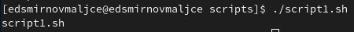
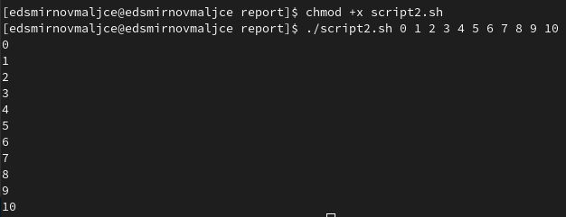
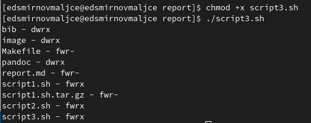
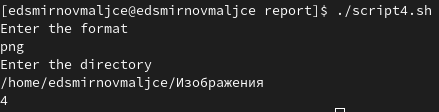

---
## Front matter
title: "Отчёт по лабораторной работе №10"
subtitle: "Программирование в командном процессоре ОС UNIX. Командные файлы."
author: "Самигуллин Эмиль Артурович"

## Generic otions
lang: ru-RU
toc-title: "Содержание"

## Bibliography
bibliography: bib/cite.bib
csl: pandoc/csl/gost-r-7-0-5-2008-numeric.csl

## Pdf output format
toc-depth: 2
fontsize: 12pt
linestretch: 1.5
papersize: a4
documentclass: scrreprt
## I18n polyglossia
polyglossia-lang:
  name: russian
  options:
	- spelling=modern
	- babelshorthands=true
polyglossia-otherlangs:
  name: english
## I18n babel
babel-lang: russian
babel-otherlangs: english
## Fonts
mainfont: PT Serif
romanfont: PT Serif
sansfont: PT Sans
monofont: PT Mono
mainfontoptions: Ligatures=TeX
romanfontoptions: Ligatures=TeX
sansfontoptions: Ligatures=TeX,Scale=MatchLowercase
monofontoptions: Scale=MatchLowercase,Scale=0.9
## Biblatex
biblatex: true
biblio-style: "gost-numeric"
biblatexoptions:
  - parentracker=true
  - backend=biber
  - hyperref=auto
  - language=auto
  - autolang=other*
  - citestyle=gost-numeric
## Pandoc-crossref LaTeX customization
figureTitle: "Рис."
tableTitle: "Таблица"
listingTitle: "Листинг"
lofTitle: "Список иллюстраций"
lolTitle: "Листинги"
## Misc options
indent: true
header-includes:
  - \usepackage{indentfirst}
  - \usepackage{float} # keep figures where there are in the text
  - \floatplacement{figure}{H} # keep figures where there are in the text
---

# Цель работы

* Изучить основы программирования в оболочке ОС UNIX/Linux. Научиться писать небольшие командные файлы.

# Задание

1. Написать скрипт, который при запуске будет делать резервную копию самого себя (то есть файла,
в котором содержится его исходный код) в другую директорию backup в вашем домашнем каталоге.
При этом файл должен архивироваться одним из архиваторов на выбор zip, bzip2 или tar.
Способ использования команд архивации необходимо узнать, изучив справку.
2. Написать пример командного файла, обрабатывающего любое произвольное число аргументов командной строки,
в том числе превышающее десять. Например, скрипт может последовательно распечатывать значения всех переданных
аргументов.
3. Написать командный файл — аналог команды ls (без использования самой этой команды и команды dir).
Требуется, чтобы он выдавал информацию о нужном каталоге
и выводил информацию о возможностях доступа к файлам этого каталога.
4. Написать командный файл, который получает в качестве аргумента командной строки формат файла
(.txt, .doc, .jpg, .pdf и т.д.) и вычисляет количество таких файлов в указанной директории.
Путь к директории также передаётся в виде аргумента командной строки.

# Теоретическое введение

Командный процессор (командная оболочка, интерпретатор команд shell) — это программа,
позволяющая пользователю взаимодействовать с операционной системой компьютера.
В операционных системах типа UNIX/Linux наиболее часто используются следующие реализации командных оболочек:
* оболочка Борна (Bourne shell или sh) — стандартная командная оболочка UNIX/Linux,
содержащая базовый, но при этом полный набор функций;
* С-оболочка (или csh) — надстройка на оболочкой Борна, использующая С-подобный
синтаксис команд с возможностью сохранения истории выполнения команд;
* оболочка Корна (или ksh) — напоминает оболочку С, но операторы управления программой совместимы
с операторами оболочки Борна;
* BASH — сокращение от Bourne Again Shell (опять оболочка Борна),
в основе своей совмещает свойства оболочек С и Корна (разработка компании Free Software Foundation).

POSIX (Portable Operating System Interface for Computer Environments) — набор стандартов
описания интерфейсов взаимодействия операционной системы и прикладных программ.
Стандарты POSIX разработаны комитетом IEEE (Institute of Electrical and Electronics Engineers)
для обеспечения совместимости различных UNIX/Linux-подобных операционных систем
и переносимости прикладных программ на уровне исходного кода.
POSIX-совместимые оболочки разработаны на базе оболочки Корна.

# Выполнение лабораторной работы

1. Написал скрипт, который при запуске будет делать резервную копию самого себя (то есть файла, в котором содержится его исходный код) в другую директорию backup в вашем домашнем каталоге. При этом файл архивируется архиватором tar (рис. 1).

<figure>
	
	<figcaption>рис. 1: выполнение первого скрипта.</figcaption>
<figure>

2. Написал пример командного файла, обрабатывающего любое произвольное число аргументов командной строки, в том числе превышающее десять. Скрипт последовательно распечатывает значения всех переданных аргументов (рис. 2).

<figure>
	
	<figcaption>рис. 2: выполнение второго скрипта.</figcaption>
<figure>

3. Написал командный файл — аналог команды ls (без использования самой этой команды и команды dir). Он выдает информацию о нужном каталоге и выводит информацию о возможностях доступа к файлам этого каталога (рис. 3).

<figure>
	
	<figcaption>рис. 3: выполнение третьего скрипта.</figcaption>
<figure>

4. Написал командный файл, который получает в качестве аргумента командной строки формат файла (.txt, .doc, .jpg, .pdf и т.д.) и вычисляет количество таких файлов в указанной директории. Путь к директории также передаётся в виде аргумента командной строки (рис. 4).

<figure>
	
	<figcaption>рис. 4: выполнение четвертого скрипта.</figcaption>
<figure>


# Ответы на контрольные вопросы

1. Командная оболочка или командный интерпретатор - это приложение предоставляющее пользователю интерфейс
командной строки в которой тот либо вводит команды по отдельности, либо запускает скрипты состоящие из списка команд.

Список существующих оболочек велик. Условно можно разделить их на три группы:

* Клоны Bourne shell (bash, zsh)
* C shell (csh, tcsh)
* Базирующиеся на популярных языках программирования(psh, ipython, scsh)
* Экзотические, специфические и все остальные

Они отличаются синтаксисом команд.

2. POSIX (англ. Portable Operating System Interface — переносимый интерфейс операционных систем) — набор стандартов,
описывающих интерфейсы между операционной системой и прикладной программой (системный API),
библиотеку языка C и набор приложений и их интерфейсов.

3. Имена переменных могут быть выбраны пользователем. Например, переменную можно объявить так:
```
mark=value
```
Массив объявляется с помощью команды set с флагом -A:
```
set -A massive 1 2 3 4
```

4. let показывает, что следующие аргументы являются выражением, подлежащим вычислению.
read говорит о том. что в последующую переменную надо записать значение, прочитанное с командной строки.

5. Можно складывать, вычитать, перемножать, целочисленно делить, считать остаток от деления,
совершать побитовые XOR, OR, AND, сдвигать не нсколько бит влево и вправо. Также есть унарный минус.

6. Операция (( )) показывает, что внутри расположено условие.

7. Есть следующие стандартные имена: Var1, PATH, trash, mon, day, PS1, PS2, -HOME, -IFS, -MAIL, -TERM, -LOGNAME.

8. Метасимволы - символы, которые несут отдельный смысл для компилятора.

9. Метасимволы экранируются заключением их в одинарные скобки.

10. Командные файлы создаются в тестовыхредакторах и сохранются в расширении .sh. Далее его можно выполнить
по команде bash.
```
bash script.sh [args]
```

11. Группу команд можно объединить в функцию с помощью слова function:
```
function func_name{
	body
}
```

12. Определить является ли объект каталогом с помощью команды test -d.
Если это директория, команда выведет 1 иначе 0.

13. set -A - определяет массив.
typeset - определяет тип последующей переменной.
unset - удаляет переменную.

14. Параметры передаются при запуске скрипта. Обратится к параметру можно с помощью $i, где i - номер параметра.

15. - $* — отображается вся командная строка или параметры оболочки;
- $? — код завершения последней выполненной команды;
- $$ — уникальный идентификатор процесса, в рамках которого выполняется командный процессор;
- $! — номер процесса, в рамках которого выполняется последняя вызванная на выполнение в командном режиме команда;
- $- — значение флагов командного процессора;
- ${#*} — возвращает целое число — количество слов, которые были результатом $*;
- ${#name} — возвращает целое значение длины строки в переменной name;
- ${name[n]} — обращение к n-му элементу массива;
- ${name[*]} — перечисляет все элементы массива, разделённые пробелом;
- ${name[@]} — то же самое, но позволяет учитывать символы пробелы в самих переменных;
- ${name:-value} — если значение переменной name не определено, то оно будет заменено на указанное value;
- ${name:value} — проверяется факт существования переменной;
- ${name=value} — если name не определено, то ему присваивается значение value;
- ${name?value} — останавливает выполнение, если имя переменной не определено,
и выводит value как сообщение об ошибке;
- ${name+value} — это выражение работает противоположно ${name-value}. Если переменная определена, то подставляется value;
- ${name#pattern} — представляет значение переменной name с удалённым самым
коротким левым образцом (pattern);
- ${#name[*]} и ${#name[@]} — эти выражения возвращают количество элементов
в массиве name.

# Выводы

* Я научился писать простые программы на языке bash.
