---
## Front matter
title: "Отчёт по лабораторной работе №13"
subtitle: "НКНбд-02-21"
author: "Самигуллин Эмиль Артурович"

## Generic otions
lang: ru-RU
toc-title: "Содержание"

## Bibliography
bibliography: bib/cite.bib
csl: pandoc/csl/gost-r-7-0-5-2008-numeric.csl

## Pdf output format
toc: true # Table of contents
toc-depth: 2
fontsize: 12pt
linestretch: 1.5
papersize: a4
documentclass: scrreprt
## I18n polyglossia
polyglossia-lang:
  name: russian
  options:
	- spelling=modern
	- babelshorthands=true
polyglossia-otherlangs:
  name: english
## I18n babel
babel-lang: russian
babel-otherlangs: english
## Fonts
mainfont: PT Serif
romanfont: PT Serif
sansfont: PT Sans
monofont: PT Mono
mainfontoptions: Ligatures=TeX
romanfontoptions: Ligatures=TeX
sansfontoptions: Ligatures=TeX,Scale=MatchLowercase
monofontoptions: Scale=MatchLowercase,Scale=0.9
## Biblatex
biblatex: true
biblio-style: "gost-numeric"
biblatexoptions:
  - parentracker=true
  - backend=biber
  - hyperref=auto
  - language=auto
  - autolang=other*
  - citestyle=gost-numeric
## Pandoc-crossref LaTeX customization
figureTitle: "Рис."
tableTitle: "Таблица"
listingTitle: "Листинг"
lofTitle: "Цель Работы"
lotTitle: "Ход Работы"
lolTitle: "Листинги"
## Misc options
indent: true
header-includes:
  - \usepackage{indentfirst}
  - \usepackage{float} # keep figures where there are in the text
  - \floatplacement{figure}{H} # keep figures where there are in the text
---

# Цель работы 

Приобрести простейшие навыки разработки, анализа, тестирования и отладки приложений в ОС типа UNIX/Linux на примере создания на языке программирования С калькулятора с простейшими функциями.

# Ход работы.

1. В домашнем каталоге создайте подкаталог ~/work/os/lab_prog.(рис. [-@fig:01])

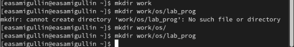{ #fig:01 width=70% }

2. Создайте в нём файлы: calculate.h, calculate.c, main.c. (рис. [-@fig:02], [-@fig:03], [-@fig:04])

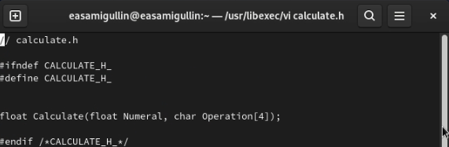{ #fig:02 width=70% }

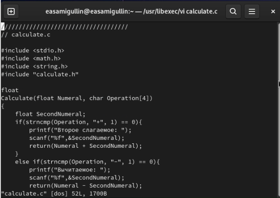{ #fig:03 width=70% }

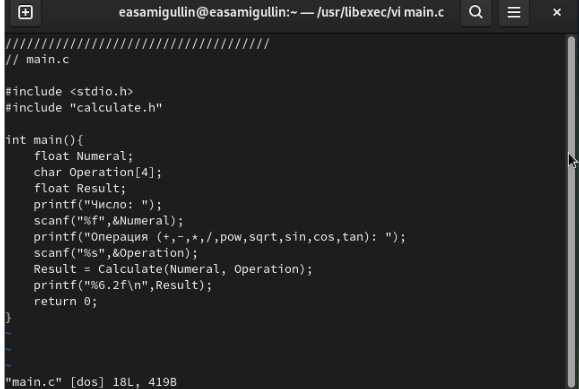{ #fig:04 width=70% }

3. Выполните компиляцию программы посредством gcc. (рис. [-@fig:05])

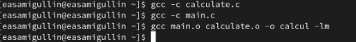{ #fig:05 width=70% }

4. Ошибок синтаксических не было, нечего было исправлять.
   
5. Создал Makefile со следующим содержанием.(рис. [-@fig:06])

{ #fig:06 width=70% }

6. С помощью gdb выполните отладку программы calcul (перед использованием gdb
исправьте Makefile)

- Запустите отладчик GDB, загрузив в него программу для отладки. (рис. [-@fig:07])

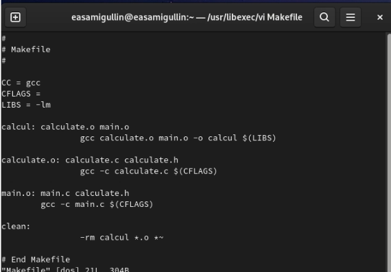{ #fig:07 width=70% }

- Для запуска программы внутри отладчика введите команду run.(рис. [-@fig:08])

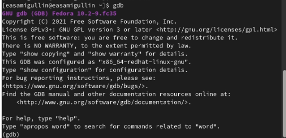{ #fig:08 width=70% }

- Для постраничного (по 9 строк) просмотра исходного код используйте команду list.
- Для просмотра строк с 12 по 15 основного файла используйте list с параметрами.
- Для просмотра определённых строк не основного файла используйте list с параметрами. (рис. [-@fig:09])

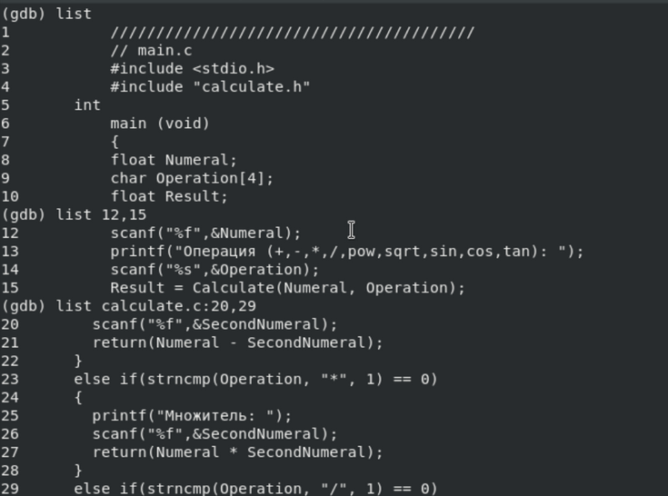{ #fig:09 width=70% }

- Установите точку останова в файле calculate.c на строке номер 21.
- Выведите информацию об имеющихся в проекте точка останова.
- Запустите программу внутри отладчика и убедитесь, что программа остановится в момент прохождения точки останова.
- Посмотрите, чему равно на этом этапе значение переменной Numeral.(рис. [-@fig:010])

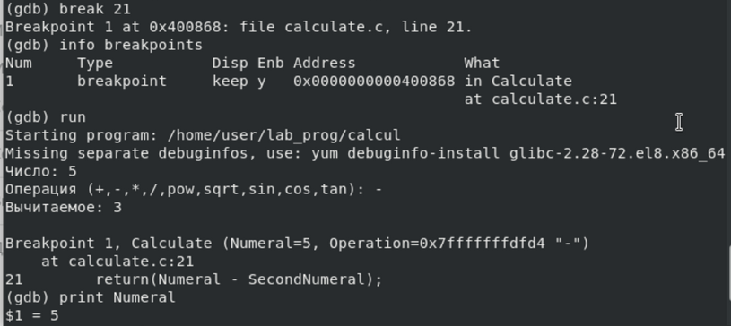{ #fig:010 width=70% }

- Сравните с результатом вывода на экран после использования команды.
- Уберите точки останова.(рис. [-@fig:011])

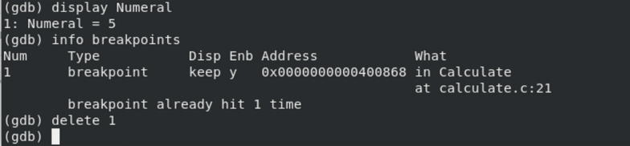{ #fig:011 width=70% }

7. С помощью утилиты splint попробуйте проанализировать коды файлов calculate.c и main.c.(рис. [-@fig:012],[-@fig:013])

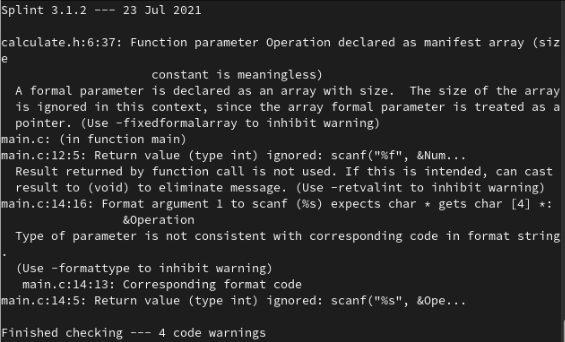{ #fig:012 width=70% }

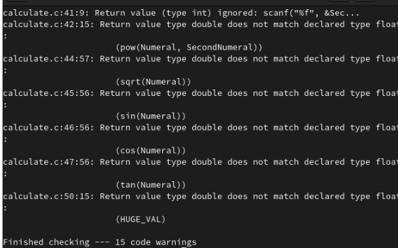{ #fig:013 width=70% }

# Вывод

Во время выполнения лабораторной работы, мы научились работать с отладчиком GDB и узнали про splint.

