---
## Front matter
title: "Отчёт по лабораторной работе №13"
subtitle: " Средства, применяемые при разработке программного обеспечения в ОС типа UNIX/Linux."
author: "Самигуллин Эмиль Артурович"

## Generic otions
lang: ru-RU
toc-title: "Содержание"

## Bibliography
bibliography: bib/cite.bib
csl: pandoc/csl/gost-r-7-0-5-2008-numeric.csl

## Pdf output format
toc-depth: 2
fontsize: 12pt
linestretch: 1.5
papersize: a4
documentclass: scrreprt
## I18n polyglossia
polyglossia-lang:
  name: russian
  options:
	- spelling=modern
	- babelshorthands=true
polyglossia-otherlangs:
  name: english
## I18n babel
babel-lang: russian
babel-otherlangs: english
## Fonts
mainfont: PT Serif
romanfont: PT Serif
sansfont: PT Sans
monofont: PT Mono
mainfontoptions: Ligatures=TeX
romanfontoptions: Ligatures=TeX
sansfontoptions: Ligatures=TeX,Scale=MatchLowercase
monofontoptions: Scale=MatchLowercase,Scale=0.9
## Biblatex
biblatex: true
biblio-style: "gost-numeric"
biblatexoptions:
  - parentracker=true
  - backend=biber
  - hyperref=auto
  - language=auto
  - autolang=other*
  - citestyle=gost-numeric
## Pandoc-crossref LaTeX customization
figureTitle: "Рис."
tableTitle: "Таблица"
listingTitle: "Листинг"
lofTitle: "Список иллюстраций"
lolTitle: "Листинги"
## Misc options
indent: true
header-includes:
  - \usepackage{indentfirst}
  - \usepackage{float} # keep figures where there are in the text
  - \floatplacement{figure}{H} # keep figures where there are in the text
---

# Цель работы

* Приобрести простейшие навыки разработки, анализа, тестирования и отладки приложений в ОС типа UNIX/Linux на примере создания на языке программирования С калькулятора с простейшими функциями.

# Задание

1. Написать приложение, выполняющее функции калькулятора на языке С.

# Теоретическое введение

Процесс разработки программного обеспечения обычно разделяется на следующие этапы:
- планирование, включающее сбор и анализ требований к функционалу и другим характеристикам разрабатываемого приложения;
- проектирование, включающее в себя разработку базовых алгоритмов и спецификаций, определение языка программирования;
- непосредственная разработка приложения:
  * кодирование — по сути создание исходного текста программы (возможно в нескольких вариантах);
  * анализ разработанного кода;
  * сборка, компиляция и разработка исполняемого модуля;
  * тестирование и отладка, сохранение произведённых изменений;
- документирование.
Для создания исходного текста программы разработчик может воспользоваться любым удобным для него редактором текста: vi, vim, mceditor, emacs, geany и др. После завершения написания исходного кода программы (возможно состоящей из нескольких файлов), необходимо её скомпилировать и получить исполняемый модуль.

# Выполнение лабораторной работы

1. Создал каталог ~/work/os/lab_prog (рис. 1).

<figure>
	
	<figcaption>рис. 1: создание каталога lab_prog.</figcaption>
<figure>

2. Написал на С программы, выполняющие функции калькулятора (рис. 2).

<figure>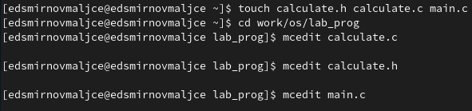
	
	<figcaption>рис. 2: создание файлов.</figcaption>
<figure>

3. Написал Makefile, компилирующий программы из предыдущего пункта и запустил утилиту make (рис. 3).

<figure>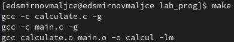
	
	<figcaption>рис. 3: выполнение утилиты make.</figcaption>
<figure>

4. С помощью gdb выполнил отладку calcul:

  * Запустил отладчик (рис. 4).
  
<figure>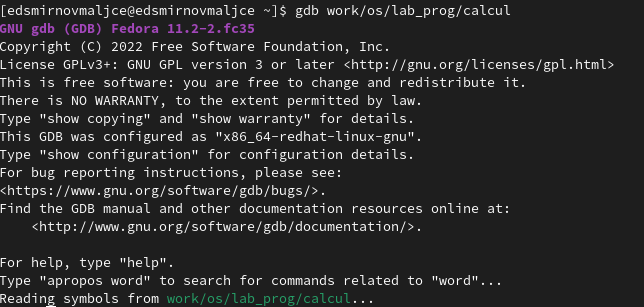
	
	<figcaption>рис. 4: запуск gdb.</figcaption>
<figure>

  * Запустил программу в отладчике (рис. 4).
  
<figure>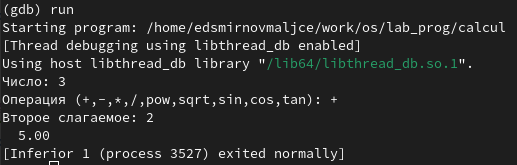
	
	<figcaption>рис. 4: запуск программы.</figcaption>
<figure>

  * Просмотрел первые 9 строк исходного кода (рис. 5).
  
<figure>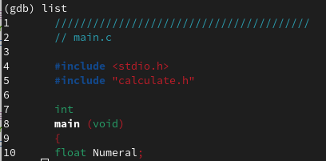
	
	<figcaption>рис. 5: строки кода.</figcaption>
<figure>

  * Просмотрел с 12 по 15 строки исходного кода (рис. 6).
  
<figure>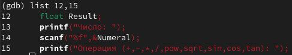
	
	<figcaption>рис. 6: 12-15 строки кода.</figcaption>
<figure>

  * Просмотрел несколько строк неосновного файла (рис. 7).
  
<figure>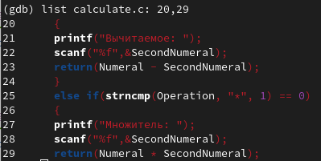
	
	<figcaption>рис. 7: строки неосновного файла.</figcaption>
<figure>

  * Установил точку останова на строке 21 (рис. 8).
  
<figure>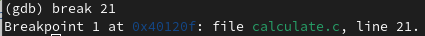
	
	<figcaption>рис. 8: создание точки останова.</figcaption>
<figure>

  * Вывел информацию о точках останова (рис. 9).
    
<figure>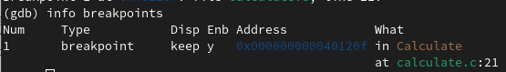
	
	<figcaption>рис. 9: информация о точках останова.</figcaption>
<figure>

  * Еще раз запустил программу (рис. 10).
  
<figure>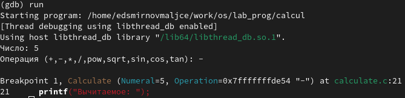
	
	<figcaption>рис. 10: запуск программы.</figcaption>
<figure>

  * Проверил значение переменной Numeral 2 способами (рис. 11).
  
<figure>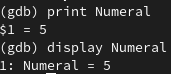
	
	<figcaption>рис. 11: вывод значения переменной Numeral.</figcaption>
<figure>

  * Убрал точки останова (рис. 12).
  
<figure>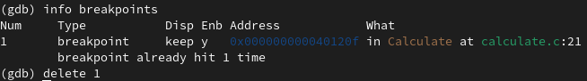
	
	<figcaption>рис. 12: удаление точек останова.</figcaption>
<figure>

7. С помощью splint просмотрел коды файлов main.c и calculate.c (рис. 13).
  
<figure>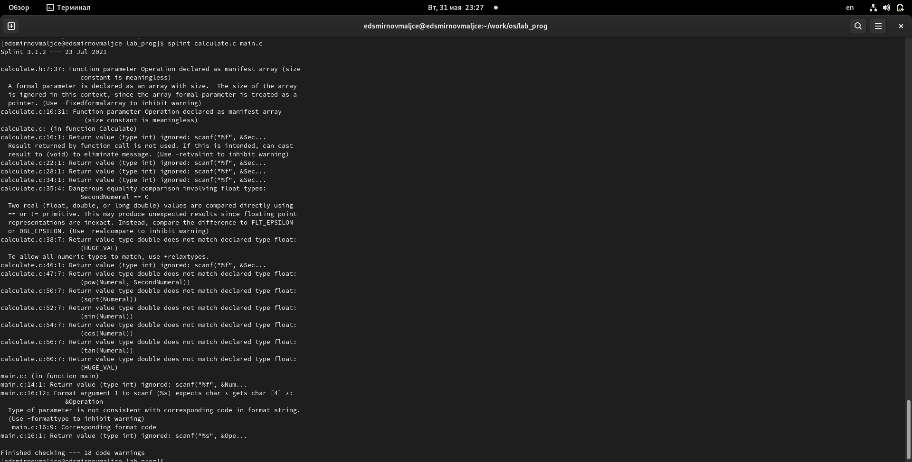
	
	<figcaption>рис. 13: коды файлов.</figcaption>
<figure> 

# Ответы на контрольные вопросы

1. Дополнительную информацию о этих программах можно получить с помощью утилиты man.
2. Unix поддерживает следующие основные этапы разработки приложений:
- создание исходного кода программы;
- представление в виде файла;
- сохранение различных вариантов исходного текста;
- анализ исходного текста;
- компиляция исходного текста и построение исполняемого модуля;
- тестирование и отладка;
- проверка кода на наличие ошибок
- сохранение всех изменений, выполняемых при тестировании и отладке.
3. Суффикс определяет какая компиляция требуется. Суффиксы и префиксы указывают тип объекта. Одно из полезных свойств компилятора Си — его способность по суффиксам определять типы файлов. По суффиксу .c компилятор распознает, что файл abcd.c должен компилироваться, а по суффиксу .o, что файл abcd.о является объектным модулем и для получения исполняемой программы необходимо выполнить редактирование связей. Простейший пример командной строки для компиляции программы abcd.c и построения исполняемого модуля abcd имеет вид: gcc -o abcd abcd.c.
Некоторые проекты предпочитают показывать префиксы в начале текста изменений для старых (old) и новых (new) файлов. Опция – prefix может быть использована для установки такого префикса. Плюс к этому команда bzr diff -p1 выводит префиксы в форме которая подходит для команды patch -p1.
4. Основное назначение компилятора с языка Си заключается в компиляции всей программы в целом и получении исполняемого модуля.
5. Утилита make освобождает пользователя от такой ручной компиляции всех файлов и служит для документирования взаимосвязей между файлами. Описание взаимосвязей и соответствующих действий хранится в так называемом make-файле, который по умолчанию имеет имя makefile или Makefile.
6. makefile может иметь вид:
```
#
# Makefile
#
CC = gcc
CFLAGS =
LIBS = -lm
calcul: calculate.o main.o
gcc calculate.o main.o -o calcul $(LIBS)
calculate.o: calculate.c calculate.h
gcc -c calculate.c $(CFLAGS)
main.o: main.c calculate.h
gcc -c main.c $(CFLAGS)
clean:
-rm calcul *.o *~
# End Makefile
```
В общем случае make-файл содержит последовательность записей (строк), определяющих зависимости между файлами. Первая строка записи представляет собой список целевых (зависимых) файлов, разделенных пробелами, за которыми следует двоеточие и список файлов, от которых зависят целевые. Текст, следующий за точкой с запятой, и все последующие строки, начинающиеся с литеры табуляции, являются командами OC UNIX, которые необходимо выполнить для обновления целевого файла. Таким образом, спецификация взаимосвязей имеет формат:`` target1 [ target2...]: [:] [dependment1...] [(tab)commands] [#commentary] [(tab)commands] [#commentary]``, где # — специфицирует начало комментария, так как содержимое строки, начиная с # и до конца строки, не будет обрабатываться командой make; : — последовательность команд ОС UNIX должна содержаться в одной строке make-файла (файла описаний), есть возможность переноса команд ``(\)``, но она считается как одна строка; :: — последовательность команд ОС UNIX может содержаться в нескольких последовательных строках файла описаний.
7. Пошаговая отладка программ заключается в том, что выполняется один оператор программы и, затем контролируются те переменные, на которые должен был воздействовать данный оператор.
8. Основные команды gdb:
- clear – удаляет все точки останова на текущем уровне стека (то есть в текущей функции);
- continue – продолжает выполнение программы от текущей точки до конца;
- delete – удаляет точку останова или контрольное выражение;
- display – добавляет выражение в список выражений, значения которых отображаются каждый раз при остановке программы;
9. Cхема отладки программы которую мы использовали при выполнении лабораторной работы.
    1. Выполнили компиляцию программы 
    2. Увидели ошибки в программе 
    3. Открыли редактор и исправили программу 
    4. Загрузили программу в отладчик gdb 
    5. run — отладчик выполнил программу, мы ввели требуемые значения. 
    6. программа завершена, gdb не видит ошибок.
10. При первом запуске программы с синтаксической ошибкой отладчику не понравился формат %s для &Operation, т.к %s — символьный формат, а значит необходим только Operation.
11. При работаете с исходным кодом, который не вами разрабатывался, назначение различных конструкций может быть не совсем понятным. Система разработки приложений UNIX предоставляет различные средства, повышающие понимание исходного кода. К ним относятся:
- cscope - исследование функций, содержащихся в программе;
- splint — критическая проверка программ, написанных на языке Си.
12. Основные задачи, решаемые программой slint:
    1. Проверка корректности задания аргументов всех использованных в программе функций, а также типов возвращаемых ими значений;
    2. Поиск фрагментов исходного текста, корректных с точки зрения синтаксиса языка Си, но малоэффективных с точки зрения их реализации или содержащих в себе семантические ошибки;
    3. Общая оценка мобильности пользовательской программы.

# Выводы

* Я научился писать командные файлы с использованием управляющих конструкций и циклов.
